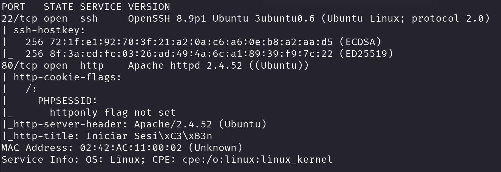
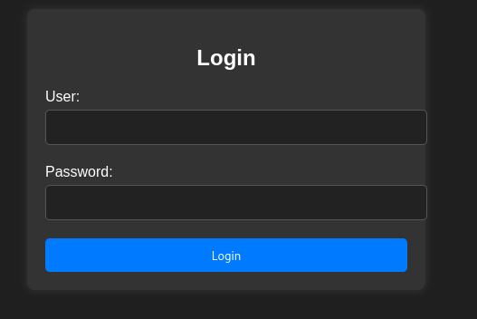
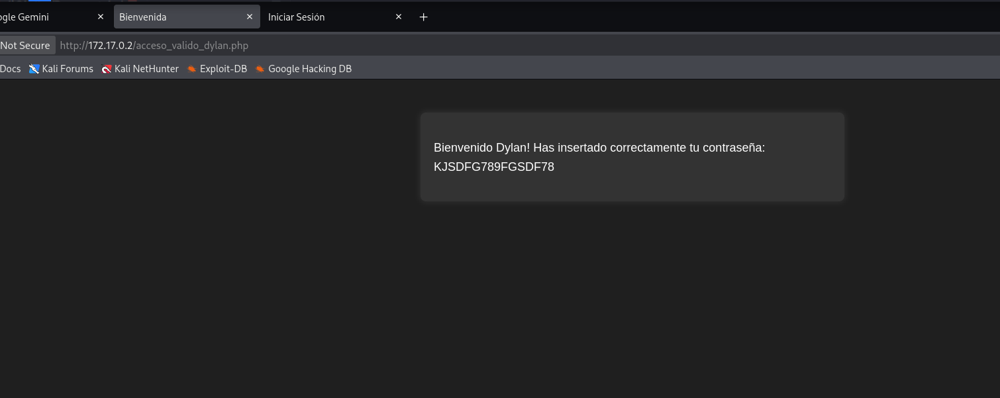
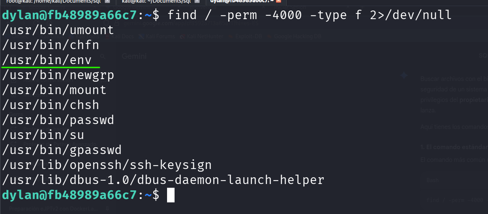
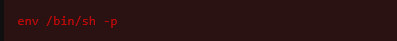
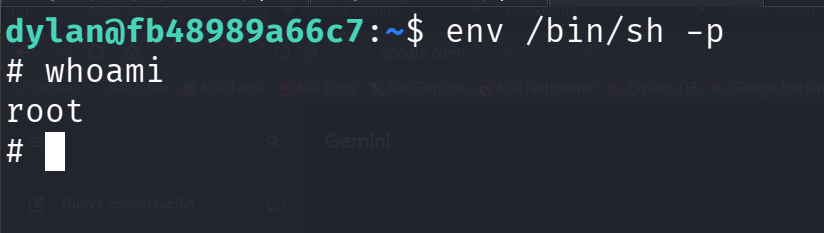

# Inyection — DockerLabs

| Field      | Value              |
|------------|--------------------|
| Platform   | DockerLabs         |
| OS         | Linux              |
| Difficulty | Easy               |
| Tags       | SQL Injection, SSH, SUID env |

---

## 1. Reconnaissance

```bash
nmap -sV -sC <IP>
```



Ports open: 22 (SSH) and 80 (HTTP). The web application presented a login form.

---

## 2. SQL Injection — Authentication Bypass

The login form was vulnerable to SQL injection. In a typical SQLi authentication bypass, injecting `' OR 1=1 --` into the username field comments out the password check, causing the query to return true for any user.

However, on this machine, injecting only the username field was not sufficient. The injection had to be **symmetric** — applied to both the username and password fields simultaneously:

```
Username: ' OR 1=1 --
Password: ' OR 1=1 --
```



This is a less common variant that occurs when the backend query checks both fields independently or uses a different query structure that requires both parameters to be injectable.

After bypassing authentication, the application returned credentials in the response — a username and password stored in the database.



---

## 3. SSH Access

Used the credentials returned by the web application to authenticate via SSH as user `dylan`:

```bash
ssh dylan@<IP>
```

---

## 4. Privilege Escalation — SUID env

Checked sudo permissions first — the `sudo` binary was disabled on this system. Moved on to SUID enumeration:

```bash
find / -perm -4000 -type f 2>/dev/null
```

**Command breakdown:**
- `/` — search from root, covering the entire filesystem
- `-perm -4000` — match files with the SUID bit set (the `4` in 4000 represents SUID)
- `-type f` — files only, not directories
- `2>/dev/null` — suppress permission denied errors for directories we can't read



Found `/env` (or `/usr/bin/env`) with SUID set.



`env` runs a program in a given environment. With SUID root, it executes the target program as root:

```bash
/usr/bin/env /bin/sh -p
# or
env /bin/sh -p
```



---

## Key Takeaways

**SQLi auth bypass sometimes requires injecting all fields, not just the username.** The query structure determines which fields are part of the authentication check. When single-field injection fails, try symmetric injection across all form fields.

**Credentials returned post-login are a gift.** Many insecure applications display or embed database credentials after login. Always inspect the full HTTP response after bypassing authentication.

**`env` with SUID = immediate root.** Combined with a disabled `sudo`, SUID enumeration becomes the primary escalation vector. `find / -perm -4000` should be in every post-compromise checklist.
