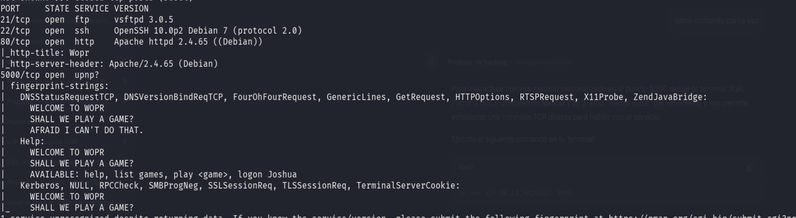
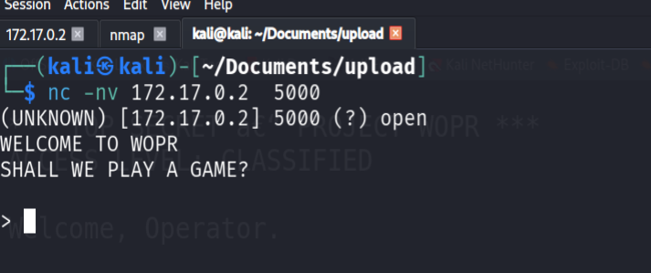

# Wargames — DockerLabs

| Field      | Value              |
|------------|--------------------|
| Platform   | DockerLabs         |
| OS         | Linux              |
| Difficulty | Easy               |
| Tags       | FTP, SSH, HTTP, gobuster |

---

## 1. Reconnaissance

```bash
nmap -sV -sC <IP>
```



Ports open: **21 (FTP)**, **22 (SSH)**, **80 (HTTP)**.

---

## 2. Web Enumeration

Port 80 returned an Apache default page — nothing at the root. Used gobuster to find hidden content:

```bash
gobuster dir -u http://<IP>/ -w /usr/share/wordlists/dirb/common.txt
```



---

> **Note:** Notes for this machine are incomplete. The attack path likely continued with FTP anonymous access or credential discovery via the web, followed by SSH login and privilege escalation. Update this writeup after re-solving.
