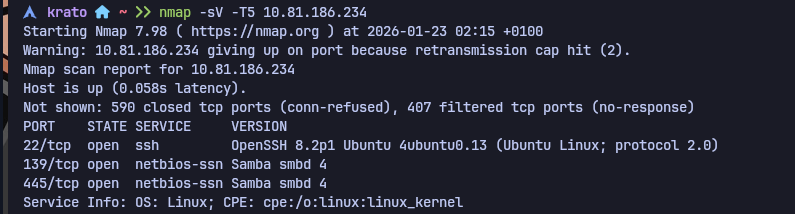
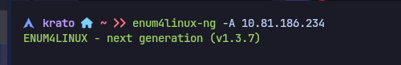
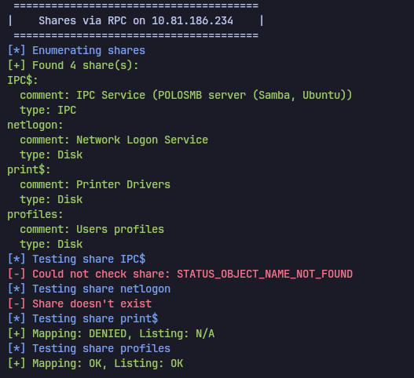
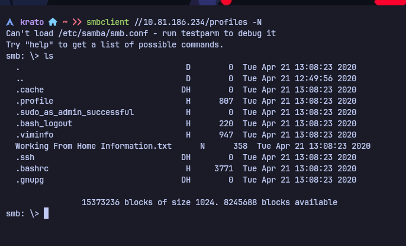
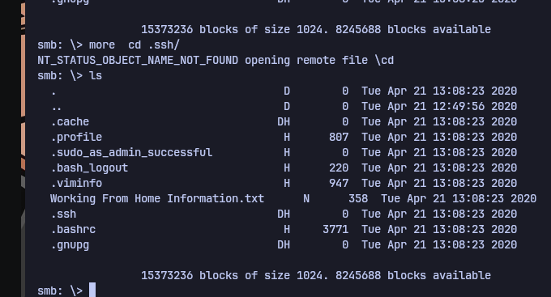
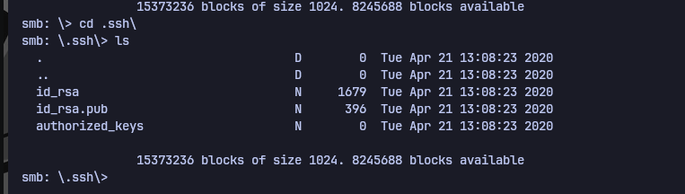
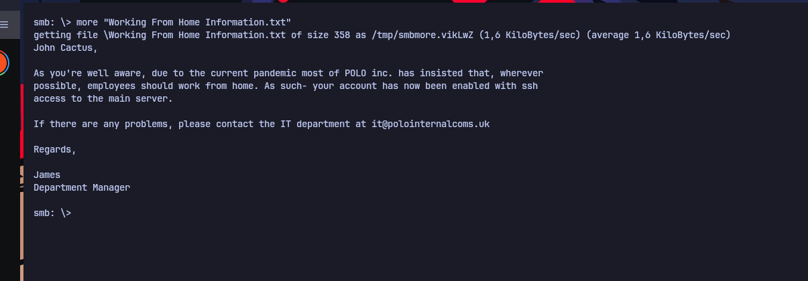
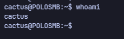

# Network Services — TryHackMe

| Field      | Value              |
|------------|--------------------|
| Platform   | TryHackMe          |
| OS         | Linux              |
| Difficulty | Easy               |
| Tags       | SMB, enum4linux, smbclient, credential discovery, SSH |

---

## 1. Reconnaissance

```bash
nmap -sV -sC <IP>
```



Ports open: 22 (SSH), 139 and 445 (SMB/Samba).

---

## 2. SMB Enumeration

Used `enum4linux` to extract shares, users, and domain/workgroup information via null session:

```bash
enum4linux -a <IP>
```





Identified available shares and potential usernames.

---

## 3. SMB Share Access

Listed accessible shares:

```bash
smbclient -L //<IP>/ -N
```



Connected to a readable share:

```bash
smbclient //<IP>/<share> -N
```





---

## 4. Credential Discovery

Downloaded files from the share and inspected them for credentials:

```bash
smb: \> get <file>
```




Found a username and password in plaintext within a file on the share.

---

## 5. SSH Access

Used the recovered credentials to authenticate via SSH:

```bash
ssh <user>@<IP>
```



---

## Key Takeaways

**SMB null sessions often expose user lists and share contents.** `enum4linux` with no credentials (`-N`) frequently returns usernames, share names, and OS information. This is a default misconfiguration on many Linux Samba installs.

**Files on SMB shares regularly contain credentials.** Configuration files, scripts, and notes left on shares are a primary source of plaintext passwords. Every file on a readable share should be downloaded and inspected.

**Reuse credentials across services.** Passwords found in SMB files should be immediately tested against SSH, web login panels, and any other service on the target.
