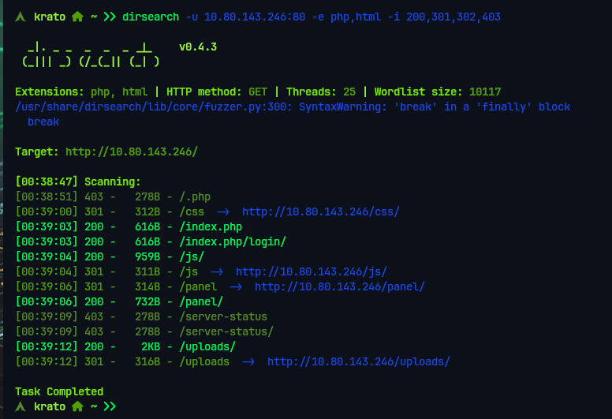
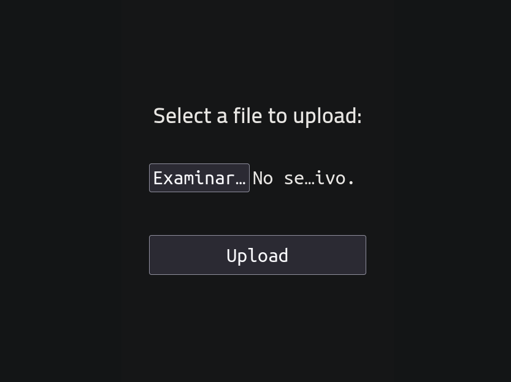
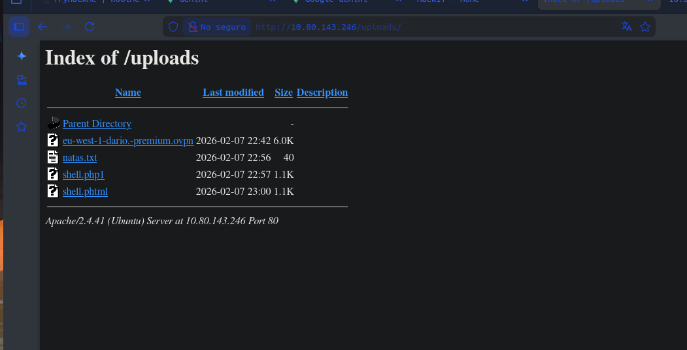
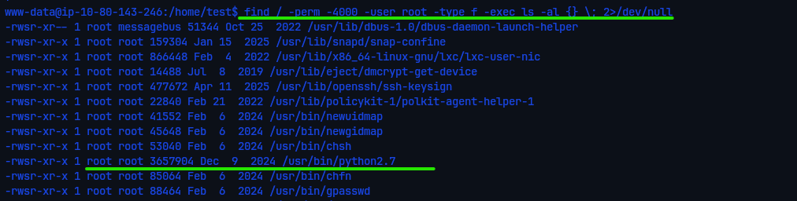
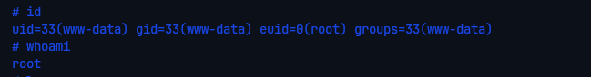

# RootMe — TryHackMe

| Field      | Value              |
|------------|--------------------|
| Platform   | TryHackMe          |
| OS         | Linux              |
| Difficulty | Easy               |
| Tags       | Web, Arbitrary File Upload, extension bypass, PHP reverse shell, SUID Python |

---

## 1. Reconnaissance

Port 80 open — Apache web server. Ran dirsearch to enumerate hidden directories:

```bash
dirsearch -u http://<IP>/
```



Two directories stood out immediately:
- `/panel` — a file upload form
- `/uploads` — where uploaded files are stored and served

The combination of an upload form and an accessible upload directory strongly indicates an arbitrary file upload vulnerability leading to RCE.

---

## 2. Foothold — PHP Upload Bypass

Navigated to `/panel`. Confirmed the form accepted file uploads.



Attempted to upload a standard `.php` reverse shell — the server rejected it. Basic extension filtering was in place. Tried the `.phtml` extension instead:

```
shell.phtml
```

`.phtml` is an alternative PHP extension that Apache processes as PHP by default if the server is misconfigured or uses a broad `AddHandler` directive. The filter checked for `.php` but not `.phtml`.

The upload succeeded.



Started a listener:

```bash
nc -lvnp 4444
```

Triggered the shell by navigating to `http://<IP>/uploads/shell.phtml`. Shell received as `www-data`.

---

## 3. Privilege Escalation — SUID Python

Searched for SUID binaries:

```bash
find / -perm -4000 -type f 2>/dev/null
```



`/usr/bin/python2.7` had the SUID bit set. Python with SUID root executes all code with root privileges. The escalation is immediate:

```bash
/usr/bin/python2.7 -c 'import os; os.execl("/bin/sh", "sh", "-p")'
```

`os.execl` replaces the current process with `/bin/sh`, and the `-p` flag preserves the effective UID (root) instead of resetting to the real UID. 



---

## Key Takeaways

**Extension filters are easily bypassed with alternative extensions.** PHP is processed under many extensions: `.php`, `.php3`, `.php4`, `.php5`, `.phtml`, `.phar`. Blocking only `.php` is insufficient. The correct approach is an allowlist (only `.jpg`, `.png`, etc.) rather than a denylist.

**SUID Python = instant root.** Python can execute arbitrary system calls — `os.execl`, `os.system`, `subprocess`. With SUID, every one of those calls runs as root. Reference: [GTFOBins — Python SUID](https://gtfobins.github.io/gtfobins/python/#suid)
