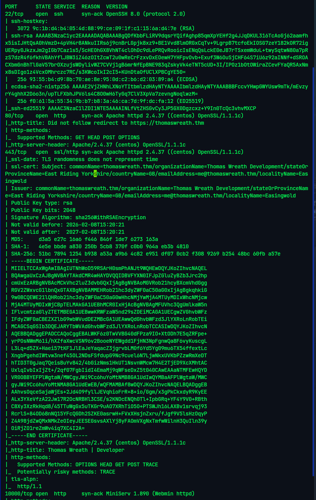
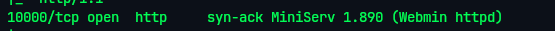
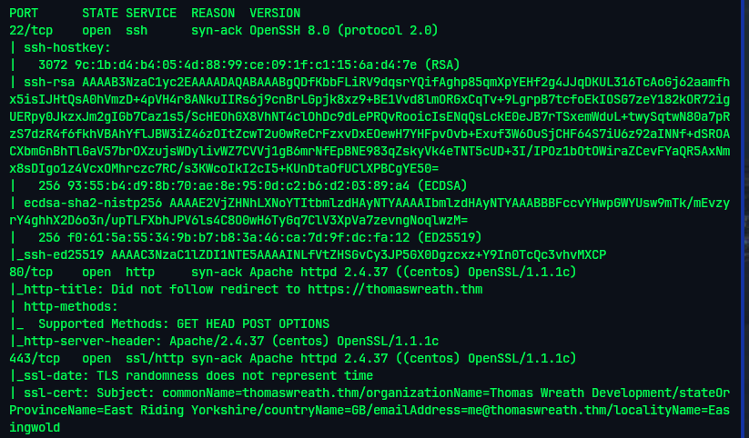

# Wreath — TryHackMe

| Field      | Value              |
|------------|--------------------|
| Platform   | TryHackMe          |
| OS         | Linux              |
| Difficulty | Medium             |
| Tags       | Network enumeration, Webmin CVE-2019-15107, RCE, SSH key extraction, pivoting |

---

## 1. Network Enumeration

Identified two live hosts in the `10.200.180.0/24` segment:

**10.200.180.200** (primary target):
- Port 22 — SSH (OpenSSH 8.0)
- Port 80 — HTTP (Apache 2.4.37 on CentOS)
- Port 10000 — HTTPS (MiniServ 1.890 — **Webmin**)

**10.200.180.250** (internal, reachable via pivot):



---

## 2. Exploitation — Webmin CVE-2019-15107

**MiniServ 1.890** (Webmin) is vulnerable to an **unauthenticated remote code execution** backdoor introduced in a compromised build.

- **CVE**: CVE-2019-15107
- **Vector**: The `password_change.cgi` script contains a backdoor that executes OS commands injected via the `expired` POST parameter
- **Authentication**: Not required
- **Privileges**: Webmin runs as root → shell lands as root

Exploited manually using the MuirlandOracle script for stability:

```bash
# Set up Python venv with dependencies
python3 -m venv venv
source venv/bin/activate
pip install requests

# Run the exploit (SSL required — Webmin on port 10000 uses HTTPS)
python3 CVE-2019-15107.py 10.200.180.200 -s
```



Root shell received on the target.

---

## 3. Persistence — SSH Key Extraction

A raw reverse shell is fragile. Extracted the root SSH private key for a stable, persistent connection:

```bash
cat /root/.ssh/id_rsa
```

Copied the key to Kali, set correct permissions, and connected via SSH:

```bash
chmod 600 id_rsa_root
ssh -i id_rsa_root root@10.200.180.200
```



With a stable SSH session, the second internal host (`10.200.180.250`) became reachable for further pivoting.

---

## Key Takeaways

**CVE-2019-15107 is a supply-chain backdoor, not a typical vulnerability.** The Webmin source code was compromised — an attacker inserted a backdoor before the release was published. No authentication is needed, and detection is difficult because the backdoor was in the official distribution.

**Always extract SSH keys when you land a root shell.** A stable SSH session is far more reliable than a raw reverse shell — full TTY, job control, no timeout, easy file transfer with `scp`.

**Webmin version 1.890 is unambiguously backdoored.** If seen on an engagement, treat it as immediate critical severity regardless of network position.
